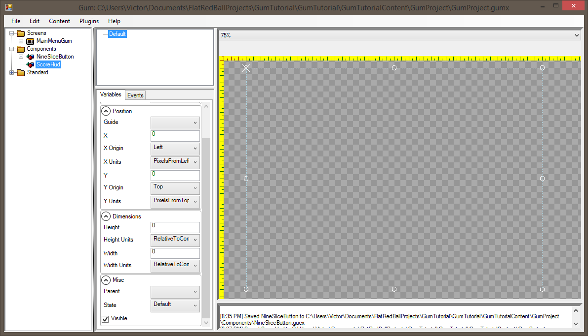
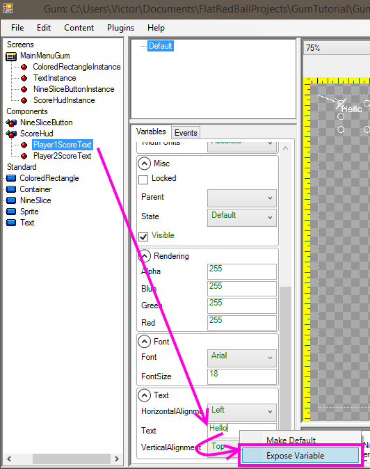
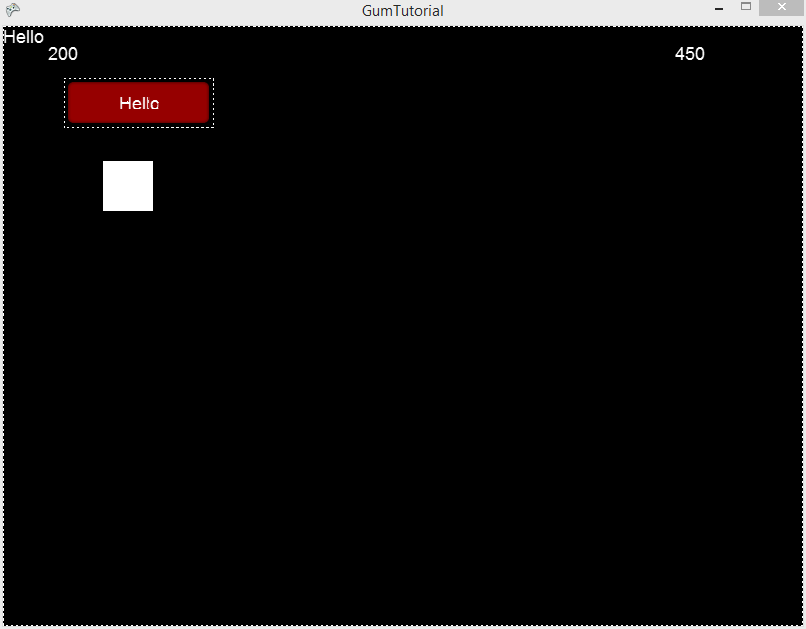

# Exposed Variables

### Introduction

Exposed variables provide a way to modify Gum objects contained within other Gum objects through your code. For this tutorial, we'll be creating a scoring HUD object.

### Creating a ScoreHud object

First, we'll create a ScoreHud component in Gum. To do this:

1. Right-click on Components and select **Add Component**
2. Enter the name **ScoreHud** and click **OK**
3. Verify **ScoreHud** is selected
4. Set **Width Units** to **RelativeToContainer**
5. Set **Width** to **0**
6. Set **Height Units** to **RelativeToContainer**
7. Set **Height** to **0**

&#x20;

<figure><figcaption></figcaption></figure>

Next, we'll create two Text objects:

1. Drag+drop a Text object into the ScoreHud object.
2. Rename the Text to Player1ScoreText
3. Position the Player1ScoreText object near the top-left of the Screen
4. Change the Player1ScoreText's "X Units" to "PercentageWidth"
5. Repeat the steps above to create a Player2ScoreText which is positioned on the top-right of the Screen


### ScoreHud in MainMenuGum

Now we can add a ScoreHud instance to the MainMenuGum by drag+dropping the ScoreHud into MainMenuGum: &#x20;

<figure><figcaption></figcaption></figure>

If you run the game at this time you'll notice that the score hud appears, but the score HUD says "Hello" for Player 1 and Player 2's scores. We can get access to the ScoreHud object in Glue as follows:

1. Switch to Glue
2. Expand the "MainMenu" screen
3. Right-click on Objects
4. Select "Add Object"
5. Select "From File"
6. Select the file "MainMenuGum.gusx"
7. Select ScoreHudInstance as the Source Name
8. Enter the name ScoreHudInstance
9. Click OK&#x20;

<figure><figcaption></figcaption></figure>

Unfortunately, if you try to access the Player objects in Visual Studio you'll see that there is no way to change the Text on the ScoreHud:&#x20;

<figure><figcaption></figcaption></figure>

### Accessing score Text

To access the score text we first need to expose the variables in Gum. To do this:

1. Switch to Gum
2. Select the Player1ScoreText object in Gum
3. Right-click on the Text variable
4.  Select "Expose Variable" \


    <figure><figcaption></figcaption></figure>
5. Enter the name "Score1" and click OK
6. Repeat the same process to expose "Score2" for Player2ScoreText

You should now have 2 exposed variables. You can see this by selecting the **ScoreHud** object in Gum: &#x20;

<figure><figcaption></figcaption></figure>

Now you can go to Visual Studio and add the following code to CustomInitialize in your MainMenu screen:

```
void CustomInitialize()
{
    this.ScoreHudInstance.Score1 = "200";
    this.ScoreHudInstance.Score2 = "450";
}
```

Notice that the variables appear in Visual Studio with the same names as exposed in Gum. Running the game will show the score values showing 200 and 450 respectively. &#x20;

<figure><figcaption></figcaption></figure>
