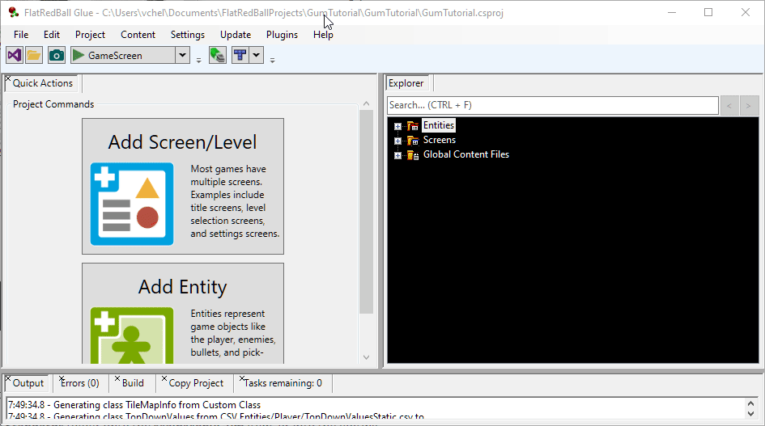
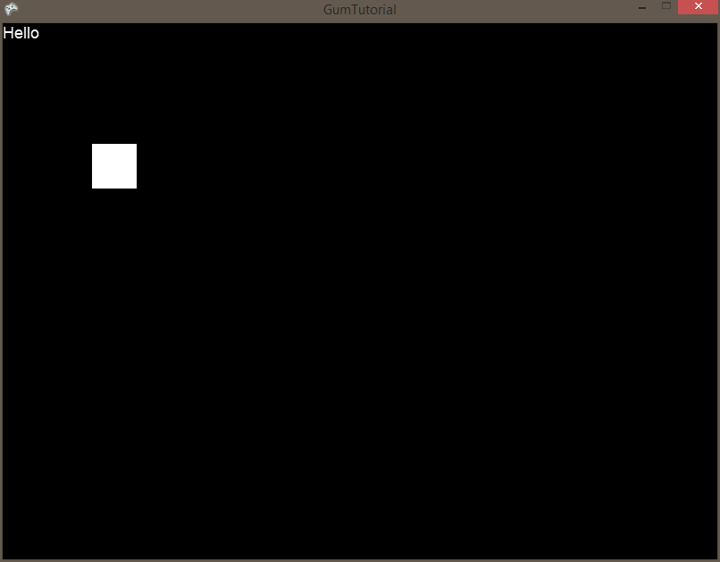

# Screens in Gum

### Introduction

Now that we have an empty Gum project set up, let's look at how we use screens. Screens in Gum are very similar to Screens in FlatRedBall. By default every FlatRedBall screen has an associated Gum screen. The naming convention for Gum screens is to match the FlatRedBall screen and to append the word "Gum" at the end. For example, let's consider a simple game which has the following screens:

1. GameScreen
2. Level1
3. Level2
4. CreditsScreen
5. MainMenuScreen

In this situation the following Gum screens would be created automatically:

1. GameScreenGum
2. Level1Gum
3. Level2Gum
4. CreditsScreenGum
5. MainMenuScreenGum

**Why do Gum screens have the word "Gum" at the end?:** The reason for this is because of a C# limitation where objects with a certain name cannot contain objects with the same name. In other words, when you create a screen in C# called MainMenu, FlatRedBall creates a class also called "MainMenu". If the Gum plugin were to create a Gum screen also called "MainMenu", the project would no longer compile. The Gum plugin avoids this problem by appending the word "Gum" when creating a new Gum screen.

### Gum Project Properties

We can control how the Gum plugin behaves by selecting the .gumx file which is located under **Global Content Files**.

The **Show Mouse** option automatically turns on the mouse cursor so it is visible on any screen with Gum UI. This is turned on by default. You may want to turn this off if you do not intend to use the mouse cursor in your game. The **Automatically Create Gum Screens for Glue Screens** option can speed up development since it automatically creates new Gum screens and adds them to your FlatRedBall project. If this option is checked, you may not need to create any Gum screens.

### Creating a MainMenu/MainMenuGum screen

First, we'll create a MainMenu FlatRedBall screen. To do this:

1. Open or bring FlatRedBall to focus
2. Select the **Quick Actions** tab
3. Click the **Add Screen/Level** button
4. Check the **Empty Screen** option since we aren't making a new level
5. Enter the name **Main Menu**
6. Click **OK**

You should now have a screen in FlatRedBall called **MainMenu** and a Gum screen called MainMenuGum (assuming you left the **Automatically Create Gum Screens for Glue Screens** option checked).

<figure><figcaption></figcaption></figure>

Next, let's add some objects to the Gum screen:

1. Double-click the **MainMenuGum** file to open it in Gum (assuming you have set up file associations)
2. Expand the **Standard** folder
3. Drag+drop a **ColoredRectangle** from the **Standards** folder onto the **MainMenuGum** item, or into the editing area if the **MainMenuGum** screen is selected
4. Move the colored rectangle away from the top-left of the screen
5. Drag+drop a **Text** from the **Standards** into **MainMenuGum**

You should now have a **Text** and a **ColoredRectangle** in your Screen in Gum.

<figure><figcaption></figcaption></figure>

Gum auto-saves your changes (just like the FlatRedBall Editor) so once you've made these changes, you do not need to manually save the Screen. Since the Gum screen was automatically added, you can run your game and you will see the Gum screen showing up in your FlatRedBall game automatically - no code necessary.

<figure><figcaption></figcaption></figure>

At this point, you have the basics working for laying out Screens. In the next tutorial, we'll look at how to interact with Gum objects in code.

### Adding Gum to Existing Screens

The example above showed how to add a new FlatRedBall Screen which automatically adds a Gum screen to your project. If you have already created a Screen (such as a GameScreen) before you added Gum to your project, then you must manually add the Gum screen. To do so:

1. Choose which FlatRedBall Screen should have a Gum screen. For example GameScreen
2. Open Gum
3. Add a new Screen to Gum called GameScreenGum
4. After adding the Screen in Gum, return to the FlatRedBall Editor
5. Right-click on GameScreen's Files folder
6. Select **Add Gum Screen** -> **GameScreenGum**

To review, if you add a new FlatRedBall Screen \*after \*having added Gum to your project, you do not need to manually create Gum screens. However, if you have FlatRedBall Screens which were created before having added Gum, then manual steps above are necessary for those Screens.
