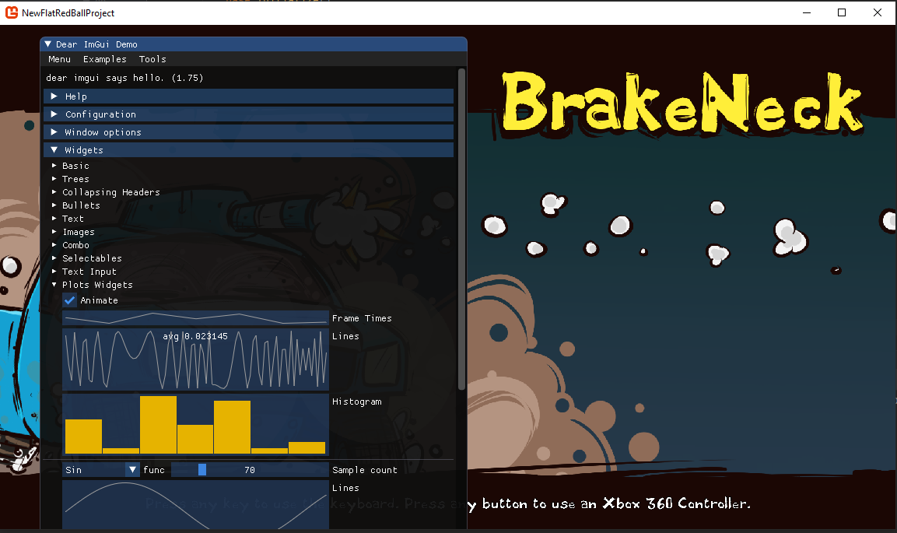

# dear-imgui-integration

The [Dear ImGui](https://github.com/ocornut/imgui) open source library provides a cross-platform way to quickly make user interfaces.  While it is not as pretty as interfaces made in Gum, it does allow for quick creation of [powerful UIs](https://raw.githubusercontent.com/wiki/ocornut/imgui/web/v167/v167-misc.png) for certain audiences.  It has found significant usage for [in-engine game development tools](https://raw.githubusercontent.com/wiki/ocornut/imgui/web/v149/gallery\_TheDragonsTrap-01-thumb.jpg), even in high profile AAA games such as the new [Final Fantasy VII Remake](https://user-images.githubusercontent.com/8225057/78885468-f9845280-7a5c-11ea-8023-fdf9bd95be10.jpg), [Assassin's Creed](https://montreal.ubisoft.com/en/ubisoft-sponsors-user-interface-library-for-c-dear-imgui/), and [Bethesda's Fallout76](https://user-images.githubusercontent.com/4228359/41322748-b9756e6e-6e78-11e8-8dfc-9a3437c1fd1a.png). While Gum will always be the preferred way to create player-focused interfaces in your game Dear ImGui can help you quickly create in-game debug and development tools to help you iterate faster.  While Dear ImGui does not have its own native support for FlatRedBall, it it is easy to integrate Dear ImGui in a FlatRedBall game, and this post will show how. \[embed]https://www.youtube.com/watch?v=lgE4x9Dmm8s\[/embed]

## Rendering

Dear ImGui is built as a C++ library that doesn't do any rendering on it's own.  Instead it generates vertex buffers that any rendering engine should be able to display.  Luckily, the open source community has created a .Net wrapper for the library and provide a sample for how to render it with MonoGame.  To use this library you want to add the [**ImGui.Net** nuget package](https://www.nuget.org/packages/ImGui.NET/) to your project. Once that the nuget package is installed we just need tell MonoGame to render it.  The easiest way to do this is to grab the [ImGuiRenderer.cs](https://github.com/mellinoe/ImGui.NET/blob/master/src/ImGui.NET.SampleProgram.XNA/ImGuiRenderer.cs) and [DrawVertDeclaration.cs](https://github.com/mellinoe/ImGui.NET/blob/master/src/ImGui.NET.SampleProgram.XNA/DrawVertDeclaration.cs) classes from the ImGui.Net XNA sample and add them to your project.  Make sure everything compiles up to this point (note that this will require at least the .Net Framework 4.6.1). The next step is to actually display something in your game.  To do this open up the **Game1.cs** file and make the following modifications:

```lang:c#
    public class Game1 : Microsoft.Xna.Framework.Game
    {
        GraphicsDeviceManager graphics;
        private ImGuiRenderer _imGuiRenderer; // Add this declaration here

        // ...

        protected override void Initialize()
        {
            // ....
            IsMouseVisible = true; // So you can see the mouse pointer over the controls
            _imGuiRenderer = new ImGuiRenderer(this); // Initialize the ImGui renderer
            _imGuiRenderer.RebuildFontAtlas(); // Required so fonts are available for rendering
            
            base.Initialize();
        }

        protected override void Draw(GameTime gameTime)
        {
            FlatRedBallServices.Draw();

            // FRB may have altered the rendering state, and this might cause ImGui's textures to render
            // with artifacts.  So we want to reset the render state just for ImGui
            var oldSamplerState = GraphicsDevice.SamplerStates[0];
            GraphicsDevice.SamplerStates[0] = new SamplerState();
            
            _imGuiRenderer.BeforeLayout(gameTime); // Must be called prior to calling any ImGui controls
            ImGui.ShowDemoWindow(); // Render the built in demonstration window
            _imGuiRenderer.AfterLayout(); // Must be called after ImGui control calls

            // Reset the sample state to what FRB originally set
            GraphicsDevice.SamplerStates[0] = oldSamplerState;

            base.Draw(gameTime);
        }
    }
```

This code intializes the ImGui renderer and calls it in each Monogame render cycle.  If you run your game now you should now see the ImGui demo window where you can explore a lot of the different UI controls that Dear ImGui offers.  And with that you have a fully functioning Dear ImGui window right in your FlatRedBall Game!  All you need to go from here is to add new controls in between the **BeforeLayout** and **AfterLayout** calls and you can create any custom UI that you want.

## Tighter Integration

So now that you have ImGui integrated you could just go off and start creating user interfaces.  However, as you start working with this you may notice that it will become quite complex to manage even trivial debug user interfaces with this setup.  For example, if all UI rendering and control management is handled from **Game1.cs** how will you create a UI that's only relevant when you select a specific unit, or available while in a specific screen?  Furthermore, how will you get values from that UI so you can affect your game entities from the UIs? This calls for a closer integration into FlatRedBall!  Specifically we need some way to allow screens and entities to be able to create and remove their own ImGui controls.  This consists of two systems, ImGui elements and an ImGui manager.

### ImGui Elements

In an idea world we would want to keep our UI organized, and such a system would require it:

1. Be easy to group a set of ImGui controls together
2. Be composable, so one grouping can render another grouping inside of it (for example rendering one group inside a tab within a larger group)
3. Be easy for external code to modify the values of code
4. Be easy to expose values the user has modified through the UI controls
5. Be possible for external code to be notified when a value is changed (for MVVM style flows)

We can accomplish this with an [ImGuiElement](https://github.com/KallDrexx/FlatRedImGui/blob/master/FlatRedImGui/ImGuiElement.cs) class.  This class intends to make it easy to create complex ImGui layouts while maintaining good separations of concerns from game logic.  For example, lets say you are working on the TownRaiser starter game and you wanted to create a user interface to modify the global data for buildings.  You may create the following class:

```lang:c#
    public class GlobalBuildingEditor : ImGuiElement
    {
        public string BuildingId
        {
            get => Get<string>(); 
            set => Set(value);
        }
        
        [HasTextBuffer(25)]
        public string DisplayName
        {
            get => Get<string>();
            set => Set(value);
        }

        public int Health
        {
            get => Get<int>();
            set => Set(value);
        }

        public double BuildTime
        {
            get => Get<double>();
            set => Set(value);
        }

        public int LumberCost
        {
            get => Get<int>();
            set => Set(value);
        }

        public int StoneCost
        {
            get => Get<int>();
            set => Set(value);
        }

        public int Capacity
        {
            get => Get<int>();
            set => Set(value);
        }

        public GlobalBuildingEditor(BuildingData buildingData)
        {
            using (DisablePropertyChangedNotifications())
            {
                BuildingId = buildingData.Name;
                DisplayName = buildingData.NameDisplay;
                Health = buildingData.Health;
                BuildTime = buildingData.BuildTime;
                LumberCost = buildingData.LumberCost;
                StoneCost = buildingData.StoneCost;
                Capacity = buildingData.Capacity;
            }
        }

        protected override void CustomRender()
        {
            if (ImGui.Begin("Global Building Editor Window")) // Define a new window
            {
                // If statement is used to create the inside controls only if the window is not collapsed
                InputText(nameof(DisplayName), "Display Name");
                InputInt(nameof(Health), "Health");
                InputDouble(nameof(BuildTime), "Build time");
                InputInt(nameof(LumberCost), "Lumber Cost");
                InputInt(nameof(StoneCost), "Stone Cost");
                InputInt(nameof(Capacity), "Capacity");
            }

            ImGui.End(); // Ends the grouping of controls for the current window
        }
    }
```

Of course, this class by itself is not very useful.  It allows you to change values but those values aren't reflected by the game itself.  Luckily the **ImGuiElement** class implements the **INotifyPropertyChanged** interface, allowing you to react to changes in this UI with code such as:

```lang:c#
    foreach (var buildingKey in GlobalContent.BuildingData.Keys)
    {
        var buildingInfo = GlobalContent.BuildingData[buildingKey];
        var editor = new GlobalBuildingEditor(buildingInfo);

        editor.PropertyChanged += (sender, args) =>
        {
            switch (args.PropertyName)
            {
                case nameof(GlobalBuildingEditor.DisplayName):
                    buildingInfo.NameDisplay = editor.DisplayName;
                    break;
                
                case nameof(GlobalBuildingEditor.Capacity):
                    buildingInfo.Capacity = editor.Capacity;
                    break;
                
                case nameof(GlobalBuildingEditor.Health):
                    buildingInfo.Health = editor.Health;
                    break;
                
                case nameof(GlobalBuildingEditor.BuildTime):
                    buildingInfo.BuildTime = editor.BuildTime;
                    break;
                
                case nameof(GlobalBuildingEditor.LumberCost):
                    buildingInfo.LumberCost = editor.LumberCost;
                    break;
                
                case nameof(GlobalBuildingEditor.StoneCost):
                    buildingInfo.StoneCost = editor.StoneCost;
                    break;
            }
        };
    }
```

Just like that we have a debug user interface that can be used to modify global CSV data, allowing you to tweak values in real time without even restarting the screen.

### Managing Elements

However, just having an ImGui element is not enough.  We somehow need to render those elements to the screen.  While we could somehow pass these elements to the **Game1** class and add calls to their **Draw()** method in between the **ImGuiRenderer** calls, that is not very ideal.  Instead what we'd really like is some global manager that not only allows screens and entities to create and destroy ImGui element implementations as they want, but we also need some way to hook ImGui into FlatRedBall's greater infrastructure.  This will not only give us greater organization for managing ImGui calls, but it will allow screens and entities to have an easy way to know if ImGui has focus or if the game has focus (for input purposes). A ready made implementation of an ImGui element manager can be found in this [ImGuiManager.cs](https://github.com/KallDrexx/FlatRedImGui/blob/master/FlatRedImGui/ImGuiManager.cs) file.  To use this, add the code file to your project and instead of the previous **Game1.cs** changes we made at the beginning of the post, the only change you need to make to **Game1.cs** is:

```lang:c#
        protected override void Initialize()
        {
            // ...

            // Add this line here to initialize the ImGui manager
            new ImGuiManager(this);

            base.Initialize();
        }
```

That's it!  The ImGuiManager constructor takes care about adding itself into FlatRedBall's rendering pipeline and lets FlatRedBall know when the cursor has focus on an ImGui control.  In your screen or entity you can then create any ImGuiElement instances that you want and add it to the ImGui manager via:

```lang:c#
    public void CustomInitialize()
    {
        _debugWindow = new MainDebugWindow {IsVisible = true};
        _debugWindow.PropertyChanged += DebugWindowOnPropertyChanged;
        ImGuiManager.Current.AddElement(_debugWindow);
    }

    public void CustomDestroy()
    {
        ImGuiManager.Current.RemoveElement(_debugWindow);
        _debugWindow.PropertyChanged -= DebugWindowOnPropertyChanged;
    }
```

&#x20;
