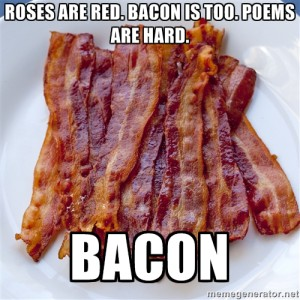
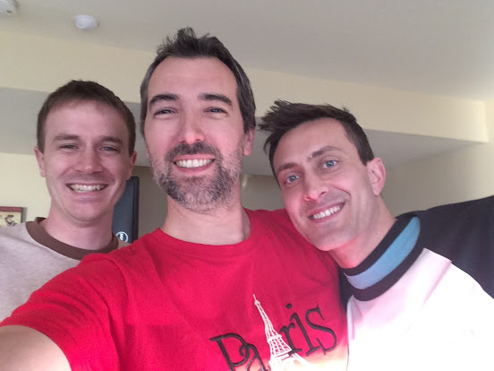

# flatredbacon

 After much anticipation, the often discussed event affectionately titled FRBacon (FlatRedBall Convention -> FRBCon -> FRBacon) took place over a gorgeous extended weekend in April in the hills overlooking Lehi, Utah:  Festivities began on Thursday, March 31st when the first of the FlatRedBallers arrived:  These handsome gentlemen above, from left to right, are: Adam, Victor, and Justin Most everyone was in attendance on Friday, and we wasted no time getting the fun started!  From left to right (heads, not bodies): Jared, Adam, Domenic, Kao, Paul, and Victor &#x20;

On Saturday, we fired up the grill and we ate. We ate a lot. Then we ate some more. Alcohol was consumed. We forgot the bacon, though, so the next day we made up for it:  This guy really likes mustard. Nice action shot!

Most of the rest of the weekend was spent playing copious amounts of games including Forza 4, Gears of War 3, Super Smash Bros, Torchlight II, and Borderlands 2.

 When someone has 5 TVs and 4 XBox 360s, plus 4 copies of Forza 4, you just have to play 4 player Forza 4 for 4 hours straight. 4.

Ok we didn't play for 4 hours straight, but it felt good to say 4 a lot.

Suffice it to say we played a LOT of games for a very very long time, but that's just what you get when you get a bunch of gamers together. That's what FlatRedBall is all about, and that's what makes us tick. We work hard the whole year, and we deserve a little time to enjoy what makes us happy: good friends, good food, good fun... good times!

It's just too bad it had to end! WHAT YOU SAY?

Yea it's over... all good things must come to an end, but maybe next year is the year that you'll join us?

Hang out in the chat room, get to know us, and perhaps contribute to the FRB community. Do these things, and maybe in 2017 you too can have a grainy picture from a smartphone on the internet!

The rest of the pictures can be found [here](https://goo.gl/photos/mK9sWkBW2UucDguB7). We hope you'll join us and help keep FlatRedBall an amazing community to be a part of!
