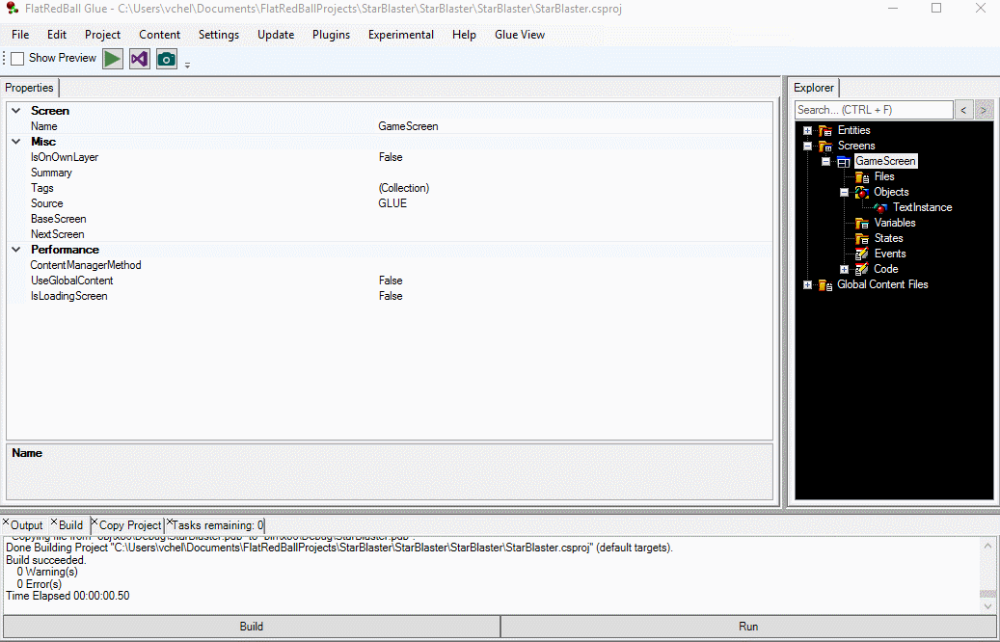

# just-press-play

&#x20;  A new feature in Glue enables developers and designers to build and launch a game directly from Glue by just clicking a button. The feature, which requires Visual Studio, makes it easier to test a change made in Glue without the need to open the IDE at all! Just press play! &#x20;
