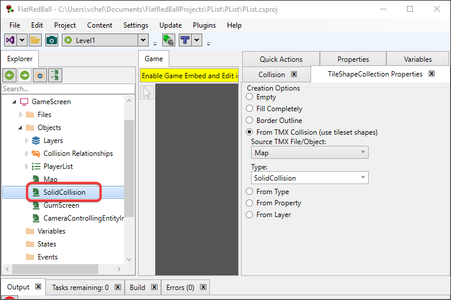
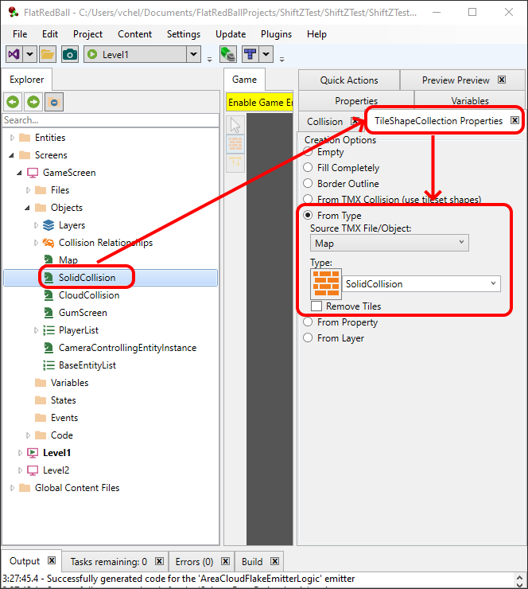
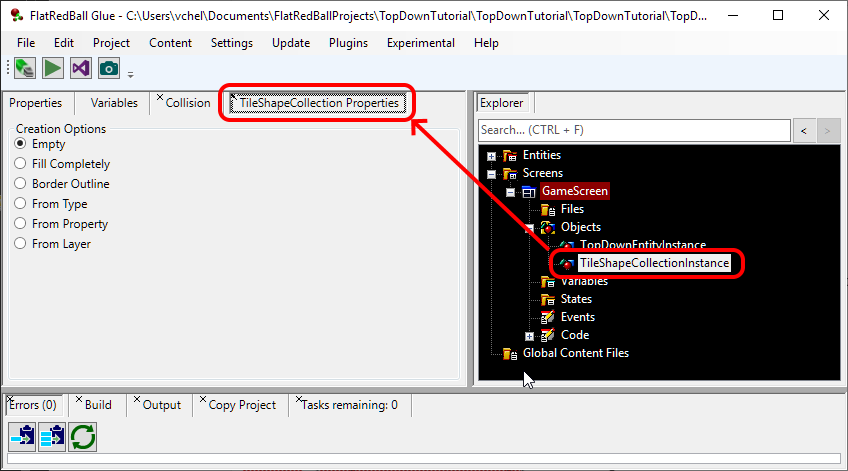
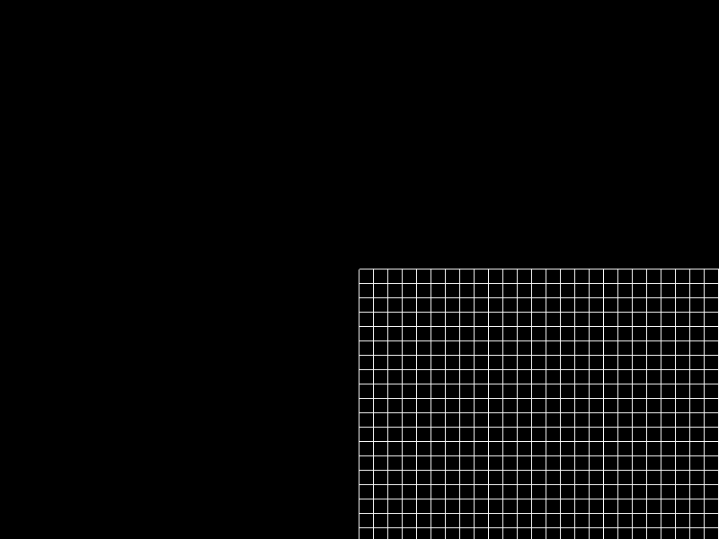
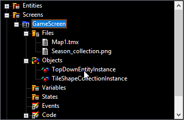
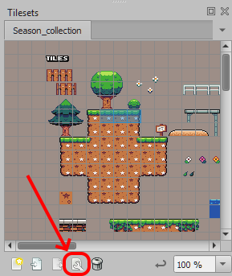
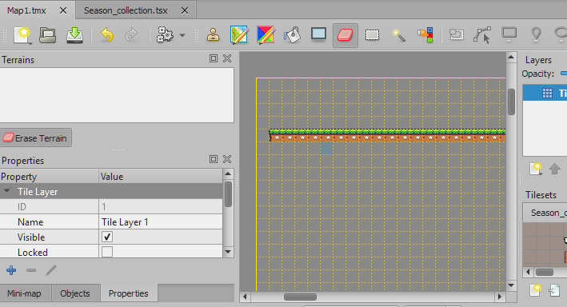
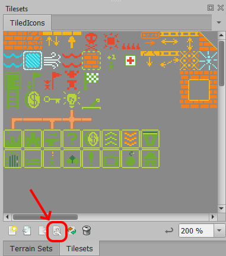
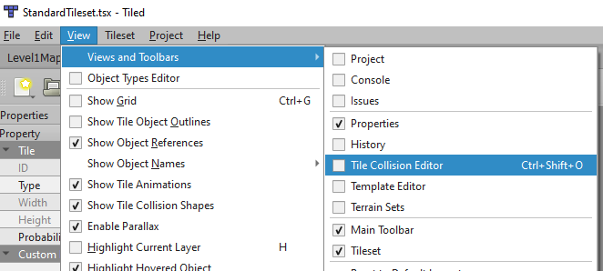

# TileShapeCollection

### Introduction

TileShapeCollection is a class created specifically for tile based collision. Its features include:

* Very fast collision - it has partitioning built-in.
* Eliminates snagging - Internally the TileShapeCollection modifies contained AxisAlignedRectangles' [RepositionDirections](../../frb/docs/index.php) to eliminate snagging.
* Full support in the FlatRedBall Editor for initial definition and collision relationships.
* Simplified syntax - Adding collisions to TileShapeCollection is very easy to do in code, whether doing so manually in code or from a loaded TMX file.

### TileShapeCollections and the Wizard

If you have created your project using the FlatRedBall Editor Wizard (either platformer or top-down), then your game already has TileShapeCollections. For example, the GameScreen should have a SolidCollision TileShapeCollection.



### Creating TileShapeCollections in the FlatRedBall Editor

To add a TileShapeCollection:

1. Expand your GameScreen or Screen which should contain the TileShapeCollection. Typically collision is added to GameScreen.
2. Right-click on Objects and select **Add Object**
3. Verify **FlatRedBall or Custom Type** is selected
4.  Select the **TileShapeCollection** option

    
5. Click **OK**

Now that you have created a TileShapeCollection, you can fill it using a variety of methods as shown before.

### Example - Setting Collision from a Tile

The most common usage of TileShapeCollections is to add collision from a particular tile Type. Usually this is done through a Map object in the GameScreen. If your project has been set up using the wizard, then you should have a Map object in GameScreen. If so, you can:

1. Select the TileShapeCollection that you would like to fill from the map
2. Check the TileShapeCollection properties
3. Select the **From Type** option
4. Use the dropdown to select the type. These types will match the types defined in your map's Tileset (tsx) file



### Example - Filling a TileShapeCollection Completely

When creating a game, you may want to add some placeholder collisions to test your logic and collision relationships. To create placeholder collisions:

1. Select your TileShapeCollection in Glue
2.  Click the **TileShapeCollection Properties**

    
3. Select the **Fill Completely** option
4.  Set the **Tiles Wide** and **Tiles High** to define the size of collision block you want

    
5. Click the **Variables** tab
6.  Check the **Visible** checkbox

    

Now the TileShapeCollection will appear in your game and can be used for testing.



### Defining Collision from a TMX File

Testing your collision using Fill or Border Outline is a handy way to make sure your game is working as you expect it, but eventually you will want to have collision defined in a map. For this tutorial we'll work with a simple game with a single TMX file already added to the GameScreen which also contains a TileShapeCollection.  First we'll specify which tiles should have collision:

1. Open Tiled
2.  Click the wrench icon to edit the tileset

    
3.  Select one (or more) tiles which should have collision

    
4. Add a Custom Property called SolidCollision. The type of the variable doesn't matter.

<figure><figcaption></figcaption></figure>

5. Save your tileset (tsx)
6.  Place some tiles in your map

    
7. Save your TMX

Now in Glue we can associate the SolidCollision with the TileShapeCollection:

1. Select the TileShapeCollection in your GameScreen
2. Click the **TileShapeCollection Properties** tab
3. Select the **From Property** option
4. Use the dropdown to select your TMX file
5.  Enter the property SolidCollision

    

Now if you run your game you will see collision wherever you placed your tiles.


### TMX (LayeredTileMap) Example

Collision can be added to a TileShapeCollection from a loaded TMX file (which loads into a LayeredTileMap). The following code shows how to add collision from all tiles with the custom property **HasCollision**.

```lang:c#
// These examples assume that a TileShapeCollection named
// solidCollision is defined somewhere (usually class scope for the screen)
TileShapeCollection solidCollision;

// Note that the TileShapeCollection is first created, then 
// collision is added. The following code might be in the Screen's CustomInitialize

solidCollision = new TileShapeCollection();
solidCollision.AddCollisionFromTilesWithProperty(TiledLevel, "HasCollision");
```

#### Code-Only Example

The following example shows how to create an AxisAlignedRectangle that moves around with the keyboard and collides against a TileShapeCollection. This project assumes a Glue project with:

1. A Screen called GameScreen
2. An AxisAlignedRectangle object named Rectangle in GameScreen

To add the TileShapeCollection:

1. Open the project in Visual Studio
2. Open GameScreen.cs
3.  Add the following using statement:

    ```
    using FlatRedBall.TileCollisions;
    ```
4.  Add the following at class scope:

    ```
    TileShapeCollection mCollision;
    ```
5.  Add the following to CustomInitialize:

    ```
    mCollision = new TileShapeCollection();
    mCollision.GridSize = 32;
    mCollision.Visible = true;

    for (int i = 0; i < 10; i++)
    {
        mCollision.AddCollisionAtWorld(i * 32 + 16, 16);
    }
    ```

To add movement and collision to your rectangle, add the following code to CustomActivity:

```
InputManager.Keyboard.ControlPositionedObject(Rectangle, 200);
mCollision.CollideAgainstSolid(Rectangle);
```

Finally you'll need to remove the TileShapeCollection. To do this, add the following to CustomDestroy:

```
mCollision.RemoveFromManagers();
```

### Defining Custom Per-Tile Collision

By default each rectangle in a TileShapeCollection occupies the entire tile (16x16). Custom shapes can be defined in Tiled to create rectangles which occupy less than the entire tile, or even polygons for sloped collision. Partial tile collisions are defined in the TSX file, typically in the StandardTileset.tsx. To add collision on tiles:

1. Open one of your levels in Tiled
2. Select the TiledIcons (typically where all collision is defined)
3.  Click the wrench icon to edit the tileset

    
4.  Select the tile which should have partial collision

    
5.  Select **View** -> **View and Toolbars** -> **Tile Collision Editor**

    
6. Draw a rectangle or polygon on the tile

<figure><figcaption></figcaption></figure>

5.  Set the Class on the tile which has the collision. Note that the same type can be given to multiple tiles. Be sure to select the tile and not the shape. You may need to deselect and re-select the tile to force its properties to display rather than the newly-drawn polygon. Usually the Class that you specify should match the name of your TileShapeCollection.

    
6. Repeat this process for any other tile which should have custom shapes.
7. Once you have added shapes to all of the tiles, and once you have set the types on the tiles, save the TSX file.
8.  Paint the tiles in their desired locations. Note that tile collision can be previewed in Tiled by selecting the **View** -> **Show Tile Collision Shapes** option

    

    
9. Save the Tiled (TMX) file.


Tiles can be flipped and rotated in Tiled to allow for more complex shapes. You can use the shortcut keys X, Y, and Z, or the icons to flip tiles. FlatRedBall respects flipping and rotation for collision.




To use these shapes to fill a TileShapeCollection in FlatRedBall:

1. Select an existing TileShapeCollection or create a new TileShapeCollection. Typically this TileShapeCollection would be in the GameScreen.
   1. If creating a new TileShapeCollection, name it the exact same as the name you assigned to the Class value for all of your tiles.
2. Select the **TileShapeCollection Properties** tab
3. Select the **From TMX Collision - requires shapes defined in the tileset (TSX)** option
4. Set **Source TMX File/Object** to **Map**
5. **Set Tile Class to the name that you specified earlier**


The TileShapeCollection now includes custom shapes as defined in Tiled.

#### Solid Collision Considerations

If you are using partial tiles for solid collision, there are a few guidelines you should follow to prevent your entities from being teleported strangely when colliding with shapes. If you are not using the tiles for solid collision, then these rules do not need to be followed.

&#x20;If a tile has partial collision, then its neighbors must fall into one of the following categories:

1. It must be completely empty (no collision)
2. The two tiles must have their solid are aligned perfectly

Let's look at a few examples to see how these rules can be followed. The following shows a valid layout:

<figure><figcaption><p>Valid collision with partial tiles</p></figcaption></figure>

Note that the partial collision tiles have neighbors which are either empty (0) or which are aligned perfectly (1).

<figure><figcaption><p>Collision following the guidelines for partial collision</p></figcaption></figure>

Similarly, adjacent tiles can also be partial as long as they continue the collision, as shown in the following image:

<figure><figcaption><p>Valid collision with neighbors continuing the collision</p></figcaption></figure>

The following would not be a valid collision because the neighbor to the edges of the solid collision do not match.

<figure><figcaption><p>Invalid solid collision</p></figcaption></figure>

We can see that the top tiles in the second and third tiles do not align properly, as shown by the following image:

<figure><figcaption><p>Invalid collision due to the solid collision edges not matching</p></figcaption></figure>

Partial tiles can connect to adjacent partial tiles even if the edges do not meet at the corner of the grid. For example the following layout is valid:

<figure><figcaption></figcaption></figure>
