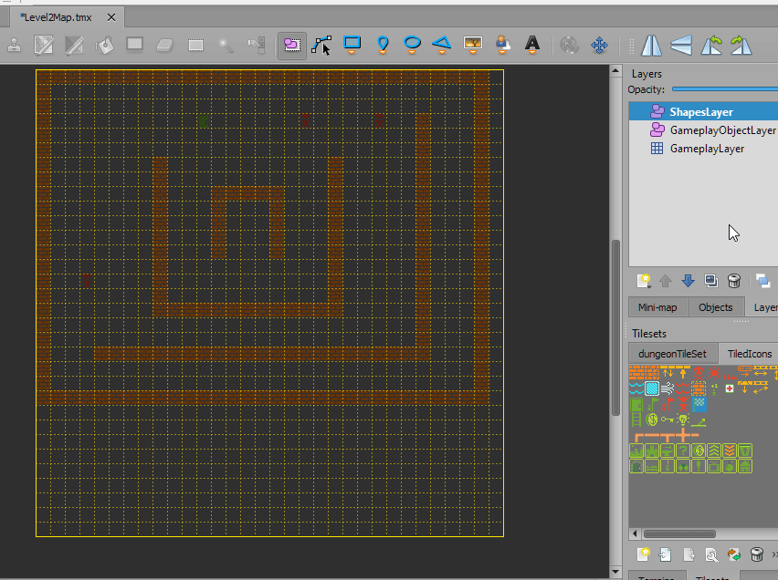

# Working with Tiled Shapes

### Introduction

Tiled object layers support "tile objects" (images) and geometric shapes. The following geometric object types can be created in Tiled:

* Rectangle
* Ellipse (similar to Oval)
* Polygon
* Polyline
* Tile (Image)


The first four types (geometric shapes) are added to the Map.ShapeCollections list when loaded. These can be accessed and used at run time for custom collision, such as the creation of triggers.

### Map.ShapeCollections vs. Collidable Entities

As shown in the [Creating Entities from Object Layers page](07-creating-entities-from-object-layers.md), it is possible to create collidable entities using Tiled. These collidable entities ultimately hold references to shapes which can be accessed in code. Some situations (such as triggers in a level) will be easier to create with "raw shapes" rather than entities. These free floating shapes can be of any shape or size, and creating them in Tiled lets us visualize the shapes in context of the entire level.

### Creating Shapes on an Object Layer

Shapes can be added to any object layer (such as the existing GameplayObjectLayer in Level2Map), but we'll keep things organized by creating a dedicated ShapesLayer.

1. In Tiled, click the Add Layer button
2. Select "Add Object Layer"
3. Enter the name "ShapesLayer"


To add a rectangle:

1. In Tiled, click the Insert Rectangle button
2. Push and drag the left mouse button to draw a Rectangle

<figure><figcaption></figcaption></figure>

3.  Enter the name "Rectangle1" for the new rectangle. This is needed to find the shape at run time.

    

As always, don't forget to save your changes in Tiled.

### Working with ShapeCollections

Each object layer with one or more shape is loaded as a separate ShapeCollection at runtime. This tutorial covers the basics of working with a ShapeCollection, but more information can be found on the [ShapeCollection page](../../api/flatredball/math/geometry/shapecollection/). All ShapeCollections are invisible by default, but can be made visible. Add the following method to GameScreen :

```csharp
private void ShapeTutorialLogic()
{
    foreach(var shapeCollection in Map.ShapeCollections)
    {
        shapeCollection.Visible = true;
    }
}
```

We could also selectively make the shape collections visible:

```csharp
private void ShapeTutorialLogic()
{
    var shapeCollection =
    Map.ShapeCollections
        // This name matches the layer name 
        .FirstOrDefault(item => item.Name == "ShapesLayer");

    if(shapeCollection != null)
    {
        shapeCollection.Visible = true;
    }
}
```

We need to modify CustomInitialize to call ShapeTutorialLogic :

```csharp
void CustomInitialize()
{
    ...
    ShapeTutorialLogic();
}
```


### Accessing Individual Shapes

The TMX loading code performs the following logic when deciding where to add shapes:

* A perfect circle (not ellipse) are added to the ShapeCollection's Circles list
* An un-rotated rectangle are added to the ShapeCollection's Rectangles list
* All other shapes (ovals, rotated rectangles, and polygons) are added to the ShapeCollection's Polygons list

We can perform shape-specific logic by accessing the individual lists. For example, we can access the Rectangles instance as shown in the following code:

```csharp
private void ShapeTutorialLogic()
{
    var shapeCollection = Map.ShapeCollections
        // This name matches the layer name 
        .FirstOrDefault(item => item.Name == "ShapesLayer");

    var rectangle = shapeCollection?.AxisAlignedRectangles
        ?.FirstOrDefault(item => item.Name == "Rectangle1");

    if(rectangle != null)
    {
        rectangle.Visible = true;
    }
}
```
