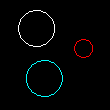

# Beefball

### Introduction

If you're looking for a jump-start on how to make games with FlatRedBall and Glue, you've come to the right place. The following tutorials will walk you through how to make a game called **Beefball**. Beefball is a fast-paced physics based game similar to air-hockey. What are you waiting for, let's get started!

<figure><figcaption>
Beefball Icon
</figcaption></figure>

Completed Project: [Beefball.zip](http://files.flatredball.com/content/Tutorials/Beefball.zip)
