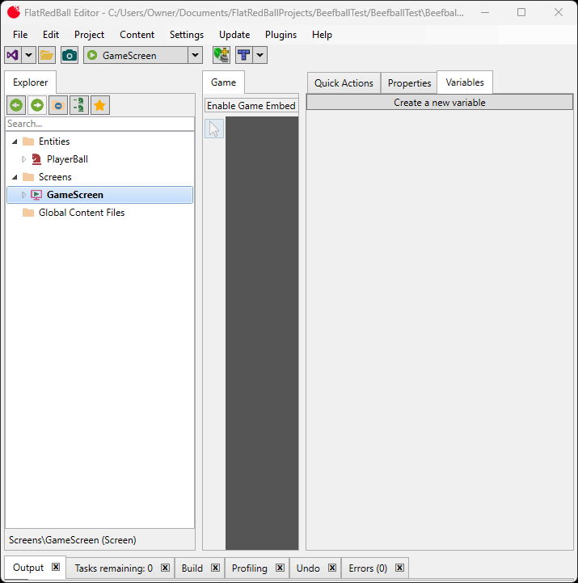

# Controlling an Entity

### Introduction

So far we have a basic structure for our game: an Entity with graphical representation, a Screen, and an instance of our Entity in our Screen. This tutorial requires writing code.

### How will we control our Entity?

Before implementing code to control your Entity you need to decide how to control an Entity. For this tutorial we will implement controls using gamepads as well as keyboard (in case you do not have a gamepad). We will use FlatRedBall's input interfaces so that our game code doesn't need to consider which input device is using after initial setup. Note that FlatRedBall uses the Xbox36GamePad name since FlatRedBall was originally written to work with XNA. Most controllers will work including wired and wireless XBox controllers, Switch Pro controllers, and Playstation DualShock (although usually the DualShock requires a wired connection).

### Defining Control Interfaces

First we need to define which controls are needed in our game. Our PlayerBall requires the following input:

* Movement in the X and Y coordinates - also known as "2D input"
* Input for executing a boost. Boosts temporarily increase the player's speed when executed for a short amount of time. The user does not need to hold the input down, simply pressing the button/key is enough.

We'll write the PlayerBall so that it works with any input device, whether that's Xbox 360 controller, Keyboard, or any other device. To add code to PlayerBall, double click **PlayerBall.cs** in Visual Studio. This is located in your project's **Entities** folder.


Modify the **PlayerBall.cs** file so it contains two input properties as follows:

```csharp
public partial class PlayerBall
{
    public I2DInput MovementInput { get; set; }
    public IPressableInput BoostInput { get; set; }
    ...
```

Next we will add code to move the player ball. Notice that there are four methods in PlayerBall.cs:

* CustomInitialize
* CustomActivity
* CustomDestroy
* CustomLoadStaticContent

CustomActivity gets called every frame, so we can use it method to respond to controller input and modify our PlayerBall appropriately. Add the following code in the CustomActivity method in **PlayerBall.cs**:

```csharp
private void CustomActivity()
{
    float movementSpeed = 10;
    if (MovementInput != null)
    {
        this.XVelocity = MovementInput.X * movementSpeed;
        this.YVelocity = MovementInput.Y * movementSpeed;
    }
}
```

At this point we have written fully-functional code for moving the ball according to its MovementInput; however, we haven't assigned the MovementInput yet. We'll do this next.

### Assigning Movement Input

The MovementInput and BoostInput were intentionally created as public properties so that they could be assigned by the GameScreen. The GameScreen will contain logic for deciding which input device to use. To assign the input interfaces, open **GameScreen.cs** in the Screens folder and modify the CustomInitialize method as follows:

```csharp
public partial class GameScreen
{
    void CustomInitialize()
    {
        PlayerBall1.MovementInput =
            InputManager.Keyboard.Get2DInput(Microsoft.Xna.Framework.Input.Keys.A,
            Microsoft.Xna.Framework.Input.Keys.D,
            Microsoft.Xna.Framework.Input.Keys.W,
            Microsoft.Xna.Framework.Input.Keys.S);
        PlayerBall1.BoostInput = InputManager.Keyboard.GetKey(Microsoft.Xna.Framework.Input.Keys.B);
    }
    ...
```

Notice that the object we are assigning code to (PlayerBall1) matches the name of the entity in the editor. FlatRedBall objects in the editor always have a matching name in code, as shown in the following image:


For more information on the Keyboard class, see [the Keyboard page](../../api/flatredball/input/keyboard/).

### Cleaning up the code

**Clean code is very important.** This is something we stress at FlatRedBall for all developers making any kind of game regardless of size. Therefore, this tutorial (and others in the future) discusses how code can be improved to be more flexible and maintainable. The code we wrote above has a number of problems:

* The velocity (which was set to 10) is set right in the method where it's used. This velocity value is typically considered "data", while its application is considered "logic". The separation of data from logic is a fundamental concept in keeping game projects maintainable.
* The game includes logic in the CustomActivity method. We encourage no logic, only method calls in the standard "Custom" methods.

### Separating Data from Logic using FlatRedBall Variables

FlatRedBall provides a number of ways to separate data from logic. The simplest of these is to create variables. To add a variable to the PlayerBall entity:

1. In the editor, click the **PlayerBall** Entity
2. Right the **Variables** tab
3. Click the **Add New Variable** button
4. Verify that **float** is the **Type**
5. Enter the name **MovementSpeed** and click the **OK** button
6. Verify **Variables** is selected and set **MovementSpeed** to **100**. Deselect the text box or press ENTER to apply the value.

<figure><figcaption><p>Creating a MovementSpeed variable in FlatRedBall</p></figcaption></figure>

Finally, return to the movement code **inside PlayerBall.cs** and change the code to:

```csharp
private void CustomActivity()
{
    if (MovementInput != null)
    {
        this.XVelocity = MovementInput.X * MovementSpeed;
        this.YVelocity = MovementInput.Y * MovementSpeed;
    }
}
```

If we run the game now we can control the player with the W, A, S, and D keys:

<figure><figcaption><p>PlayerBall moving with the MovementSpeed variable</p></figcaption></figure>

### Adding Gamepad Controls

The benefit of using the input interfaces (I2DInput and IPressableInput ) is that the input device being used can be set or changed without any code changes in the entity. For example, we can modify the GameScreen to optionally use an gamepad if connected, otherwise it falls back to using the keyboard. To add support for keyboard and gamepad controls, open **GameScreen.cs** and Modify CustomActivity as follows:

```csharp
void CustomInitialize()
{
    // As mentioned above, non-xbox controllers should work fine
    if (InputManager.Xbox360GamePads[0].IsConnected)
    {
        PlayerBall1.MovementInput =
            InputManager.Xbox360GamePads[0].LeftStick;
        PlayerBall1.BoostInput =
            InputManager.Xbox360GamePads[0].GetButton(Xbox360GamePad.Button.A);
    }
    else
    {
        PlayerBall1.MovementInput =
            InputManager.Keyboard.Get2DInput(Microsoft.Xna.Framework.Input.Keys.A,
            Microsoft.Xna.Framework.Input.Keys.D,
            Microsoft.Xna.Framework.Input.Keys.W,
            Microsoft.Xna.Framework.Input.Keys.S);
        PlayerBall1.BoostInput = 
            InputManager.Keyboard.GetKey(Microsoft.Xna.Framework.Input.Keys.B);
    }
}
```

For more information on Xbox360GamePad, see [the Xbox360GamePad page](../../api/flatredball/input/xbox360gamepad/).

### Cleaning CustomActivity and CustomInitialize

Finally, we should clean up CustomActivity. In general, we encourage keeping the Custom methods free of logic so that it is clear what an Entity/Screen is doing when initialized and when destroyed without having to mentally translate code into concept. Open **PlayerBall.cs** and replace the CustomActivity with the following:

```csharp
private void CustomActivity()
{
    MovementActivity();
}
```

Then define MovementActivity in **PlayerBall.cs** file:

```csharp
private void MovementActivity()
{
    if (MovementInput != null)
    {
        this.XVelocity = MovementInput.X * MovementSpeed;
        this.YVelocity = MovementInput.Y * MovementSpeed;
    }
}
```

Similarly, we'll want to clean up the CustomInitialize method in **GameScreen.cs**:

```csharp
void CustomInitialize()
{
    AssignInput();
}
```

We'll implement the AssignInput method in **GameScreen.cs**:

```csharp
private void AssignInput()
{
    if (InputManager.Xbox360GamePads[0].IsConnected)
    {
        PlayerBall1.MovementInput =
            InputManager.Xbox360GamePads[0].LeftStick;
        PlayerBall1.BoostInput =
            InputManager.Xbox360GamePads[0].GetButton(Xbox360GamePad.Button.A);
    }
    else
    {
        PlayerBall1.MovementInput =
            InputManager.Keyboard.Get2DInput(Microsoft.Xna.Framework.Input.Keys.A,
            Microsoft.Xna.Framework.Input.Keys.D,
            Microsoft.Xna.Framework.Input.Keys.W,
            Microsoft.Xna.Framework.Input.Keys.S);
        PlayerBall1.BoostInput =
            InputManager.Keyboard.GetKey(Microsoft.Xna.Framework.Input.Keys.B);
    }
}
```

### Conclusion

Now we have a PlayerBall Entity which is cleanly written, has speed which can be customized through the FlatRedBall Editor, and can be moved with the game pad or keyboard. The next tutorial covers defining collision in the GameScreen.
