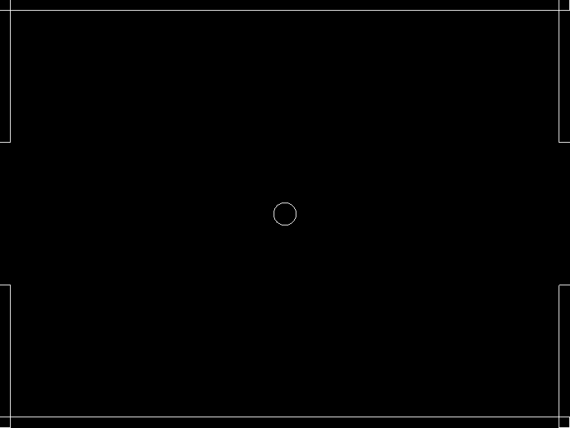

# Creating the Screen Collision

### Introduction

So far we have a very simple project with a PlayerBall (which appears as a Circle) which can be moved with a gamepad or the keyboard. This tutorial will cover creating collision for the game. This tutorial introduces two new types.

* ShapeCollection - an object which can contain any number of shapes. Adding multiple shapes to a ShapeCollection makes the creation of collision relationships very easy.
* AxisAlignedRectangle - this is a rectangle shape which can be created in Glue just like We'll use multiple AxisAlignedRectangles to assemble our level, and we'll be organizing these in a list object.

### Creating the Walls ShapeCollection

First we'll create a ShapeCollection called Walls. This ShapeCollection contains all of the rectangles in our game. ShapeCollections are a specialized list which can contain multiple instances of Shape objects such as Circles and AxisAlignedRectangles. To create the Walls ShapeCollection:

1. Select **GameScreen**
2. Click the **Quick Actions** tab
3. Click **Add Object to GameScreen**
4. Select **ShapeCollection** as the type
5. Enter the name **Walls**
6. Click **OK**

<figure><figcaption>
Adding a new ShapeCollection
</figcaption></figure>

### Adding Wall AxisAlignedRectangles

Now that we have a ShapeCollection for our walls, we will add the individual walls. To add the first wall AxisAlignedRectangle:

1. Right-click on the **Walls** item.
2. Select **Add Object**
3. Select **AxisAlignedRectangle** as the type. Notice that available types are limited to shapes since we are adding to a ShapeCollection.
4. Enter the name **Wall1** and click **OK**.

<figure><figcaption>
Adding Wall1 to Walls ShapeCollection
</figcaption></figure>

Now we can modify the properties of this wall. Select **Wall1** and change the values as follows:

* Y = 300
* Width = 800
* Height = 30

Doing so will move the rectangle to the top of the screen. If you run the game you will see the wall at the top of the screen.

Now that we've created a single wall, we can duplicate it by right-clicking on it and selecting the "Duplicate" command:

<figure><figcaption>
Right-click Duplicate command
</figcaption></figure>

Create 5 duplicates, so that the Walls list holds a total of 6 AxisAlignedRectangle instances:

<figure><figcaption>
All six walls in Walls ShapeCollection
</figcaption></figure>

Next set the X, Y, Width, and Height variables for for the newly-created walls as follows: **Wall2**

* X = 0
* Y = -300
* Width = 800
* Height = 30

**Wall 3**

* X = -400
* Y = 200
* Width = 30
* Height = 200

**Wall 4**

* X = 400
* Y = 200
* Width = 30
* Height = 200

**Wall 5**

* X = -400
* Y = -200
* Width = 30
* Height = 200

**Wall 6**

* X = 400
* Y = -200
* Width = 30
* Height = 200

When finished, the game should have walls made of AxisAlignedRectangles with gaps on the left and right sides for goals:

### Implementing Collision

Next we'll use collision relationships to define collision between the PlayerBall and Walls. We'll revisit collisions in later tutorials, so keep in mind that this is only the first step in setting up our game's collision. When we created our PlayerBall entity in an earlier tutorial, we marked that the entity should contain a Circle object. Doing so automatically marked the Entity as using the ICollidable interface. As a reminder, the following image shows the window we used to create the PlayerBall entity:

Since our PlayerBall is an ICollidable, that means it can collide with any other ICollidable and with any shapes - like the Walls. We need to tell our game that we want the PlayerList to collide against the PlayerWalls. The easiest way to do this is to create a Collision Relationship in Glue. To do this:

1. Drag+drop the **PlayerBallList** onto the **Walls** in the Glue explorer. This will create a new CollisionRelationship
2.  Select the new CollisionRelationship (which will be named **PlayerBallVsWalls**)\\

    <figure><figcaption>
Creating PlayerBallVsWalls collision relationship
</figcaption></figure>
3. Select the **Collision** tab
4. Change the **Collision Physics** to **Bounce Collision** so that our **PlayerBall** bounces against the walls
5. Change the PlayerBall Mass to 0. This means that the PlayerBall will behave as if it has no mass, so it will not be able to move the walls. Be sure to press Enter or Tab to save the change.

<figure><figcaption>
Changing collision mass
</figcaption></figure>

If we run the game now, the PlayerBall will collide with the walls.

<figure><figcaption>
PlayerBall colliding with the walls
</figcaption></figure>

We use CollisionRelationships here because they are very powerful and require no code. Just like everything else in Glue, collisions can also be managed in code. If you are interested in writing collision purely in code, see the [CollideAgainstMove page](../../frb/docs/index.php).

### Why doesn't the PlayerBall Bounce?

The CollisionRelationship we created in the previous step set the Collision Physics to Bounce Collision, but if we move the PlayerBall to the wall, it doesn't bounce. While this may seem like bounce collision is broken at first glance, the real reason is because of the way our movement has been implemented. Our code in PlayerBall sets the velocity values every frame. When the PlayerBall collides against the wall, the bounce physics sets the velocity values to simulate a bounce; however, our code in PlayerBall overwrites this velocity immediately. We will make changes in a later tutorial to our movement code so we no longer overwrite the velocity every frame, and so the bounce movement works as expected.

### Conclusion

Even though the game isn't really playable yet, we're definitely starting to see something come together. We have a movable object and game boundaries which have solid collision. The next tutorial will dive deeper into the control of our PlayerBall Entity.
