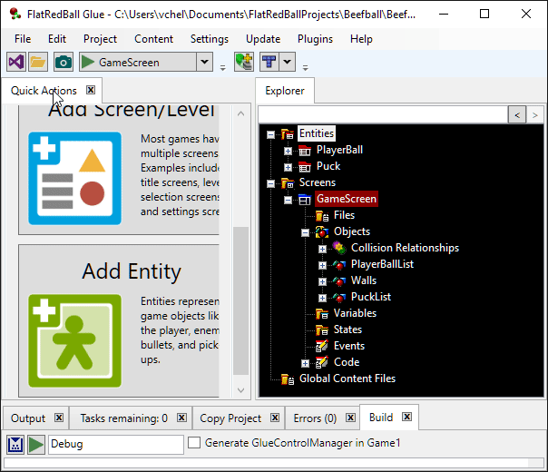
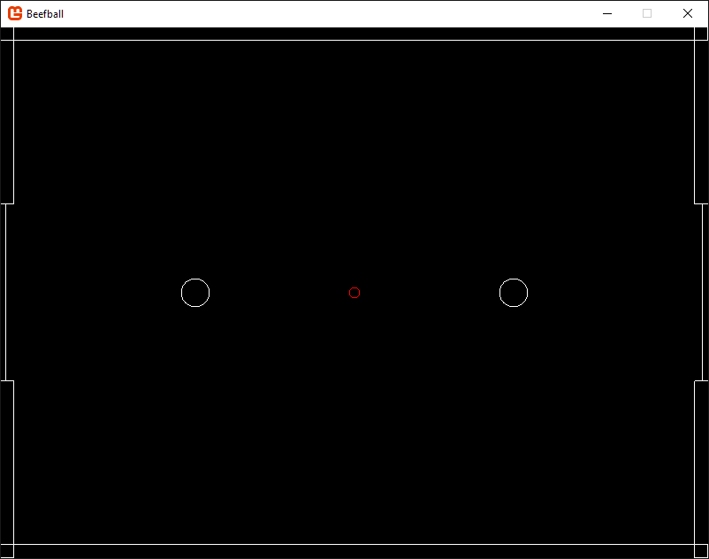

# Scoring and Restarting Rounds

### Introduction

Currently the game is playable, but scoring a goal results in the puck moving off-screen. We'll add logic and data to detect when a goal is scored by resetting the position of all objects and assigning points.

### Creating the Goal Region Rectangles

Conceptually detecting a goal is simple - whenever the Puck collides with a certain area then a goal has been scored. The first step is to define the goal area. First we'll create a Goal entity:

1. Select the **Quick Actions** tab
2. Click the **Add Entity** button
3. Name the entity **Goal**
4. Select the **AxisAlignedRectangle** option under **Collisions**
5. Click **OK**

<figure><figcaption></figcaption></figure>

The default rectangle size for a Goal is too small, so we will make it bigger:

1. Select the **AxisAlignedRectangleInstance** in the **Goal** entity
2. Click the **Variables** tab
3. Change **Height** to **200**


Just like before, we'll also add a list of goals in our GameScreen:

1. Select the Goal entity
2. Select the Quick Actions tab
3. Click the Add Goal List to GameScreen button


Next we'll add two goal rectangles to the GameScreen. Instead of using the Quick Actions tab, we'll show an alternative method here by drag+dropping the Goal entity onto GameScreen. Do this twice, changing the name of the first to LeftGoal and the second to RightGoal:

<figure><figcaption></figcaption></figure>

**Why do goal names matter?** In an earlier tutorial we created the wall collision and named them sequentially (Wall1, Wall2, etc). However, the goals are slightly different - we will be checking which goal we collided with in code to determine whether the left or right team should earn a point. Setting clear names will make it easier to keep track of which goal is on each side.

Next, modify the goals values as follows: LeftGoal:

* X = -410

RightGoal:

* X = 410

### Keeping the PlayerBall Instances in the game

If you tried playing the game, you may have noticed that the PlayerBall instances can leave the screen by passing through the goals. To fix this we can create another CollisionRelationship between the PlayerList and GoalList:

1. Expand the **GameScreen's Objects** folder
2. Drag+drop the **PlayerBallList** onto the **GoalList** object
3. Select the new **PlayerBallVsGoal** collision relationship
4. Click the **Collision** tab
5. Change the **Collision Physics** to **Bounce Collision**
6. Set the **PlayerBall Mass** to **0**

<figure><figcaption></figcaption></figure>

If you run the game, you will no longer be able to leave the play area with either PlayerBall.

<figure><figcaption></figcaption></figure>

### Detecting Goals

Now that we have all of our data and object instances set up, we can write code to detect if a goal has occurred. First we'll need two variables to keep track of score. Add this code to GameScreen.cs at class scope (outside of any methods):

```
 int player1Score = 0;
 int player2Score = 0;
```

Now we'll create another collision relationship, but this time we won't use any physics. Instead, this will be an _event only_ collision relationship. This means that when the relationship detects a collision, we it will _raise an event_ (call a function) which allows us to perform custom logic such as increasing score and resetting the game. First we'll create a collision relationship:

1. Expand the **GameScreen's Objects** folder
2. Drag+drop the **PuckList** object onto the **GoalList**

<figure><figcaption></figcaption></figure>

Now we'll create an event, which is a function that is automatically called whenever the collision occurs:

1. Select the new **PuckVsGoal** collision relationship
2. Select the Collision tab
3. Scroll to the bottom and click the **Add Event** button
4. Accept the defaults and click **OK**

<figure><figcaption></figcaption></figure>

When an event is added, Glue automatically adds a new file to contain events called GameScreen.Events.cs. We can find the new event there. You will need to expand the GameScreen.cs in Visual Studio's Solution Explorer to see this file.

<figure><figcaption></figcaption></figure>

We can check which Goal collided with the Puck in the code and perform different logic. We will Modify the OnPuckVsGoalCollided method and add a new ReactToNewScore method to the GameScreen.Event.cs file as shown in the following snippet:

```
public partial class GameScreen
{
    void OnPuckVsGoalCollided (Entities.Puck puck, Entities.Goal goal)
    {
        if (goal == LeftGoal)
        {
            player1Score++;
            ReactToNewScore();
        }
        else if (goal == RightGoal)
        {
            player2Score++;
            ReactToNewScore();
        }
    }
    
    private void ReactToNewScore()
    {
        PlayerBall1.X = -180;
        PlayerBall1.Y = 0;
        PlayerBall1.Velocity = Microsoft.Xna.Framework.Vector3.Zero;
        PlayerBall1.Acceleration = Microsoft.Xna.Framework.Vector3.Zero;

        PlayerBall2.X = 180;
        PlayerBall2.Y = 0;
        PlayerBall2.Velocity = Microsoft.Xna.Framework.Vector3.Zero;
        PlayerBall2.Acceleration = Microsoft.Xna.Framework.Vector3.Zero;

        Puck1.X = 0;
        Puck1.Y = 0;
        Puck1.Velocity = Microsoft.Xna.Framework.Vector3.Zero;
    }
}
```

Whenever a Puck collides with either goal, we call ReactToNewScore, which resets the player and puck positions and velocities back to their starting states. Notice that the code in GameScreen.Event.cs has access to the player1Score and player2Score variables. This is because the GameScreen is one class split into multiple files using the partial keyword. Therefore, anything you define in Glue or GameScreen.cs is available in GameScreen.Event.cs.

### Conclusion

If you've made it this far, congratulations! You now have a fully-playable game...at least, to the point where you can play with friends. There's still a few more things we'll do to improve the design and add polish. The next tutorial will cover adding a HUD to display player score.
