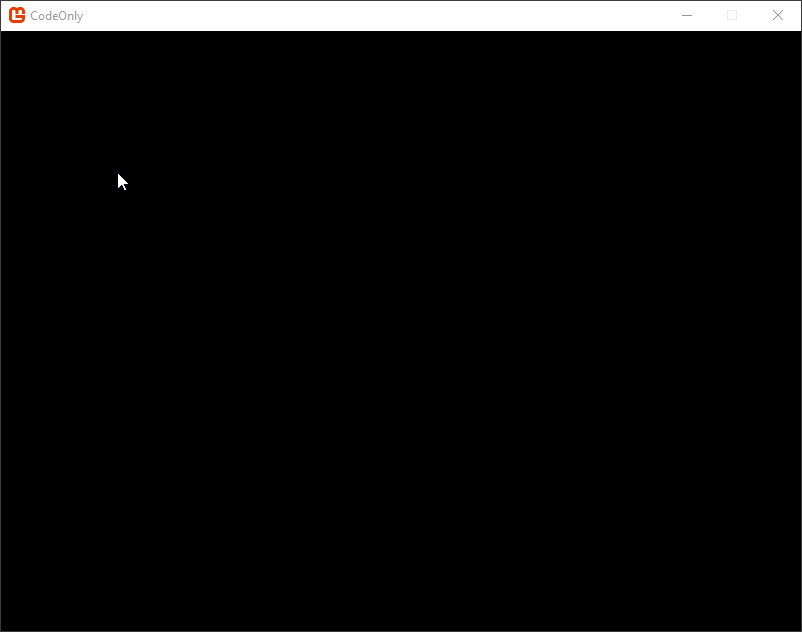

# Adding a Circle

### Introduction

FlatRedBall provides a number of **primitives** which can be used to render your game, and to perform collision. These include:

* Sprite - draws an image to screen. This image is often referred to as a _Texture_.
* Text - draws text to screen.
* Circle - draws a circle to screen and can be used for circular collision.
* AxisAlignedRectangle - draws a rectangle to screen and can be used for collision. AxisAlignedRectangles cannot be rotated.

This tutorial will show you how to create, move, and destroy a circle. It will use input from the keyboard to control the circle.

### A Note About Organization

FlatRedBall provides Screens and Entities for organizing your code. These are built-in to the FlatRedBall editor, but we will not use these in this tutorial so we can focus on the raw FlatRedBall engine. Instead, this tutorial will place all code in Game1. Feel free to move this code to other classes to fit your own patterns.

### Initializing the Camera

FlatRedBall provides a built-in Camera object which can be used to scroll, zoom, or even display graphics using a 3D perspective. For this tutorial we will set our camera up to be a pure 2D camera, where one unit equals one pixel on screen. To do this, add the following code to Game1's Initialize method, after the InitializeFlatRedBall call.

```
Camera.Main.UsePixelCoordinates();
```

### Creating a Circle

The Circle object can be created and managed using the ShapeManager class. The ShapeManager class is responsible for:

* Creation of new instances
* Movement (velocity and acceleration)
* Drawing
* Destroying (removing references)

We will also use the InputManager which provides common classes for accessing keyboard, mouse, and Xbox gamepad input. We will be writing our code in the **Update** method in  **Game1.cs**. By default our Update method looks like this:

```
protected override void Update(GameTime gameTime)
{
    FlatRedBallServices.Update(gameTime);

    FlatRedBall.Screens.ScreenManager.Activity();

    base.Update(gameTime);
}
```

Some of this code is needed if using FRB editor's code generation functionality. If you are absolutely sure you do not want to use the editor, you can remove some code in Update as shown in the following snippet:

```
protected override void Update(GameTime gameTime)
{
    FlatRedBallServices.Update(gameTime);

    base.Update(gameTime);
}
```

To add a circle whenever the mouse is clicked, we will use the Cursor class to detect input and create a new circle, as shown in the following code:

```
protected override void Update(GameTime gameTime)
{
    FlatRedBallServices.Update(gameTime);

    IsMouseVisible = true;

    var cursor = FlatRedBall.Gui.GuiManager.Cursor;

    if(cursor.PrimaryClick)
    {
        var circle = FlatRedBall.Math.Geometry.ShapeManager.AddCircle();

        circle.X = cursor.WorldX;
        circle.Y = cursor.WorldY;
        circle.Radius = 8;
    }

    base.Update(gameTime);
}
```

[](../../media/2019-10-18\_08-40-34.gif)

### Circle Movement

Circles (and most other FlatRedBall objects) can be positioned directly by setting the X and Y values, or their position can be modified by changing their velocity and acceleration values. For example, we can modify the code to give the circle a positive XVelocity and negative YAcceleration:

```
protected override void Update(GameTime gameTime)
{
    FlatRedBallServices.Update(gameTime);

    IsMouseVisible = true;

    var cursor = FlatRedBall.Gui.GuiManager.Cursor;

    if(cursor.PrimaryClick)
    {
        var circle = FlatRedBall.Math.Geometry.ShapeManager.AddCircle();

        circle.X = cursor.WorldX;
        circle.Y = cursor.WorldY;
        circle.Radius = 8;

        circle.XVelocity = 120;
        circle.YVelocity = 220;
        circle.YAcceleration = -180;
    }

    base.Update(gameTime);
}
```

The circles will now move to the right and up, but fall naturally. &#x20;

<figure><figcaption></figcaption></figure>

Notice that the velocity and acceleration values apply automatically once they are assigned. The ShapeManager keeps track of all Circles and applies these values every frame. For more information on working with the Circle object in code, see the [Circle page](../../documentation/api/flatredball/math/geometry/circle.md).
