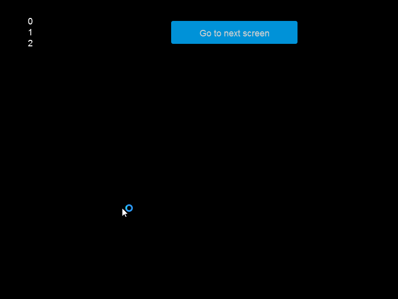

# async and await

### Introduction

FlatRedBall provides a built-in synchronization context enabling the use of async and await keywords while keeping logic on the primary thread. This document discusses common usage of these keywords.

### Async and Await Concepts

For a general discussion of async and await, see the [Microsoft Asynchronous Programming page](https://docs.microsoft.com/en-us/dotnet/csharp/programming-guide/concepts/async/). The most common FlatRedBall usage of asynchronous programming is to delay the execution of some action. For example, consider a player entity which can shoot a bullet. After shooting a bullet the player must reload. The following code could be used to implement shooting and reloading:

```csharp
async void DoShootingActivity()
{
  if(InputManager.Keyboard.KeyPushed(Keys.Space) && this.IsReloading == false)
  {
    this.ShootBullet(); // this is how the bullet in instantiated
    this.IsReloading = true;
    await TimeManager.DelaySeconds(this.ReloadTimeInSeconds);
    this.IsReloading = false;
  }
}
```

In this example, if the player is not reloading, pressing the space bar shoots a bullet and immediately sets the IsReloading variable to true. The remainder of the code (the line setting IsReloading back to false) will not execute until some time passes, as specified in ReloadTimeInSeconds. The example above shows how using async/await can reduce the amount of code needed to perform time-based logic. By contrast, implementing the code above without using the `async` and `await` keywords would require additional variables for timing.

### Task.Delay vs TimeManager.DelaySeconds

Programmers who have performed async programming may be familiar with the **Task.Delay** method. For example, the following code creates a Circle, then destroy it after 3 seconds:

```csharp
var circle = new Circle();
ShapeManager.Add(circle);
await Task.Delay(3);
ShapeManager.Remove(circle);
```

While the code above is functional, it does suffer from a few problems:

* The removal of the circle executes after 3 seconds, even if the game is paused.
* The delay of 3 seconds runs in real-world time, and does not respect slow-motion or fast-forward.
* The Task is not cancelled when the Screen exits. If additional creation logic were performed after Task.Delay, this may result in objects being added to a different screen.

These limitations make sense - the `Task.Delay` method doesn't know about game-specific considerations like pausing or slow motion. By contrast, the `TimeManager.DelaySeconds` method can take all of these concepts into consideration. Therefore, in most cases your game should use `TimeManager.DelaySeconds` instead of `Task.Delay`. Of course, if you are performing logic which should run on a timer regardless of pausing or slow motion, then `Task.Delay` should be used.

For more information about Screen destruction, see the next section.

### Asynchronous Programming and Screen Destruction

FlatRedBall eliminates any FlatRedBall async calls which have yet to execute when transitioning a screen. This allows code to fire-and-forget async calls without needing to consider whether screens have switched since the last call. For example, consider the following code which adds text objects to a stacking Gum container, one each second:

```csharp
void CustomInitialize()
{
    StartAddingTexts();

    Forms.ButtonInstance.Click += (not, used) => MoveToScreen(typeof(Level1));
}

private async void StartAddingTexts()
{
    while(true)
    {
        var text = new TextRuntime();
        text.Text = GumScreen.ContainerInstance.Children.Count.ToString();
        GumScreen.ContainerInstance.Children.Add(text);

        await TimeManager.DelaySeconds(1);
    }
}
```

This code might produce the following result:

<figure><figcaption></figcaption></figure>

Notice that although the code has a while(true) statement, the code does not block the execution of the normal game loop. In other words, the button still shows its hover state in response to cursor movement.

However, a loop like this would normally never end, but if we move to the next screen the loop will end. In short, code can be safely written without considering whether the screen has changed when using await calls.

#### async Calls and Screen.CancellationTokenSource

All async FlatRedBall calls automatically cancel when the Screen, but if you are making calls to non-FlatRedBall async calls which should cancel when the Screen is destroyed, you can use the current Screen's CancellationTokenSource.

For example, consider a situation where a sound effect is played after 1 second of actual real-world time. The following code could be used to properly handle the Screen exiting:

```csharp
public async void PlaySongAfterOneSecond()
{
    try
    {
       await Task.Delay(
          1_000, 
          ScreenManager.CurrentScreen.CancellationTokenSource.Token);
   
       AudioManager.PlaySound(SoundToPlay);      
    }
    catch(OperationCanceledException)
    {
       // do nothing, it got cancelled
    }
}
```
