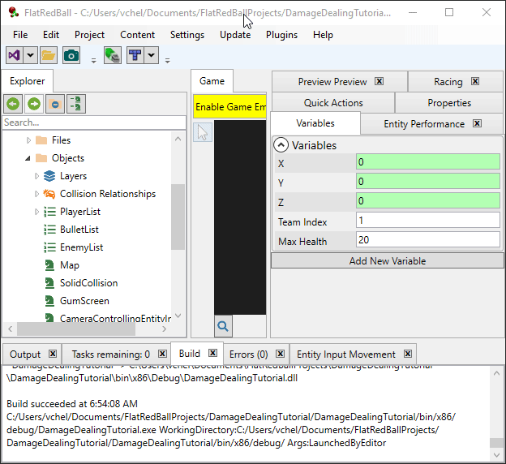
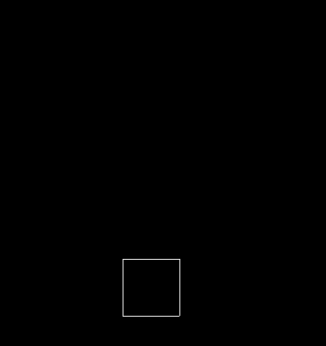

# Team Index

### Introduction

The previous tutorial shows how to create new Entities which implement the IDamageable and IDamageArea interfaces. In some cases this results in the automatic creation of collision relationships, and other times manual collision relationships must be created (if the two opposing entity types have the same Team Index). This tutorial explores the Team Index property and its affect on the generated damage dealing code. This tutorial assumes a project which contains:

* A Player entity implementing IDamageable with Team Index 0
* A Bullet entity implementing IDamageArea with Team Index 0
* An Enemy entity implementing IDamageable with Team Index 1
* A collision relationship EnemyVsBullet

### Shooting Bullets

To test damage dealing, we need instances of entities which collide with one-another. Our game automatically contains a Player instance (this is created by the wizard) so we will use this instance to create bullets. To do this, add the following code to Player.cs CustomActivity:

```csharp
private void CustomActivity()
{
    if(InputManager.Keyboard.KeyPushed(Microsoft.Xna.Framework.Input.Keys.Space))
    {
        var bullet = Factories.BulletFactory.CreateNew(this.Position);
        bullet.YVelocity = 200;
    }

}
```

Now the Player creates bullets when the Space key is pressed. Note that if you have a gamepad connected, the player automatically uses that as its input device. The space bar still shoots bullets, but movement will be controlled by the gamepad.

<figure><figcaption><p>Player moving and shooting bullets</p></figcaption></figure>

### Adding Enemies

Next we'll create Enemy instances to shoot. To do this, add the following code to the GameScreen.cs CustomActivity:

```csharp
void CustomActivity(bool firstTimeCalled)
{
    var cursor = GuiManager.Cursor;
    if (cursor.PrimaryPush)
    {
        Factories.EnemyFactory.CreateNew(cursor.WorldPosition);
    }
}
```

Now we can click on the screen with the mouse to add enemies, and we can shoot these enemies with bullets.a

<figure><figcaption><p>Bullets destroying Enemy instances</p></figcaption></figure>

### Destroy Bullet on Damage

You may have noticed that your enemies are destroyed by a single shot. We haven't set up the details for how damage should be dealt, so the default behavior is for bullets to deal damage to enemies every frame. This results in enemy health being drained very quickly, resulting in the enemies dying.

You may have also noticed that the bullets continue to move upward after destroying the enemy. We can control this behavior through an option on the collision relationships.

If we want the bullets to be destroyed after hitting the enemy, we can check the Destroy Bullet on Damage option on the **EnemyVsBullet** collision relationship.


This option provides a convenient way to handle a common situation - destroying the damage area (Bullet) on collision. Note that we can control whether the bullet should always be destroyed, or only if damage is dealt. Later tutorials show how to adjust the amount of damage dealt.

Also, keep in mind that these options are here for convenience but you are not required to use them. You can always leave them unchecked and handle everything manually in a collision relationship event.

With this option checked, the bullets are destroyed on collision, and each enemy takes multiple hits to be destroyed.

<figure><figcaption><p>Enemies taking multiple hits and the bullets being destroyed on collision</p></figcaption></figure>

### Deal Damage in Generated Code

The EnemyVsBullet collision relationship also has the **Deal Damage in Generated Code** option checked. If this is checked, the following occurs on an Enemy vs Bullet collision:

1. The team index of the bullet and enemy are compared to see if they differ.
2. If so, the enemy performs _damage over time_ checks to make sure it can take damage from the bullet. At this point our game does not have bullets which perform damage over time, but we will cover this in a later tutorial.
3. Damage calculations are performed by raising events which can modify how much damage the enemy receives. Currently we are not handling these events, but we will cover this in a future tutorial.
4. Health is subtracted from the enemy.
5. The enemy is killed (Destroy is called) if the enemy has less than or equal to 0 health

We can see the this logic work by shooting an enemy enough times to kill it - by default this is 10 shots.

<figure><figcaption><p>Enemy dying after 10 shots</p></figcaption></figure>

The default variables used to deal damage and kill the enemy are defined in the Entity and Bullet entities. All entities created with the IDamageable interface default to have 100 health.


All Entities created with the IDamageArea interface default to dealing 10 damage.


If we change these values we can change how many shots it takes to kill an enemy. For example, if the enemy is changed to have 20 health, it only takes 2 shots to kill each enemy.

<figure><figcaption><p>Enemies being killed with 2 shots</p></figcaption></figure>

### Team Index in Code

As mentioned before, the collision relationship EnemyVsBullet results in damage dealing code because the Enemy and Bullet have different team indexes. Our bullets have a default Team Index of 0, so they will not deal damage to the Player even if a PlayerVsBullet collision relationship exists. To show this, we'll create a collision relationship by dragging PlayerList onto BulletList (you may have already done this in an earlier tutorial).

<figure><figcaption><p>Creating a PlayerVsBullet collision relationship</p></figcaption></figure>

Even with this collision relationship, Bullets which are fired by the Player do not deal damage to the player - the generated code checks team index and both have a team index of 0 so no damage is dealt ot the player.

<figure><figcaption><p>Player shooting bullets</p></figcaption></figure>

We may want enemies to be able to shoot bullets at the player. These bullets should have the Enemy Team Index (a value of 1) which can be assigned in code. To do this, add the following code to Enemy.cs CustomActivity:

```csharp
double lastTimeShot;
private void CustomActivity()
{
    if(TimeManager.CurrentScreenSecondsSince(lastTimeShot) > 2)
    {
        var bullet = Factories.BulletFactory.CreateNew(this.Position);
        bullet.YVelocity = -100;
        bullet.TeamIndex = this.TeamIndex;
        lastTimeShot = TimeManager.CurrentScreenTime;
    }

}
```

Also, you should check the option to destroy the bullet when it hits the player, but only if damage is dealt.

<figure><figcaption><p>Destroy bullet on damage but only if damage is dealt</p></figcaption></figure>

Now each Enemy shoots a bullet every 2 seconds which travels downward and which shares the same Team Index as the Enemy. These bullets now collide with the Player, deal damage to the Player, and ultimately kill the Player once the Player's health has dropped to 0.

<figure><figcaption><p>Enemies shooting bullets</p></figcaption></figure>

When developing a full game, keep the following in mind:

* Values like MaxHealth, TeamIndex, and DamageToDeal can all be set in the FlatRedBall Editor at the entity level. These should be used for useful defaults, but they can all be assigned in code.
* Variables to control logic such as how frequently enemies shoot and bullet speed should be controlled through variables in the FlatRedBall Editor. These values were hardcoded above to keep the tutorial short, but do not reflect how full games should be structured.

### Conclusion

This tutorial shows how the built-in logic in collision relationships results in automatic damage dealing and killing (destroying) of entities which can take damage. It also covered how to assign the Team Index variable in code to control whether a pair of entities result in damage dealing logic being applied. The next tutorial shows how to assign events to modify how much damage is dealt and to react to damage dealt visually.
