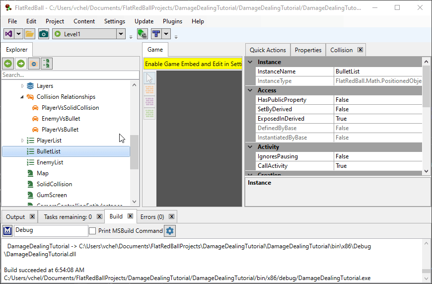
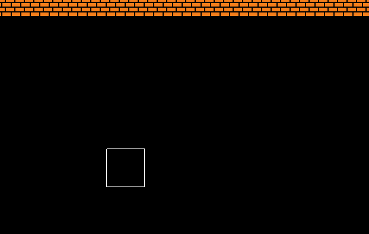

# IDamageArea Removal

### Introduction

The removal of IDamageArea entities can sometimes be handled automatically by collision relationshps, but sometimes this removal requires custom code. This tutorial discusses how IDamageArea removal can be customized.

### BulletVsEnemy Automatic Removal

The previous tutorials set up a BulletVsEnemy collision relationship which resulted in the removal of the Bullet when it collides with the enemy. To review, the removal of the bullet required the following:

* A collision relationship between BulletList and EnemyList exists in GameScreen
* The Enemy and Bullet have different team indexes
* The BulletVsEnemy collision relationship has the **Destroy Bullet on Damage** option checked

Collision relationships with IDamageArea lists always display the Destroy option, even if the collision relationship is not against an IDamageable. This allows IDamageAreas such as Bullets to destroy themselves when colliding with non-IDamageArea objects such as solid collision. For example, a collision relationship between BulletList and SolidCollision can be added to the GameScreen to automatically destroy bullets. This collision relationship will have the **Destroy Bullet on Damage** option checked by default.

<figure><figcaption></figcaption></figure>

Bullets will now be destroyed automatically when they collide with the wall.

<figure><figcaption></figcaption></figure>

### Damage Over Time and Manual Removal

Although the automatic removal is handy, we may want to control the removal of bullets. For example, we can modify our game so the bullets do not immediately disappear when hitting an enemy, but instead deal continuous damage over time. First, we'll modify the BulletVsEnemy collision relationship so bullets are not removed automatically by unchecking the **Destroy Bullet on Damage** option.


Now bullets will continually deal damage to the Enemy, one time per frame. This results in enemies dying very quickly.

<figure><figcaption></figcaption></figure>

### Seconds Between Damage Variable

As mentioned above, since the Bullet instance does not get destroyed immediately, it continues to live and it deals damage every frame. In this case the game runs at 60 frames per second, dealing 10 damage each frame. Therefore, enemies die after overlapping a bullet after 10 frames (1/6 of a second). We can change this behavior by changing the Bullet's default Seconds Between Damage. For example, if we change the value to 0.5, then bullets deal damage once every half second.


Each enemy automatically keeps track of the last time it took damage, so it will take damage only 2 times per second. To see this clearly, we'll also change the bullet speed in Player.cs so bullets move slower (50 instead of 200 pixels per second).

```csharp
private void CustomActivity()
{
    float bulletSpeed = 50;
    if(InputManager.Keyboard.KeyPushed(Microsoft.Xna.Framework.Input.Keys.Space))
    {
        var bullet = Factories.BulletFactory.CreateNew(this.Position);
        bullet.YVelocity = bulletSpeed;
    }
    if (InputManager.Keyboard.KeyPushed(Microsoft.Xna.Framework.Input.Keys.LeftAlt))
    {
        var bullet = Factories.BulletFactory.CreateNew(this.Position);
        bullet.IsFireElement = true;
        bullet.YVelocity = bulletSpeed;
    }
}
```

<figure><figcaption></figcaption></figure>

### Handling Removal in Custom Code

In this case the removal of our bullets is ultimately handled by collision with SolidCollision. Level 1 (by default) is surrounded by solid collision, so the bullets will eventually collide with a wall and be removed. Of course, this may not always be the case, or your game may require removal of bullets after travelling a certain amount of distance, or after being alive for a certain amount of time. In this case, you can still add logic to the Bullet entity to destroy bullets based on any condition you need. For example, bullets could be destroyed after a few seconds using the following code in Player.cs.

```csharp
bullet.Call(bullet.Destroy).After(5);
```

The usage of automatic removal through collision relationships does not prevent you from also adding custom code for entity removal. You can mix these two approaches to achieve the desired entity removal.

### Conclusion

This tutorial covers the different ways to remove an IDamageArea entity using automatic removal or manual removal. It also covers how to deal damage over time to IDamageables.
