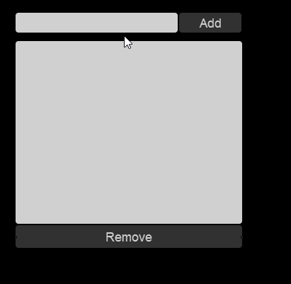

# Binding FlatRedBall.Forms

### Introduction

Binding can be performed on FlatRedBall Forms objects similar to binding on other UI frameworks such as WPF and Xamarin.Forms. This tutorial provides a binding example using Button, TextBox, and ListBox instances.

### Example Screen

This tutorial uses a Glue screen which contains the following:

* TextBoxInstance (TextBox)
* AddButton (Button)
* ListBoxInstance (ListBox)
* RemoveButton (Button)

These instances are all default FlatRedBall.Forms objects which are available in all FlatRedBall projects created with the wizard.


### Creating a ViewModel

Like the previous tutorial, this tutorial uses a ViewModel for binding. The ViewModel will need properties to bind to the following UI properties:

* The string displayed in the text box.
* Whether the Add button is enabled. It is enabled only if there is a string in the text box.
* The list of objects in the list box.
* The selected item in the list box.
* Whether the Remove button is enabled. It is only enabled if there is a selection in the ListBox.

Not only will we be binding to FlatRedBall.Forms objects, but the binding will be _two way_ binding. This means that the UI objects can make changes to the view model. For example, when the user clicks on an item in the list box, the SelectedItem is updated automatically.

```csharp
class FormsScreenViewModel : ViewModel
{
    public string TextBoxText
    {
        get => Get<string>();
        set => Set(value);
    }

    [DependsOn(nameof(TextBoxText))]
    public bool IsAddButtonEnabled => !string.IsNullOrEmpty(TextBoxText);

    public ObservableCollection<string> ListBoxItems
    {
        get => Get<ObservableCollection<string>>();
        private set => Set(value);
    }

    public string SelectedItem
    {
        get => Get<string>();
        set => Set(value);
    }

    [DependsOn(nameof(SelectedItem))]
    public bool IsRemoveButtonEnabled => !string.IsNullOrEmpty(SelectedItem);

    public FormsScreenViewModel()
    {
        ListBoxItems = new ObservableCollection<string>();
    }

}
```

#### Two-Way Properties

The ViewModel includes a number of properties which will be controlled by the UI elements:

* TextBoxText
* SelectedItem

Notice that although these are controlled by the UI rather than code, they are written identical to other ViewModel properties. Also, they can be used as dependency properties for properties like IsAddButtonEnabled and IsRemoveButtonEnabled. In other words, the binding properties and dependency attributes will result in the add and remove buttons automatically enabling and disabling themselves according to properties that they depend on.

#### ObservableCollection

The ObservableCollection is used as the type for the ListBoxItems. This enables the ListBox to react to any items being added or removed. Whenever the ListBoxItem's Add or Remove methods are called, the ListBox will create ListBoxItems automatically. Notice that the ListBoxItems property has a private setter - there is no reason to make this public since the ObservableCollection will never change after it has been created.

### Assinging BindingContext

The ViewModel can be created in the FlatRedBall screen class, just like in the previous tutorial. Binding to FlatRedBall.Forms object properties is done the same way as binding to Gum objects - by using the SetBinding method.

```csharp
public partial class FormsScreen
{
    FormsScreenViewModel ViewModel;

    void CustomInitialize()
    {
        ViewModel = new FormsScreenViewModel();

        Forms.BindingContext = ViewModel;

        Forms.TextBoxInstance.SetBinding(
            nameof(Forms.TextBoxInstance.Text), 
            nameof(ViewModel.TextBoxText));

        Forms.AddButton.SetBinding(
            nameof(Forms.AddButton.IsEnabled), 
            nameof(ViewModel.IsAddButtonEnabled));

        Forms.ListBoxInstance.SetBinding(
            nameof(Forms.ListBoxInstance.Items), 
            nameof(ViewModel.ListBoxItems));

        Forms.ListBoxInstance.SetBinding(
            nameof(Forms.ListBoxInstance.SelectedObject), 
            nameof(ViewModel.SelectedItem));

        Forms.RemoveButton.SetBinding(
            nameof(Forms.RemoveButton.IsEnabled), 
            nameof(ViewModel.IsRemoveButtonEnabled));

        Forms.AddButton.Click += (not, used) =>
        {
            ViewModel.ListBoxItems.Add(ViewModel.TextBoxText);
            ViewModel.TextBoxText = null;
        };

        Forms.RemoveButton.Click += (not, used) =>
        {
            ViewModel.ListBoxItems.Remove(ViewModel.SelectedItem);
        };
    }
    ...
```

Like the previous tutorial, the add and remove buttons do not access any properties on the UI elements - only properties on the ViewModels are accessed.

<figure><figcaption><p>Using the TextBox, Add Button, and Remove Button to add and remove items from the ListBox</p></figcaption></figure>

#### Forms.BindingContext

Notice that the BindingContext is assigned on the Forms object. The Forms.BindingContext property is the same as the GumScreen.BindingContext property, so either can be assigned.
