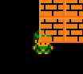

# Adding New Types to FlatRedBall.Forms Library

### Introduction

This section discusses how to add new element types to FlatRedBall.Forms. This section is for maintainers of FlatRedBall who would like to add new types to be used across all projects and to be included in new projects created with the wizard.

The high-level steps for creating a new Forms object are:

1. Define the class in FlatRedBall.Forms shared code project
2. Identify the required and optional Gum objects for your new control
3. Create a new Gum component in the embedded Gum project in the Gum plugin
4. Add a behavior for the new control
5. Implement the new behavior on the new component
6. Update `FormsControlInfo` and `GetIfIsCompleteFulfillment` to include your new behavior and control
7. Test the new control in a new project

You can verify that the Gum plugin code generation logic has picked up on the new behavior by checking a game's `GumIdbExtensions` class. for the presence of your new control.

<figure><figcaption>
Entries for new controls appear in the GumIdbExtensions code file
</figcaption></figure>

