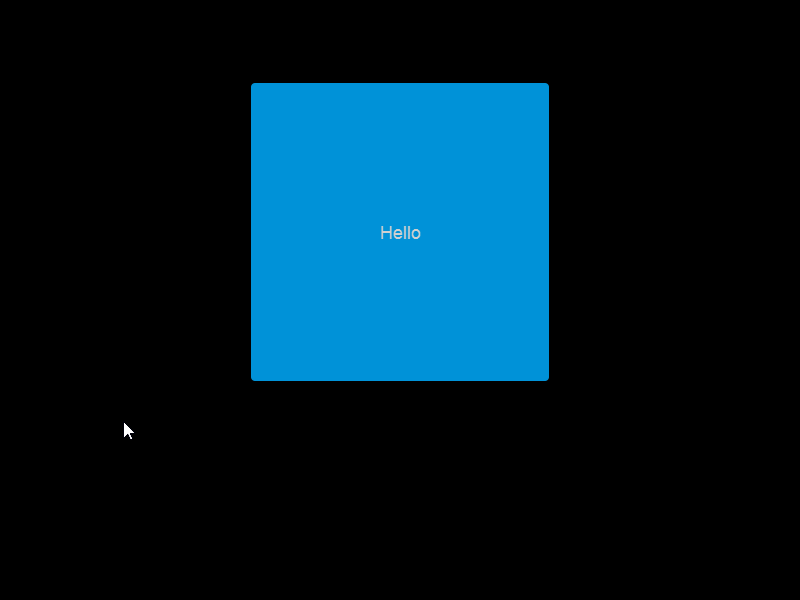

# Forms vs Gum in Code

### Introduction

FlatRedBall Forms is a set of classes which are used to give UI controls _automatic_ behavior. When using FlatRedBall Forms, your code has access to the FlatRedBall Forms object (such as **Button**) as well as the _Visual_ for the Forms object (such as the component **DefaultForms/Button**). Since your code has access to both the Forms and Gum object, some confusion may arise about which object to interact with in code.

This guide discusses the relationship between the Forms and Gum objects, and provides some guidelines to determine whether to interact with one of the other.

The most important concept here is - some components in your project are Forms types, and some are not. **Only Forms-implementing component instances appear in the Forms property, but all instances appear in the GumScreen property**.

### Button Forms and Gum Object

To understand how Forms and Gum objects interact, we will consider a simple example - a Screen with a single Button. The following image shows a default Button instance in a Gum screen:


In this example, the MenuScreenGum is loaded by the FlatRedBall screen **MenuScreen.**


We can access both the Gum and Forms objects in Visual Studio as shown in the following code. Keep in mind that every Screen with Gum and Forms objects will have **GumScreen** and **Forms** properties. These make it easy to access objects the same way no matter which Screen you are working on:

```csharp
public partial class MenuScreen
{
    void CustomInitialize()
    {
        // Code can access either Gum or Forms object
        var buttonAsGumObject = GumScreen.ButtonInstance;
        var buttonAsFormsObject = Forms.ButtonInstance;

        // Set the width through the Gum object...
        buttonAsGumObject.Width = 300;
        // ...and the height through the Forms object
        buttonAsFormsObject.Height = 300;
        
        // Sometimes the syntax is not the same, such as with clicks:
        buttonAsGumObject.Click += (buttonClicked) => { /* code here */ };
        buttonAsFormsObject.Click += (sender, args) => { /* code goes here */ };

    }
    ...
```

Notice that setting width and height modifies the same object at runtime - it appears as a square. Also, filling in the two click handlers would result in both handlers being called when the button is clicked.


You may be wondering - which object should I access in code? The answer is - usually it's best to use the Forms object. If you end up needing to make changes to the Gum object (such as to change its position or size), it's worth considering whether this change should actually be done in code. Most of the time these changes should be performed in the Gum tool.

### Forms is a Wrapper to Standardize and Automate Behavior

FlatRedBall.Forms objects are _wrappers_ around Gum objects. For example, in the example above we have a Forms.ButtonInstance. This object has a reference to the Gum object. The Forms object automates behavior so that the Gum object behaves like a UI element. For example, the Forms Button object automatically modifies the state of the button in response to cursor hovers and clicks. No custom code is necessary to achieve this behavior.

<figure><figcaption></figcaption></figure>

This behavior is convenient, but it is not particularly complex - at least not conceptually. The Forms object is responsible for detecting if the cursor is hovering over the button, or if the left mouse button is pressed. If so, the Forms object modifies the state of the button. These states are part of the default Button control, and can be inspected (and modified) in Gum.

<figure><figcaption></figcaption></figure>

The Forms Button logic is responsible for setting the button's state, and it will do so in response to any UI behavior. Therefore, manually setting the Gum object's state is not recommended - it will be over written by the Forms object as shown in the following code and animation:

```csharp
void CustomInitialize()
{
    // Code can access either Gum or Forms object
    var buttonAsGumObject = GumScreen.ButtonInstance;

    buttonAsGumObject.CurrentButtonCategoryState = 
        GumRuntimes.DefaultForms.ButtonRuntime.ButtonCategory.Pushed;
}
```

<figure><figcaption></figcaption></figure>

Notice that the state is not immediately changed, but rather only when the mouse moves over the button. Once the mouse hovers over the button, its state changes immediatelz. After the mouse leaves the button, the state is reverted to Enabled. Setting the state through the Gum object can produce confusion. For example, a button may appear pushed or disabled if the state is manually assigned; however, the actual behavior of the button will not match a disabled state. Therefore, the button's state (specifically the **CurrentButtonCategoryState**) is controlled by the Forms Button object. The Forms Button object will modify the state according to standard button behavior, so custom code should not modify the Gum button's state.

### Forms Property Contains Only Forms Objects

The Forms property in FlatRedBall Screens contains properties for all Forms objects in the Gum screen, and only the Forms objects. Therefore, any object that is part of the Gum screen which is not a Forms type (such as Button or TextBox) does not appear in the Forms property.

For example, consider the following screen in Gum:

<figure><figcaption><p>Forms and normal Gum instances in a Screen</p></figcaption></figure>

The left column consists of Forms controls: a Button, ListBox, and TextBox. The right column consists of instances of Gum objects which do not implement any Forms controls: a Text, ColoredRectangle, and Container.

In code, the Forms property **only contains references** to the Gum-implementing instances. Therefore, the following code is valid:

```csharp
var button = Forms.ButtonInstance;
var listBox = Forms.ListBoxInstance;
var textBox = Forms.TextBoxInstance;
```

However, the following is not valid code because these instances are not Forms-implementing types:

```csharp
// None of these are valid:
var text = Forms.TextInstance;
var rectangle = Forms.ColoredRectangleInstance;
var container = Forms.ContainerInstance.
```

To access the non-forms objects, you must use the GameScreen object. For example, the following code is valid:

```csharp
var text = GumScreen.TextInstance;
var rectangle = GumScreen.ColoredRectangleInstance;
var container = GumScreen.ContainerInstance;
```

Keep in mind that an instance in a Gum screen will **always be a Gum object** but only **sometimes be a Forms object**. This means that any instance that is a Forms object can also be accessed through GumScreen as shown in the following code:

```csharp
var button = GumScreen.ButtonInstance;
var listBox = GumScreen.ListBoxInstance;
var textBox = GumScreen.TextBoxInstance;
```

As mentioned above, accessing Forms objects through GumScreen is generally not good practice.

### Additional Examples of Automatic Behavior

FlatRedBall Forms contains many types of controls each with their own type of automatic behavior. The following list is an example (not a complete list) of properties which are controlled by Forms behaviors, and which should not be modified on the Gum object:

* Button **ButtonCategoryState** controlled by cursor and **Button.IsEnabled**
* RadioButton **RadioButtonCategoryState** controlled by **RadioButton.IsChecked**
* ComboBox ListBoxInstance **Visible** controlled by **ComboBox.IsDropDownOpen**
* ListBox and ScrollViewer VerticalScrollBarInstance **Visible** controlled by **ScrollViewer.VerticalScrollBarVisibility** and the number of items in the list
* Slider ThumbInstance **X** controlled by **Slider.Value**, **Slider.Minimum**, and **Slider.Maximum**
* TextBox.CaretInstance **X** and **Y** controlled by **TextBox.CareIndex** and **TextBox.TextWrapping**

As mentioned above, this is not a complete list. In general, if you plan on modifying a Forms object in code, you should first look to the Forms object to see if it provides a way to modify the object as desired. If your custom code modifies the Gum properties mentioned above, these changes will likely be overwritten by automatic Forms behavior.

### Benefits of Standardization

FlatRedBall Forms also provides a way to standardize UI programming. When working against Gum objects, the types of the Gum objects depend on the project. For example, one project may use the default Button object for its Button, whereas another project may create a customized button called StyledButton which contains a different set of values. In both cases (assuming the behaviors have been set up correctly in Gum), both objects will produce a Forms Button, and programming against both will be identical. This makes it easier to learn the Forms syntax once and code the same everywhere.

### When to Modify Gum Objects

The Forms objects standardize syntax, but they do not provide the full control that can be provided by access to the Gum objects. For example, consider a game which lets the player choose which save slot to load. Each save slot may be represented by a Button, and the Text on the button may display the name of the character. However, the game may also include additional information on each save slot, such as the level of the character, or the percentage completed in the game. These properties are not part of the Button class because they are custom to a particular game. In this case, the code may need to access the Gum object to modify the CharacterLevelText or PercentageCompletedText objects. Forms objects also provide a subset of the standard Gum layout variables. The following lists the current set of layout variables available to every Forms control:

* X
* Y
* Width
* Height

Games which need to modify the layout in code may benefit from access to the full set of Gum layout variables:

* X
* XUnits
* XOrigin
* Y
* YUnits
* YOrigin
* Width
* WidthUnits
* Height
* HeightUnits

To access the full set (units and origin values), the Gum object must be accessed.
