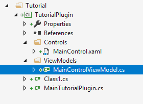
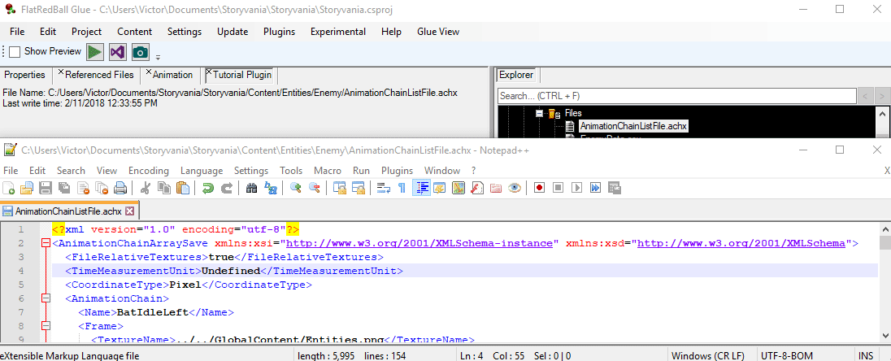

# Using MVVM

### Introduction

The WPF framework can be used with the MVVM (https://en.wikipedia.org/wiki/Model–view–viewmodel) pattern. Glue provides a useful ViewModel class which can be used as the base class for view models in plugins. This tutorial will show you how to use the MVVM pattern to display data.

### Creating a ViewModel

Developers familiar with MVVM can implement view models according to their own preferred patterns or frameworks, but we will be covering one way to implement view models using Glue's base ViewModel  class. Specifically we will be modifying the plugin from the previous tutorial to display information about the selected file. First, we'll create a view model for the control:

1. Right-click on the plugin project and select **Add** -> **New Folder**
2. Name the folder **ViewModels**
3. Right-click on the newly-created folder and select **Add** -> **Class**
4. Enter the name **MainControlViewModel**
5. Click **Add**



Next we'll modify the view model to implement the base ViewModel class and to have properties for displaying information about the file. Modify MainControlViewModel.cs as shown in the following code snippet:

```lang:c#
using FlatRedBall.Glue.MVVM;

namespace TutorialPlugin.ViewModels
{
    class MainControlViewModel : ViewModel
    {
        public string FileNameDisplay
        {
            get => Get<string>(); 
            set => Set(value); 
        }

        public string WriteTimeDisplay
        {
            get => Get<string>(); 
            set => Set(value); 
        }
    }
}
```

The code above can be used to display the file name and write time of the selected file in our MainControl. Next, we'll update the XAML to add TextBlocks with binding, as shown in the following XAML:

```lang:c#
<UserControl x:Class="TutorialPlugin.Controls.MainControl"
             xmlns="http://schemas.microsoft.com/winfx/2006/xaml/presentation"
             xmlns:x="http://schemas.microsoft.com/winfx/2006/xaml"
             xmlns:mc="http://schemas.openxmlformats.org/markup-compatibility/2006" 
             xmlns:d="http://schemas.microsoft.com/expression/blend/2008" 
             xmlns:local="clr-namespace:TutorialPlugin.Controls"
             mc:Ignorable="d" 
             d:DesignHeight="300" d:DesignWidth="300">
    <StackPanel>
        <TextBlock Text="{Binding FileNameDisplay}"></TextBlock>
        <TextBlock Text="{Binding WriteTimeDisplay}"></TextBlock>
    </StackPanel>
</UserControl>
```

Finally we can create add a MainControlViewModel  instance to our MainTutorialPlugin  class and assign the view model in the HandleItemSelected  method, as shown in the following code snippet:

```lang:c#
using FlatRedBall.Glue.Plugins;
using FlatRedBall.Glue.Plugins.ExportedImplementations;
using System;
using System.Collections.Generic;
using System.Linq;
using System.Text;
using System.Threading.Tasks;

namespace TutorialPlugin
{
    [System.ComponentModel.Composition.Export(typeof(FlatRedBall.Glue.Plugins.PluginBase))]
    public class MainTutorialPlugin : FlatRedBall.Glue.Plugins.PluginBase
    {
        Controls.MainControl mainControl;
        PluginTab tab;

        public override string FriendlyName => "Tutorial Plugin";

        ViewModels.MainControlViewModel viewModel;

        public override void StartUp()
        {
            this.ReactToItemSelectHandler += HandleItemSelected;
        }

        private void HandleItemSelected(TreeNode selectedTreeNode)
        {
            var currentFile = GlueState.Self.CurrentReferencedFileSave;

            if(currentFile == null)
            {
                tab?.Hide();
            }
            else
            {
                if(tab == null)
                {
                    mainControl = new Controls.MainControl();
                    viewModel = new ViewModels.MainControlViewModel();
                    mainControl.DataContext = viewModel;
                    tab = this.CreateTab(mainControl, "Tutorial Plugin");
                }

                tab.Show();

                var fullFileName = GlueCommands.Self.ProjectCommands.MakeAbsolute(
                    currentFile.Name, forceAsContent: true);

                UpdateToFullFile(fullFileName);
            }
        }

        private void UpdateToFullFile(string fullFileName)
        {
            viewModel.FileNameDisplay = $"File Name: {fullFileName}";
            var writeTime = System.IO.File.GetLastWriteTime(fullFileName);
            viewModel.WriteTimeDisplay = $"Last write time: {writeTime}";
        }
    }
}
```

Now we can run our project and see information about the selected file.


### Reacting to File Changes

Glue can notify plugins when a file changes. To respond to these changes, the plugin can use the ReactToFileChangeHandler  delegate, as shown in the following code snippet:

```lang:c#
...

public override void StartUp()
{
    this.ReactToItemSelectHandler += HandleItemSelected;
    this.ReactToFileChangeHandler += HandleFileChanged;
}

private void HandleFileChanged(string fileName)
{
    var currentFile = GlueState.Self.CurrentReferencedFileSave;

    if(currentFile != null)
    {
        var currentFullFileName = GlueCommands.Self.ProjectCommands.MakeAbsolute(
            currentFile.Name, forceAsContent: true);

        if(currentFullFileName == fileName)
        {
            viewModel.FileNameDisplay = $"File Name: {fileName}";
            var writeTime = System.IO.File.GetLastWriteTime(fileName);
            viewModel.WriteTimeDisplay = $"Last write time: {writeTime}";
        }
    }
}

...
```

We an change files which are selected and the plugin will be notified of the change and will automatically update the displayed information.&#x20;

&#x20;&#x20;

<figure><figcaption></figcaption></figure>
