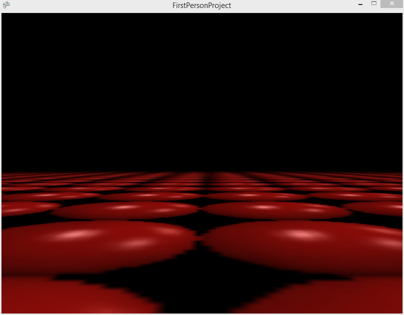

# How to Create a First Person Camera

### Introduction

This tutorial shows how to make an Entity which controls the Camera in first person mode. The general steps we'll follow are:

1. Create a FlatRedBall project
2. Create a large repeating Sprite which we'll use for the ground
3. Create an Entity which will control the Camera (called CameraController)
4. Set the initial position of our CameraController instance in our Screen
5. Implement code to move and look around

### Create a 3D project

If you already have a project created, you can skip this step. If not, to Create a project:

1. Launch the FRB Editor
2. Select File->New Project
3. Name your project **FirstPersonProject**
4. Uncheck the **Open New Project Wizard** option - we will be creating our own game fully from scratch
5. Click **Create Project!**

Now we'll set the Camera to be in 3D mode:

1. In the FRB Editor, click the camera icon
2. Change the **Perspective** to **3D**


Finally create a Screen which will contain the rest of our project. This is not necessary if you already have a GameScreen:

1. Select the **Quick Actions** tab
2. Click **Add Screen/Level**
3. Uncheck the **Add LayeredTileMap** option unless you intend to use Tiled for your levels. To keep this tutorial short, we will skip this step.
4. Click OK to create a new screen called GameScreen

### Create a large repeating Sprite

Now we'll create a large Sprite which will serve as our ground. To create this:

1. Download this file to your computer. Note that you should rename it to not begin with a letter, so renaming it as redball.png is a good idea: [](../../media/2016-01-redball-1.png)
2. Drag+drop the newly-downloaded .png file onto GameScreen's Files in the FRB Editor
3. Select the **Quick Actions** tab
4. Click **Add Object to Game Screen**
5. Search for **Sprite**
6. Click **OK**

Now that the Sprite has been created, let's make it really large and repeating:

1. Select the new SpriteInstance
2. Click the **Variables** tab
3. Set the Sprite's Texture to **redball**
4. Set the Sprite's TextureAddressMode to **Wrap**
5. Set the Sprite's **Right Texture Pixel** to 32000 - this makes the Sprite repeat 1000 times on the X axis
6. Set the Sprite's **Bottom Texture Pixel** to 32000 - this makes the Sprite repeat 1000 times on the Y axis


### Create CameraController Entity

Now we'll create an Entity which will control the Camera. To do this:

1. In the FRB Editor, right-click on Entities
2. Select **Add Entity**
3. Name the new entity "CameraController" and click OK

Next let's have the CameraController control our Camera. To do this:

1. Right-click on CameraController's Objects
2. Select "Add Object"
3. Verify "FlatRedBall or Custom Type" is selected.
4. Select "Camera" and click OK
5. Drag+drop the "CameraController" into the GameScreen's **Objects** folder to create an instance of CameraController

### Set CameraController1's Initial position

Next we'll set up our initial position of the CameraController1. We'll be setting position in the FRB Editor, but we'll set the rotation and orientation in code since the FRB Editor does not allow us to set some of these values. To set the CameraController1's initial values:

1. Select CameraController1 in the FRB Editor
2. Set Z to 10. This is the height that the Camera will be positioned above the ground
3. Open Visual Studio
4. Open CameraController.cs which is located in the Entities folder
5. Add the following code to CustomInitialize:

```csharp
this.CameraInstance.UpVector = new Vector3(0, 0, 1);
this.CameraInstance.RelativePosition = new Vector3();
this.RotationX = Microsoft.Xna.Framework.MathHelper.PiOver2;
```

At this point we can run the game and we should see the Camera looking into the distance:&#x20;

<figure><figcaption></figcaption></figure>

### Implement code to move and look

Finally we'll add code for movement and looking. We'll add looking first, then add moving. To do this, add the following code to CustomActivity in the CameraController entity:

```csharp
private void CustomActivity()
{
    LookingActivity();
    MovementActivity();
}
```

Now implement the LookingActivity function:

```csharp
void LookingActivity()
{
    // This would normally be a Glue variable,
    // but added here to keep the tutorial shorter:
    const float rotationMultiplier = .006f;

    int xMovement = GuiManager.Cursor.ScreenXChange;
    int yMovement = GuiManager.Cursor.ScreenYChange;

    Vector3 absoluteZAxis = new Vector3(0,0,1);

    this.RotationMatrix *=
        Microsoft.Xna.Framework.Matrix.CreateFromAxisAngle(
        absoluteZAxis, xMovement * -rotationMultiplier);

    Vector3 relativeXAxis = this.RotationMatrix.Right;

    this.RotationMatrix *=
        Microsoft.Xna.Framework.Matrix.CreateFromAxisAngle(
        relativeXAxis, yMovement * -rotationMultiplier);
}
```

Next, we'll implement the MovementActivity function:

```csharp
void MovementActivity()
{
    const float movementSpeed = 36;

    // Let's get the "forward" vector - this is a vector that represents the way the
    // camera is looking:
    Vector3 projectedForward = this.RotationMatrix.Forward;

    // We're going to use this vector to walk forward and backward.  The user may
    // be looking up/down, which means the vector's Z value could be non-zero.
    // We're going to zero it out, so that the user doesn't move up into the
    // sky, or down into the ground when moving forward/backward:
    projectedForward.Z = 0;

    // If the user was viewing straight up or straight down, then zero-ing out the
    // Z value will make the entire Vector have 0 length. If we normalize when a Vector is of
    // length 0, that will throw an exception.
    // LengthSquared() and Length() will both return 0 if the length of the vector is 0,
    // but LengthSquared is faster, so we'll use that.
    if (projectedForward.LengthSquared() != 0)
    {
        // The vector is not of length 0, so it's safe to normalize it
        projectedForward.Normalize();
    }

    // This is the "right" direction for the player.  
    Vector3 right = this.RotationMatrix.Right;

    var keyboard = InputManager.Keyboard;

    // Let's reset the velocity - we'll change it below according to key presses
    this.XVelocity = 0;
    this.YVelocity = 0;

    // W is forward
    if (keyboard.KeyDown(Keys.W))
    {
        this.Velocity += projectedForward * movementSpeed;
    }
    // S is backward
    else if (keyboard.KeyDown(Keys.S))
    {
        this.Velocity += projectedForward * -movementSpeed;
    }

    // A is left (inverse of right)
    if (keyboard.KeyDown(Keys.A))
    {
        this.Velocity += right * -movementSpeed;
    }
    // D is right
    else if (keyboard.KeyDown(Keys.D))
    {
        this.Velocity += right * movementSpeed;
    }
}

```

### Conclusion

This shows the basics of how to set up a First Person camera, but it is by no means a final implementation. First person games (and 3D games in general) are complicated and require a good understanding of 3D math, and quite often of rendering technologies.

<figure><figcaption></figcaption></figure>
