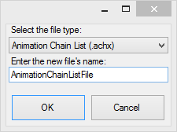
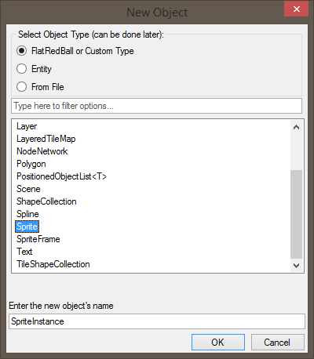
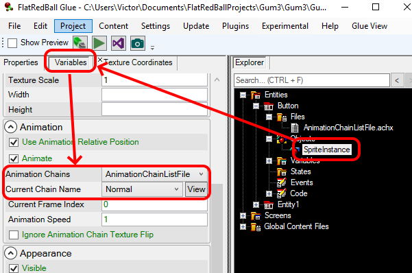
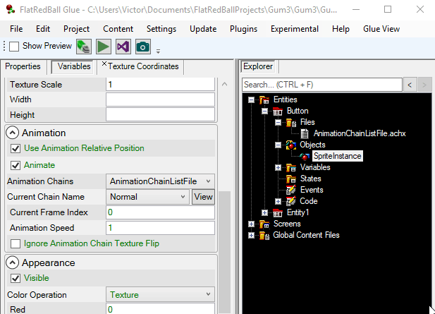

# using-animation-chains

### Introduction

AnimationChains are a common object used in Glue. AnimationChains are a series of images which can be swapped on a timer to create texture-flipping animation. AnimationChains can be created from multiple, individual images, or they can be created from what is called a "sprite sheet" which is an image containing multiple frames of an animation. Typically AnimationChains are created from a .achx file.

### When are AnimationChains used?

AnimationChains are useful when creating a game with animated entities, such as a running or attacking player. For example a typical platformer may have the following AnimationChains:

* IdleLeft
* IdleRight
* JumpLeft
* JumpRight
* WalkLeft
* WalkRight

AnimationChains can also be used to define static regions of a texture which should display depending on conditions in a game, such as a type of space ship or the state of UI . When considering the ability to control visible states, keep in mind that an AnimationChain does not have to contain multiple "frames" that it flips between. An AnimationChain can be as simple as one frame, so if you are creating button states, each AnimationChain can be as simple as a single image.

### Creating a Button Entity

To show how AnimationChains work, we'll create a Button Entity. To do this:

1. Right-click on your Entities item
2. Select **Add Entity**
3. Name your Entity **Button** and press **OK**

### Adding an AnimationChain

Next we'll add an AnimationChain List File (.achx). The file is a list of AnimationChains because it can contain multiple AnimationChains. To add an AnimationChain List File:

1. Right-click on the Files item
2. Select "Add File"->"New File"
3. Select "Animation Chain List (.achx)" as the type
4. Click OK 

### Creating AnimationChains

We'll create three AnimationChains in this step, but first you'll need to download the files we'll use. These are: [Download](../../frb/docs/images/6/6a/Button_inactive.png) [Download](../../frb/docs/images/b/bf/Button_normal.png) [Download](../../frb/docs/images/f/fb/Button_press.png) Once you've downloaded these files, double-click your AnimationChainFile under your Button Entity's Files item and the AnimationEditor should open. For information on using the AnimationEditor, see the [AnimationEditor Tutorial](../../documentation/tools/glue-gluevault-component-pages-animationeditor-plugin.md). Once the AnimationEditor is open, create three AnimationChains - each one referencing one of the images you downloaded  Notice that each AnimationChain has just one image representing the visual state of the button. Once you are finished creating your three AnimationChains, save your AnimationChain and be sure to copy all files.

### Creating a Sprite Object

Now that we've defined all of our animations in a .achx file, we'll create a Sprite that can display these animations. To do this:

1. Right-click on the Button Entity's Objects item
2. Select **Add Object**
3. Select **FlatRedBall or Custom Type**
4. Select **Sprite** from the list
5. Click **OK** 

Now your Button has a Sprite object. To associate the .achx file you created with the Sprite:

1. Select the Sprite
2. Make sure the **Variables** tab is selected
3. Change the **Animation Chains** value to **AnimationListChainFile**
4.  Change the **Current Chain Name** to **Normal**. This sets the default animation for the Sprite.

    

Note that the AnimationChainListFile must be in the same entity as the Sprite - otherwise AnimaitonChainListFile will not appear in the drop down. You can change the Current Chain Name to any value to give the Sprite a default value.

### Tunneling the Current Chain Name Variable

Tunneling is useful for setting the SpriteInstance's CurrentChainName in the following situations:

1. States
2. Instances of the entity in a Screen or another Entity
3. Responding to events when the variable changes

To tunnel the variable:

1. Right-click on your Button's Variables item
2. Select "Add Variable"
3. Click on the "Tunneling" tab
4. Select the SpriteInstance as the Object
5. Select the CurrentChain name as Variable
6. For brevity, change the "Alternative Name:" to "CurrentChain" 
7. Click **OK**

Now you can change the variable by selecting the Sprite in Glue by selecting the Variables folder. 

<figure><figcaption></figcaption></figure>

 If you are interested in changing the current AnimationChain on a Sprite in code, see [this article](glue-how-to-control-animation-at-runtime.md).

### WHEW, all done!

If you've read this far, congratulations on sticking through a long tutorial. At this point, the button visible states can be set in code and in Glue, making your Button Entity incredibly flexible. Keep AnimationChains in mind, you can use them for a lot of different things! [To the next tutorial ->](../../frb/docs/index.php)
