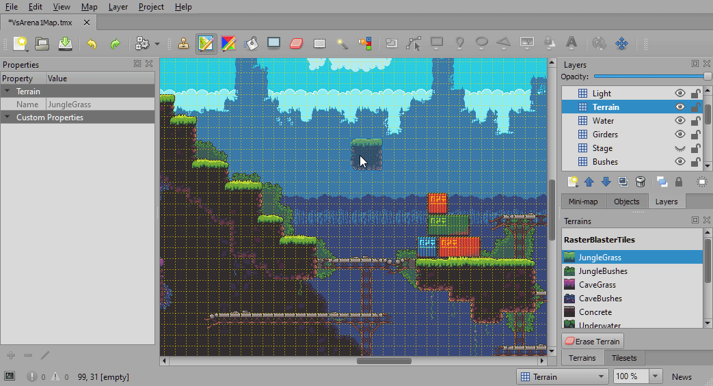
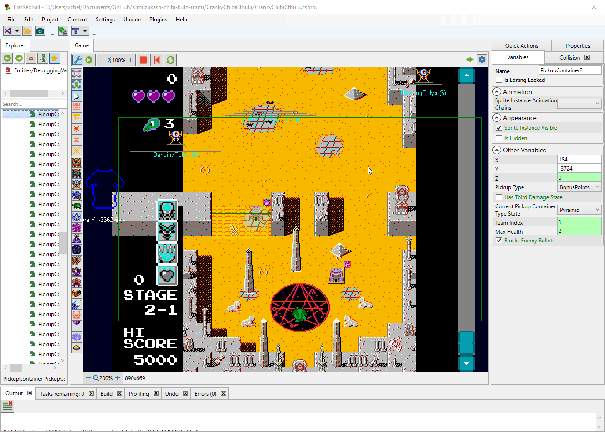

# Introduction To FlatRedBall

### Welcome!

We're glad you came to check out FlatRedBall. Before jumping in, let's take a few moments to discover what FlatRedBall is all about. If you're new to game development or just new to FlatRedBall, this page will introduce you to common FlatRedBall (FRB) concepts.

### What is FlatRedBall?

The FlatRedBall game engine has been in active development since 2005 with the goal of making 2D game development as easy as possible. Even today FlatRedBall is [continually being improved](https://github.com/vchelaru/FlatRedBall/commits/NetStandard). Not only are we developing the best 2D game engine in the world, but we're actively using it to make our own games. Every FlatRedBall feature has been tested with a real-world game development team.

All FlatRedBall development centers around a program called the FlatRedBall Editor.

This program is where you'll start when making a new project, and you'll use it throughout development as your game grows. The editor is a visual tool, which means you won't be writing any code directly in the editor. However, the editor is a programmer-friendly environment. Everything you do in the editor results in generated code. This makes your game easy to debug and keeps your program as efficient as possible.

You still have the full power of C# and Visual Studio to write and debug code. Ultimately your project is a standard .NET project which builds and runs just like any other project. It's real .NET!

The editor can set up your project and keeps it structured using the best patterns, but gives you all of the freedom you'd expect from a code-based game engine.

#### FlatRedBall Code-Only Projects

Although FlatRedBall provides a powerful editor, if you prefer you can use FlatRedBall in code-only situations. Ultimately the FlatRedBall Editor does not generate any binary data - it is all code generated, which means you can do everything that the editor does yourself. You can even use the FlatRedBall Editor to look at the generated code to learn how to write your own code.

### Screens

Screens define the flow of your game. Most games have a screen called **GameScreen** for all common parts of the main game play. For example, **GameScreen** may contain a list of enemies, a player, a list of collectable coins, and collision for the player and enemies to walk on. Anything that's specific to a particular level (such as the Tiled map file) is added to a new screen for that specific level. Games may also have screens which aren't created specifically for game play, such as settings, credit, and level select screens. To help visualize this, let's take a look at the screens that might be used in a game like [Super Mario World](https://en.wikipedia.org/wiki/Super\_Mario\_World).

Note that the three levels are grouped together because they use the GameScreen as their base screen. Of course, a full game like Super Mario World contains dozens of screens, but the picture above gives an example of how it could be organized.

### Tiled Map Files

Each level in FlatRedBall uses (at least) one Tiled Map File. Tiled is a powerful, commonly-used tool for creating level files using tileset images. The following image shows a typical platformer level in Tiled.

Notice that the level is composed of small squares which are called _tiles_. This approach to game development can be very efficient because it allows reuse of art to create large levels. The image above is created using tiles from a **tileset sprite sheet** which is a .png file with all of the art needed to create a level.

Once you have a tileset created, making new levels is easy.

<figure><figcaption></figcaption></figure>

### Entities

Entities are objects in your game which can move (a player walking in a level), collide (a bullet hitting a wall), have animations (an enemy playing a walk animation), and have AI behavior (enemy ships flying towards a target). In other words, entities are objects in a game world which the player can interact with. There are two parts to creating an entity. The first is to define the entity. When creating an entity, you are answering the following questions:

* What does it look like?
* Does this entity have collision? In other words, do we care if this entity is touching any other entity or any solid part of the level? For example, coins in Super Mario World are entities which have collision so that the game can respond when Mario touches the coin.
* Can the entity be controlled by the player?
* Does the entity have any logic that has to be continually performed every frame? For example, an enemy in Mario must check whether it is going to walk off of a cliff. Some enemies turn around when reaching the edge of a platform.

Once you've defined an entity, you can place the entities in a screen. Each time you place an entity in a screen, you are _creating an instance_ of that entity. A screen may have lots of instances of an entity. For example, consider the following image from Super Mario World.

Here we see eight instances of the Coin entity. Of course, the full level may have dozens or even hundreds of coins. The image above also has a few Enemy entity instances, and an instance of the Player (Mario).

### Gum

FlatRedBall works well with the [Gum UI tool](http://gumui.net/). You can add user interfaces like menus and HUD (UI) to your game with no code. Experienced programmers will feel right at home working with Gum. It provides an event system similar to other common UI frameworks such as WPF, Winforms, and Xamarin Forms. Gum is a visual layout tool with a flexible, powerful layout engine. You can create pretty much anything in Gum!

You can use Gum to create interactive menu screens (as shown above) or in-game HUD.

### Live Editor

FlatRedBall's Editor is also a live editor, enabling the creation of content in real time. The live editor comes out-of-the-box with powerful features, but it can be customized by adding code to your game. You can add error checking, real time visualizations, and custom logic in response to variable assignments. The editor runs your game, so your code runs while you are making changes.

<figure><figcaption></figcaption></figure>

### FlatRedBall is Active

FlatRedBall is one of the longest-running actively developed game engines available! We started development in 2005 and never stopped. It is fully open-source [(MIT License) on GitHub](https://github.com/vchelaru/FlatRedBall) and is updated almost daily with bug fixes and improvements.

If you need help you can [post an issue](https://github.com/vchelaru/FlatRedBall/issues) or join our [Discord channel](https://discord.gg/dg7WsFv). The FlatRedBall team is dedicated to making the best game engine for you and for ourselves. We are continually _dogfooding_ (using it to make our own games). This means our improvements are not just to show off fancy visuals, but to help you complete your game as fast as possible.

### Let's Get Started

If you're ready to start making games, head over to the [downloads page](../) to get the latest version of FlatRedBall. Once it's installed, start moving through the tutorials to start making your first game.
