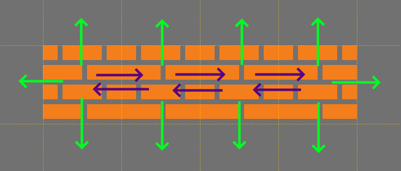

# Creating the Block Entity

### Introduction

Now that we have a simple platformer game with a Player moving around in a level with solid collision, we can add blocks to our game. We will be creating a new Block entity, instantiate blocks through our TileMap, and adjusting collision RepositionDirections.

### Creating the Block Entity

Our Block entity will contain an AxisAlignedRectangle for collision and a Sprite for visual. Since the player will be able to walk on Block instances, we want to make sure the AxisAlignedRectangle size matches the tile size of our map (16x16). To create a Block entity:

1.  Select the **Quick Actions** tab and click the **Add Entity** button&#x20;

    <figure><figcaption><p>Click the Add Entity button in the Quick Actions tab</p></figcaption></figure>
2. Enter the name **Block**
3. Check the **AxisAlignedRectangle** option
4. Check the **Sprite** option
5.  Click **OK**

    
6. Select the newly-created AxisAlignedRectangle inside of Block
7. Click the Variables tab
8.  Change the Width and Height to 16

    

FlatRedBall automatically creates a BlockList in our GameScreen, so we are finished creating our Block entity and can move on to instantiating it in our Tiled map.


### Instantiating Block in Level1Map.tmx

To create Block instances in Tiled, we must decide which tile we want to use to represent the Block. When creating entities, we recommend using tiles in the standard tileset. This is the same tileset we used in the previous tutorial to add solid collision. To mark a tile as a Block tile:

1. Open Level1Map.tmx in Tiled
2. Select the TiledIcons tileset
3.  Click the Edit button to make changes to the Tileset

    
4. Select the desired tile to mark as Block. I'll use the tile that looks like the solid collision with cracks
5.  Change the Type to match the name of your Entity. In this case, it should be **Block**

    
6. Save the TSX file
7.  Place blocks as desired in the GameplayLayer in Level1Map. Be sure to do this in the GameplayLayer, since mixing tilesets in a single layer will prevent your game from running.

    
8. Save the map file so the game can use the changes

Your game should now be creating Block instances for each Block tile placed in Level1Map.tmx. Since we haven't yet added graphics to the blocks, the blocks currently display only the white collision rectangles. Notice that each instance also has a small black square - this is the Sprite which we will be modifying next.


### Adding Block Graphics

Our Block objects are currently displaying a black dot in the center of the collision rectangle for its graphics. This Sprite is not currently assigned a Texture yet. To fix this:

1. Expand the **Block** entity
2. Right-click on **Files**
3.  Select **Add File -> Existing File**. We will be using the same file which is used for the graphics in our Level1Map.tmx - it has a graphic for a breakable block.

    
4.  Search for **FRBPlatformer.png** and click **OK**

    
5. Drag+drop the FRBPlatformer file onto the SpriteInstance to set its Texture

<figure><figcaption></figcaption></figure>

6. Change the pixel coordinates to the following:
   * Left Texture Pixel = 0
   * Right Texture Pixel = 16
   * Top Texture Pixel = 144
   *   Bottom Texture Pixel = 160

       

For more information on texture pixels, see the [Sprite.Texture Coordinates](../../../api/flatredball/sprite/texture-coordinates.md) page. Now our entity is using the breakable block graphic.


### Colliding PlayerList vs Block List

Currently our Player can jump through blocks rather than being able to hit and stand on them. We can fix this by creating a CollisionRelationship:

1. Expand the GameScreen Objects folder in Glue
2. Drag+drop the **PlayerList** onto the **BlockList** to create a new CollisionRelationship

<figure><figcaption></figcaption></figure>

3.  Select the newly-created **PlayerListVsBlockList** and change the **Collision Physics** to **Platformer Solid Collision**

    

The Player can now collide with the blocks.

<figure><figcaption></figcaption></figure>

### Adjusting RepositionDirections

So far our game seems fairly functional, but it has a collision bug which can result in _snagging_ - the unexpected stopping of the Player's velocity when moving across flat surfaces. This bug can be difficult to reproduce, so you may not have noticed it in the game yet, but it can definitely happen given our current setup. This problem is caused by the Block instances currently having AxisAlignedRectangles with RepositionDirections in all four directions. The following image provides a visualization of this problem:

<figure><figcaption></figcaption></figure>

The purple lines indicate possible RepositionDirections which can occur, and if these occur the Player will experience snagging. The topic of RepositionDirections is fairly extensive, and interested readers can see the following pages for more information:

* [AxisAlignedRectangle.RepositionDirections](../../../api/flatredball/math/geometry/axisalignedrectangle/repositiondirections.md)
* [TileShapeCollection.AdjustRepositionDirectionsOnAddAndRemove](../../../tiled-plugin/glue-gluevault-component-pages-tile-graphics-plugin-tileshapecollection/adjustrepositiondirectionsonaddandremove.md)
* [TileShapeCollection.InsertCollidables](../../../tiled-plugin/glue-gluevault-component-pages-tile-graphics-plugin-tileshapecollection/insertcollidables.md)

We will be applying some of the concepts and code discussed in the tutorials above, but for the sake of keeping the tutorial shorter we will not take a deep dive into every topic here. To adjust the RepositionDirections of our Block instances, we will use a new TileShapeCollection which is created purely for this purpose. In other words, we'll make a new TileShapeCollection, but we won't create any collision relationships or fill it in Glue the way we normally do with other TileShapeCollections. First we'll create a TileShapeCollection to be used for adjusting the Block RepositionDirections:

1. Select the **GameScreen** in Glue
2.  Select the **Quick Actions** tab and click **Add Object** to **GameScreen**

    
3. Select **TileShapeCollection**
4. Enter the name **CombinedShapeCollection**
5.  Click **OK**

    

Now we can add the rectangles from our BlockList to the CombinedShapeCollection. To do this:

1. Open **GameScreen.cs** in Visual Studio
2. Modify CustomInitialize as shown in the following code snippet

```
void CustomInitialize()
{
    CombinedShapeCollection.InsertCollidables(BlockList);
}
```

Now our BlockList will have proper RepositionDirections. Remember the CombinedShapeCollection - we will be returning to this when we work on creating/destroying our Blocks in the next tutorial.

### Conclusion

Our blocks are now fully functional as platforming collision. The next tutorial will add the ability to break the blocks when the player hits the block from below.
