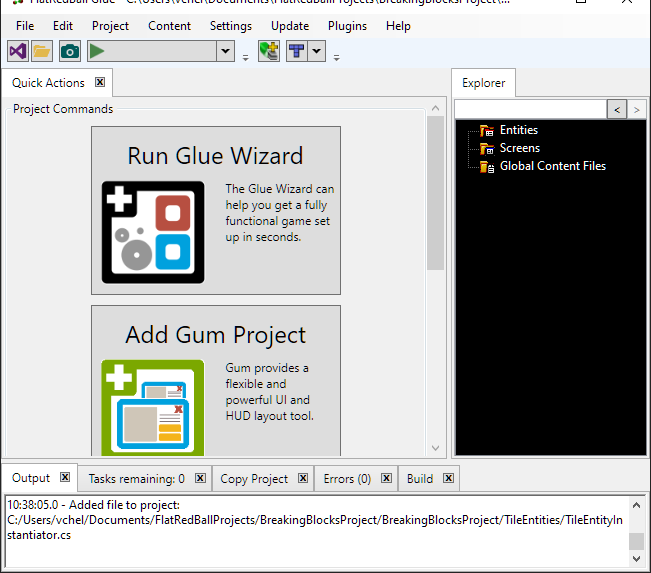

# New Project Setup

### Introduction

We’ll begin this tutorial with an empty project. Mine is called EnemyDamage.

### Glue Wizard

The Glue Wizard can help us get a quick project set up. We leave most of the options to their default, but we change the following:

#### Player Entity

* Change **What kind of control will the player have?** to **Platformer**
* Uncheck **Add Sprite to Player Entity** unless you intend to add graphics to your Player entity. This tutorial does not cover how to add graphics to the Player entity.

Note that we don't work directly with the Player entity in this game, but we still create one since most games need one eventually.

#### Levels

* Change **Number of levels to create** to **1**. We only have one level in this game

### Conclusion

Now our project is ready to go as a fully functional platformer. We can begin adding the Enemy entity in the next tutorial.
