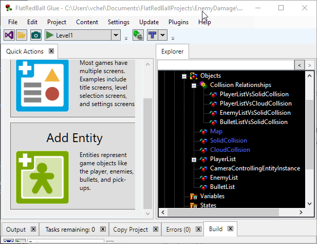
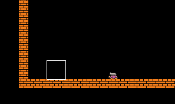

# Damaging the Enemy

### Introduction

This tutorial will implement dealing damage to an Enemy. Rather than immediately destroying the Enemy when it collides with a Bullet, we'll implement _health points_ (HP) which can be reduced when an Enemy collides with a Bullet. Once an Enemy's HP is reduced to 0, it will be destroyed.

### Adding Enemy HP

Typically enemies will have two values for HP:

* MaxHP - the starting number of HP when an Enemy is first spawned
* CurrentHP - the number of HP that the enemy currently has

The MaxHP is a _designer variable_ - a variable which a game designer may change during the development of the game to adjust difficulty. We'll define this in Glue so it can be changed easily. By contrast, CurrentHP is a _logic variable_ - a variable which is used in game logic and which should not be modified by a game designer. It will initially be assigned to MaxHP and will be reduced whenever the Player takes damage. To define a MaxHP variable:

1. Select the **Enemy** entity
2. Click on the **Variables** tab
3.  Click the **Add New Variable** button

    
4. Select the **int** type
5. Enter the name **MaxHP**
6.  Click **OK**

    
7.  Set the new **MaxHP** variable to **6**

    

Now we can add the CurrentHP value to the Enemy:

1. Open the project in Visual Studio
2. Open **Enemy.cs**
3. Add the **CurrentHp** variable and modify **CustomInitialize** as shown in the following code snippet

&#x20;

```
public int CurrentHP { get; set; }

private void CustomInitialize()
{
    this.InitializePlatformerInput(new EnemyInput());

    CurrentHP = MaxHP;
}
```

In a typical game, whenever an Enemy takes damage the game may perform many actions such as:

* Flashing the Enemy or playing some visual effect
* Playing a sound effect
* Showing the amount of damage dealt (as a floating number)
* Modifying how much health is shown in a health bar
* Destroying the Enemy and showing a death effect if the Enemy has died

Keeping this logic in the Enemy.cs file can help keep code organized, so we'll be adding the following function to the Enemy.cs file:

```
public void TakeDamage(int damageAmount)
{
    CurrentHP -= damageAmount;
    if(CurrentHP <= 0)
    {
        Destroy();
    }
}
```

Be sure to make the **TakeDamage** method **public** so it can be called from outside of the Enemy class.

### Bullet vs Enemy Collision

Now we can create a collision relationship between the BulletList and EnemyList objects in the GameScreen:

1. Expand the **GameScreen** **Objects** folder
2.  Drag+drop the **BulletList** object onto **EnemyList**\
    &#x20;

    <figure><figcaption></figcaption></figure>
3. Select the new **BulletListVsEnemyList** relationship
4. Click on the **Collision** tab
5.  Click the **Add Event** button

    
6.  Accept the defaults and click **OK**

    

Now we can fill in the event method. Open **GameScreen.Event.cs** and modify the **BulletListVsEnemyListCollisionOccurred** method as shown in the following snippet:

```
void OnBulletListVsEnemyListCollisionOccurred (Entities.Bullet first, Entities.Enemy second)
{
    first.Destroy();
    // assume the bullet only deals 1 damage for now
    second.TakeDamage(1);
}
```

Now we can shoot at the enemy. After six shots, the enemy is destroyed.&#x20;

<figure><figcaption></figcaption></figure>

### Conclusion

Now we've created a game where we can destroy an enemy with 6 shots. A real game would have more than one enemy, but if we add additional enemies, our game will automatically collide bullets against each enemy, and each enemy will keep track of its own HP.
