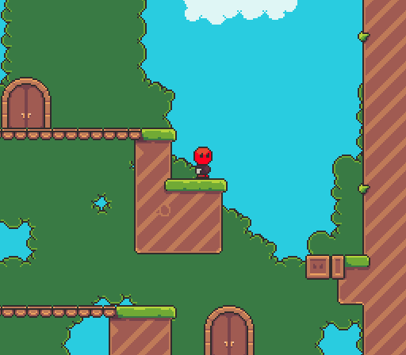
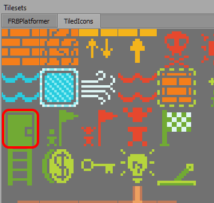
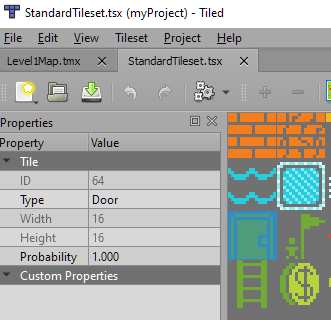
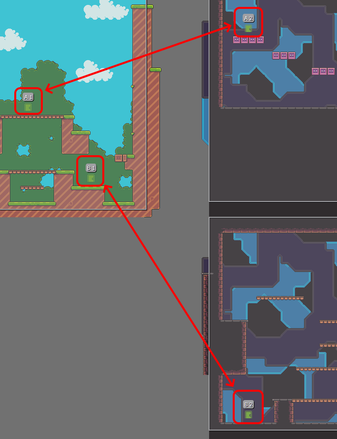

# Doors

### Introduction

This walkthrough covers the concept of _doors_ - objects which can move the player from one area on the map to another. Doors are often used to subdivide single levels, and are used in games like Super Mario World (pipes and doors) and Mega Man X (doors leading to bosses).&#x20;



The sample project can be downloaded from Github: [https://github.com/vchelaru/FlatRedBall/tree/NetStandard/Samples/Platformer/DoorsDemo](https://github.com/vchelaru/FlatRedBall/tree/NetStandard/Samples/Platformer/DoorsDemo) &#x20;

<figure><figcaption></figcaption></figure>

This walkthrough refers to the DoorsDemo as _this demo_ and _the demo_.

### Main Concepts

This walkthrough covers a number of concepts for using doors:

* The map is broken up into three sections which are all part of the same TMX file, but the Camera follows bounds defined by rectangles in the map
* Doors are entities which are added to the Tiled map
* The collision event between Player and Door instances is used to check if the player is pressing the up direction
* When transitioning (the screen is fading in and out), the code uses async/await to wait for the fading animations before allowing the Player to move

### Tile Map CameraBoundsLayer

The Level1Map file is a TMX which contains three sections. These three sections are drawn just like normal tile maps, but they also contain a layer called CameraBoundsLayer. This layer, which is an _Object Layer,_ contains three rectangles. Object layers with shapes can be used any time a shape is needed for game logic. Other uses besides camera bounds include defining large triggers (such as the goal in a level) or areas to destroy objects which fall off of a level (such as enemies falling into pits).


These three rectangles will be used to mark the bounds of the Camera when the Player is in one of the three areas of the map. These bounds will apply directly to the Camera, so they must not extend beyond tile edges. Every object layer with shapes is automatically loaded into a ShapeCollection contained in the map. The name of the ShapeCollection matches the name of the layer, so it can be retrieved with a First linq call on the map's ShapeCollections object, as shown in GameScreen's CustomInitialize.

```
ShapeCollection boundsShapeCollection;

void CustomInitialize()
{
    // adjust the map Z so that the background layers are behind entities
    Map.Z = -3;

    // Adjust the doors so they're behind the player
    foreach(var door in DoorList)
    {
        door.Z = -.5f;
    }

    boundsShapeCollection = Map.ShapeCollections.First(item => item.Name == "CameraBoundsLayer");

    UpdateBoundsForPosition(Player1.Position);
}
```

The boundsShapeCollection field is used to position the player in the UpdateBoundsForPosition method. This takes a Vector3 defining a point inside the rectangle. The method then looks through all rectangles to find which rectangle contains the argument position, and adjusts the CameraEntityInstance's Map object. &#x20;

```
private void UpdateBoundsForPosition(Vector3 position)
{
    foreach(var rectangle in boundsShapeCollection.AxisAlignedRectangles)
    {
        if(rectangle.IsPointInside(position.X, position.Y))
        {
            CameraControllingEntityInstance.Map = rectangle;
            break;
        }
    }
}
```

Normally the Map object references an entire MapDrawableBatch (the runtime for TMX files), but in this case we replace it with an AxisAlignedRectangle. In either case, the CameraControllingEntityInstance will respect the bounds of the Map object it is assigned. We can observe this behavior by walking to the edge of the map. Notice that the Camera doesn't move further to the right even though it hasn't reached the edge of the TMX file.&#x20;

<figure><figcaption></figcaption></figure>

### Door Entity

The demo defines a Door entity in Glue which contains a Sprite and AxisAlignedRectangle. The Sprite is used to display the visual, and the AxisAlignedRectangle defines the collision area used to detect if the player can enter the door. The Door instances are created in our map which contains four Door tiles. The standard door tile is used to place doors in the map.



Its Type is set to Door, which results in instances of that tile automatically being replaced with Door entities.



The map contains four doors. Each door in the map has another door which marks where the Player should appear when travelling through the door. These pairs are identified by their names. The demo uses the convention of setting the Name of each pair of doors with the same letter. Specifically, the doors "A 1" and "A 2" are paired together and the doors "B 1" and "B 2" are paired together. This convention could support up to 26 pairs of doors if using only upper case, and more if using lower case and numbers, so it will work for even larger levels.



When collision occurs between a Door and  Player and the up direction is pressed, the demo obtains the **otherDoor** to determine where to place the player. This code is used in the \*\*OnPlayerListVsDoorListCollisionOccurred \*\*method.

```
...
var thisDoorLetter = door.Name[0];
...
var otherDoor = DoorList
    .First(item => item != door && item.Name.StartsWith(thisDoorLetter.ToString()));

player.X = otherDoor.X;
player.Y = otherDoor.Y - 16;
...
```

### Player vs Door Collision

The logic for moving between doors is ultimately driven by the PlayerListVsDoorList collision relationship in Glue. This collision relationship raises an event **OnPlayerListVsDoorListCollisionOccurred** in **GameScreen.Event.cs**. &#x20;

```
async void OnPlayerListVsDoorListCollisionOccurred (Entities.Player player, Entities.Door door)
{
    if(player.InputEnabled && player.PressedUp)
    {
        door.Open();
        player.InputEnabled = false;

        var thisDoorLetter = door.Name[0];

        await GameScreenGum.ToBlackAnimation.PlayAsync();

        var otherDoor = DoorList
            .First(item => item != door && item.Name.StartsWith(thisDoorLetter.ToString()));

        player.X = otherDoor.X;
        player.Y = otherDoor.Y - 16;

        UpdateBoundsForPosition(otherDoor.Position);

        CameraControllingEntityInstance.ApplyTarget(
            CameraControllingEntityInstance.GetTarget(), lerpSmooth: false);

        otherDoor.Open();

        await GameScreenGum.FromBlackAnimation.PlayAsync();

        otherDoor.Close();

        player.InputEnabled = true;

    }
}
```

We'll focus primarily on the collision and positioning logic in this section. Initially we check if the player has input enabled and whether the player is pressing up. Checking the InputEnabled property is important otherwise the Player could press Up multiple times during the transition animation and force the animations to play over and over, resulting in confusing behavior. We use the PressedUp property which returns whether the default up input was just pressed. This property is defined in Player.cs.

```
public bool PressedUp => InputDevice.DefaultUpPressable.WasJustPressed;
```

As mentioned earlier, once inside the if-statement, the demo searches for a matching door which has the same first letter in its name. The player is immediately moved to this position and UpdateBoundsForPosition is called. As shown earlier, this method updates the camera bounds to the rectangle which contains the other door.&#x20;

The demo also immediately moves the camera to the new bounds through the ApplyTarget method. The ApplyTarget method can optionally **lerp** (move the Camera smoothly) or move immediately. In this case we move immediately so that the camera doesn't move across the level and through areas inbetween the map sections. Notice that we are moving between two doors when entering a door, but we could also have created a convention which results in players moving to a completely different level. In this case, we would have called MoveToScreen rather than moving the Player to a new position. Such a system would enable games with maps which have multiple areas but which also connect to other maps, such as a dungeon in Final Fantasy 4.

### Transitioning to Other Doors

When the player collides with a door and the if-check passes, the player's input is disabled and the transition logic begins. The first part of this transition is the async prefix on the OnPlayerListVsDoorListCollisionOccured method. This enables the method to use the await keyword to delay logic. Without this, the method would need to use more complex code to enable and disable input as the fade animations are playing. The OnPlayerListVsDoorListCollisionOccurred method is effectively split up into three sections, separated by the await calls:


The first section (yellow) happens immediately when the player presses up - the player's input is disabled, the door shows its open graphic, and the fading animation begins playing. Once the animation finishes the second section (green) happens. This section moves the player immediately and adjusts the camera bounds, and opens the other door. This happens while the screen is completely covered by the black overlay, so the player cannot see the immediate movement happen. Once this movement happens, the black overlay fades away. Finally, once the fade happens, the third section (blue) happens. This closes the door and enables the player's movement.

### Conclusion

This walkthrough has covered how to add doors to a map enabling the player to move between different sections in the same level.
