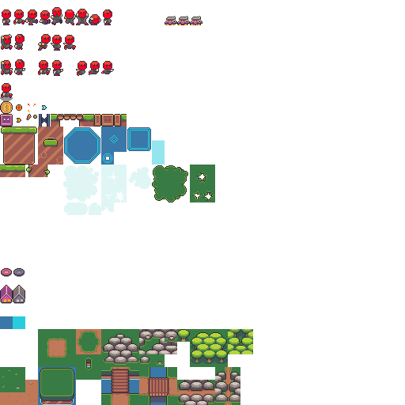

# New Project Setup

This tutorial begins with a new platformer project. To create a new platformer project, see the [Platformer Basics](../platformer-basics/) tutorial. In short, the easiest way to get an animated character is to use the new project wizard.

If you started a new project without using the wizard, you would need to [create an entity with a sprite](../../../glue-reference/objects/object-types/glue-reference-sprite.md#creating-an-entity-with-a-sprite) and [assign a .achx file](../../../glue-reference/objects/object-types/glue-reference-sprite.md#animations) to the sprite. If you don't have a .achx file prepared already, use these below to give yourself a head start.

<figure><figcaption></figcaption></figure>



Once finished, your project will have a character which is animated and ready to go. The remainder of the tutorials in this series cover how to modify the animations on the player and how to add new animations in response to game logic.
