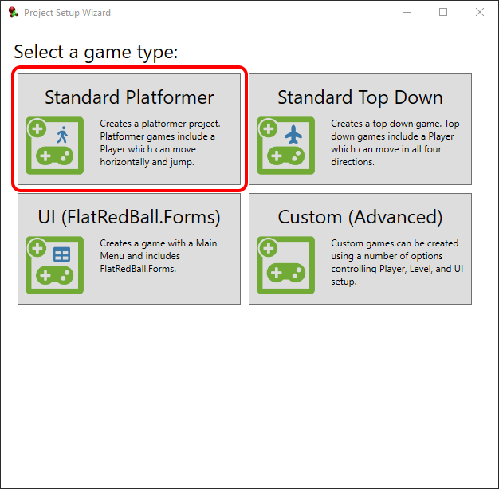

# Creating an Entity

### Introduction

This tutorial provides a set of steps for creating an entity with platformer behavior.

### Using the Wizard

The FlatRedBall Editor provides a quick setup for creating a platformer project. To create a platformer project:

1. Launch the FlatRedBall Editor
2. Create a new project
3. Wait for the project to finish loading
4. Wait for the Wizard window to appear
5.  Select the Platformer project option\

    <figure><figcaption></figcaption></figure>
6. Wait for the wizard to finish processing
7. Run the game from either Visual Studio or the FlatRedBall Editor

**If you are using the wizard as shown above, you can skip the remainder of this tutorial series and check out the** [other platformer tutorials](./)**. If you are interested in how to build a platformer in the editor "from scratch", keep reading.**

### Creating a GameScreen

Although this tutorial is focused on creating a platformer entity, we will first add a GameScreen. Creating a GameScreen first makes it much easier to add an entity after. Most FlatRedBall projects have a GameScreen - it's a standard screen created by the wizard, so it's best to follow this naming convention in your own projects even if you aren't using the wizard.

Note that you may already have a GameScreen in your project. If so, you can skip this section. To add a GameScreen:

1. Select the **Quick Actions**
2. Click the **Add Screen/Level** button
3. Leave the default **GameScreen** name
4. Check both the **Add SolidCollision ShapeCollection** and **Add CloudCollision ShapeCollection** options
5. Click **OK**

We will return to the GameScreen in future tutorials, but having one created before we create entities will speed up the process.

### Creating a Player Entity

The Player entity is our entity that will be controlled and have platformer physics. Regardless of the genre, most FlatRedBall games have a Player entity. It's a convention that your games should follow, just like having a GameScreen.

To create an entity with platformer behavior:

1. Select the **Quick Actions** tab in Glue
2. Click the **Add Entity** button
3. Enter **Player** as the name for the entity
4. Check the **AxisAlignedRectangle** checkbox - platformer entities perform collision against their environment
5. Verify that the **ICollidable** checkbox is checked - this enables collision which is necessary for platforming physics
6. Change the **Input Movement Type** to Platformer
7. Leave the Tiled options selected to automatically create a list for this new entity in GameScreen
8. Click **OK**

This will create a new platformer entity with a rich set of default functionality. We can verify that the entity is marked as a platformer by checking its **Entity Input Movement** tab to verify that it is marked as a platformer and that it has two movement types:

* Ground
* Air

### Adding a Player to the GameScreen

Now that we have the **Player entity** set up with platfomer control values, we can add it to our **GameScreen** by drag+dropping the **Player** onto the **GameScreen** node. We should already have a **PlayerList** in our **GameScreen** so the newly-added object will be inside of that list after the drag+drop.

<figure><figcaption></figcaption></figure>

### Adding a CameraControllingEntity Instance (Optional)

This tutorial series primarily focuses on creating a platformer entity. If you would like to control the camera manually, you can do so by modifying Camera.Main. More information about the Camera object can be found on the [Camera documentation page](../../../api/flatredball/camera/). Alternatively, if you would like to have automatic camera control, see the [CameraControllingEntity documentation](../../../api/flatredball/entities/cameracontrollingentity.md).

### Adding a Level

Before we can run our game we also need to add a Level. Typically, the GameScreen includes objects, files, and objects which are common to all screens (such as a Player), while each level includes objects and logic which are level-specific (such as the TMX).

To add a level:

1. Select the **Quick Actions**
2. Click the **Add Screen/Level** button
3.  Leave all defaults and click **OK**\

    <figure><figcaption></figcaption></figure>
4. After clicking OK, another popup appears with options for the level tile map (TMX). Leave all defaults and click OK\
   .png>)

Your project should now have a Screen named Level1. This is marked as the startup screen (it has the play icon and appears in the startup dropdown).

<figure><figcaption></figcaption></figure>

### Conclusion

If we run our game now we'll see the entity functional - at least, it seems to fall with gravity. In the next tutorial we'll add collision and controls using our entity.
