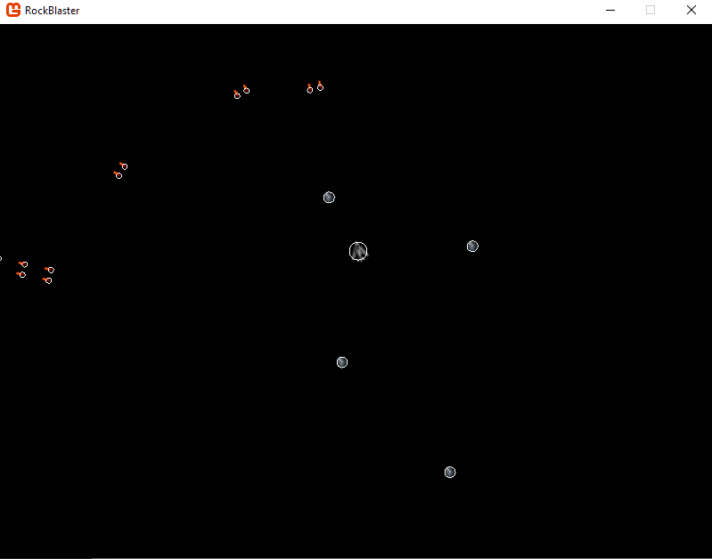
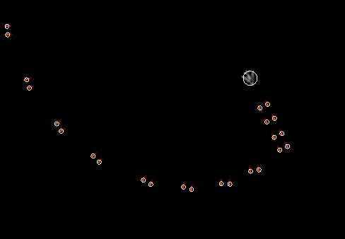
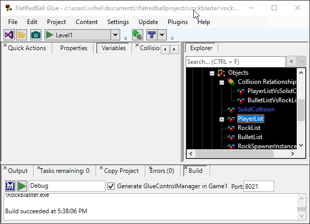
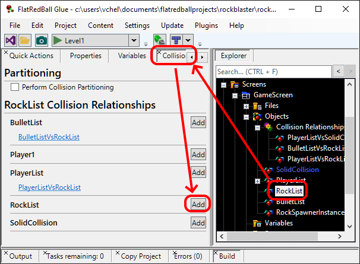
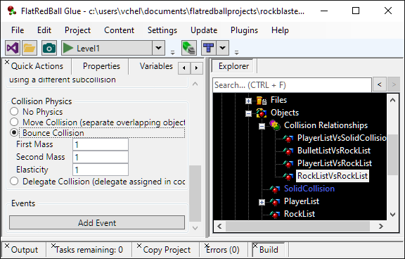
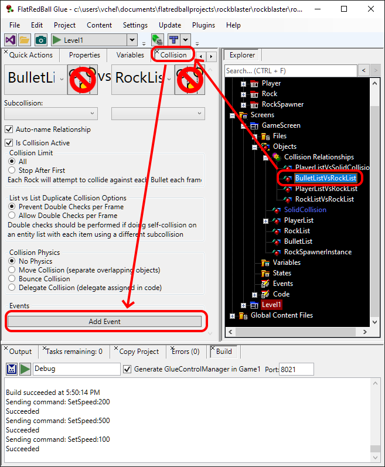
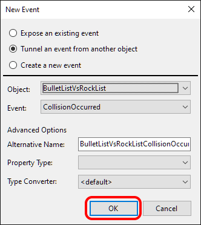
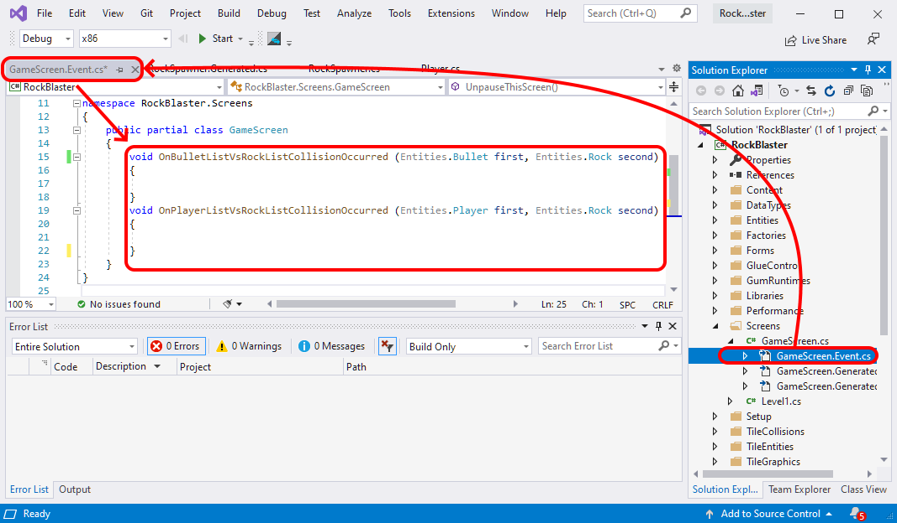

# tutorials-collision

### Introduction

The most obvious missing component of our game is currently collision - the MainShip can move through Rocks, Bullets pass through Rocks, and Rocks pass through each other. This tutorial will cover adding collision to all objects.

### Modifying Collision Sizes

All of our entities which need collision (Player, Rock, Bullet) have collision circles - all of the entities have white circles for collision. As you may have noticed, the collision shapes are a little too big. We can modify the Radius value on all of our collisions to more accurately match the art. To change the Player collision radius:

1. Expand the **Player** entity
2. Expand the **Objects** folder
3. Select the **CircleInstance** object
4. Click on the **Variables** tab
5. Change the **Radius** value to **10**


Repeat the process above for the following circles:

* Bullet CircleInstance Radius = 3
* Rock CircleInstance Radius = 6

Now our collision size matches the size of our objects.



You may have noticed that the bullet sprite doesn't quite match the collision radius. We could either offset the collision to match the sprite, or we could offset the sprite to offset the collision. While both approaches will solve the problem, we recommend keeping the collision centered if possible. For larger games this can improve performance. Therefore, we'll adjust the sprite.

1. Expand the Bullet entity
2. Select SpriteInstance
3. Change the Y value to -5

That's much better!



### Creating Collision Relationships

Next we will add logic to our collision. When talking about collision, it's helpful to think about _collision relationships_. A collision relationship is created between two objects (in this case two lists) and defines what happens when any items in these lists collide. Our game will have three collision relationships:

1. Bullet vs Rock - destroy the rock and bullet (for now).
2. Player vs Rock - destroy the player and the rock. Eventually we'll want to handle a game over state.
3. Rock vs Rock - this is an example of a self-colliding list. When one rock collides against another we want to have them _bounce_ off of each other.

To create a collision relationship, drag+drop one list in the GameScreen onto another list. For example, dragging the BulletList on top of the RockList will create a collision relationship between these two lists. 

<figure><figcaption></figcaption></figure>

 We can also repeat this process to create a relationship between the PlayerList and RockList. 

<figure><figcaption></figcaption></figure>

 To create a self-collision, we cannot use the drag+drop method. Instead, we can use the **Collision** tab:

1. Select the **RockList** object under **GameScreen**
2. Click the **Collision** tab
3.  Click the **Add** button next to the **RockList** label to add a self-collision

    

Notice that the Collision tab provides a quick way to view all collision relationships for the currently-selected object. All collision relationships are also organized under the Collision Relationships item in the GameScreen.


### Collision Relationship Physics

So far we've created a few collision relationships. This tells the game that we want _something_ to happen when objects collide, but we haven't yet told Glue what we want to happen. First we'll start with the RockListVsRockList collision relationship. To edit a collision relationship, click it and select the **Collision** tab. Notice that there are lots of options available to customize collision relationships.


For now we'll focus on the **Collision Physics** section, which lets us specify how the colliding objects should be moved or whether they should bounce when a collision occurs. We want the objects to bounce, so click the **Bounce Collision** option. Leave all of the other defaults unchanged.



Now if we run our game, the rocks will bounce off of each other. You may need to let the game run for a while to accumulate enough rocks for a collision to occur. 

<figure><figcaption></figcaption></figure>


### Collision Relationship Events

Often a game needs custom code to be executed whenever a collision occurs. Our game needs to destroy bullets and rocks whenever they collide, and players and rocks must be destroyed whenever a player collides against a rock. Collision events provide the option of running custom code whenever a collision occurs. First, we'll add custom code whenever the bullet and rock collide.

1. Select the **BulletListVsRockList** collision relationship
2. Click the **Collision** tab
3. Click the **Add Event** button 
4.  Click the OK button to confirm the defaults for the new event

    

This will add a new event to the code project. Before we edit it, let's repeat the same process for the PlayerListVsRockList collision relationship:

1. Select the **PlayerListVsRockList** collision relationship
2. Click the **Collision** tab
3. Click the **Add Event** button
4. Click the **OK** button to accept the defaults

All events added to GameScreen will be contained in the **GameScreen.Events.cs** file in our Visual Studio project. You may need to expand the **GameScreen.cs** file in the **Solution Explorer** to see this file.



Notice that the methods created provide access to the objects that have collided. For example, **OnBulletListVsRockListCollisionOccurred** provides access to the Bullet and Rock that have collided, named **first** and **second**, respectively. We can modify the code to destroy all objects when they collide. To do so, modify the code in your event file as shown in the following snippet:

```
void OnBulletListVsRockListCollisionOccurred (Entities.Bullet first, Entities.Rock second)
{
 first.Destroy();
 second.Destroy();
}
void OnPlayerListVsRockListCollisionOccurred (Entities.Player first, Entities.Rock second)
{
 first.Destroy();
 second.Destroy();
}
```

### Conclusion

This tutorial did a lot to make our game feel like a real game! Now we can shoot rocks and take damage. Of course, once the player dies the game continues to run. We'll improve that behavior in a future tutorial. 

<figure><figcaption></figcaption></figure>

 [<- 06. Rock Entity](tutorials-rock-entity.md) -- [08. Rock States ->](tutorials-rock-states.md)
