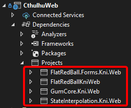
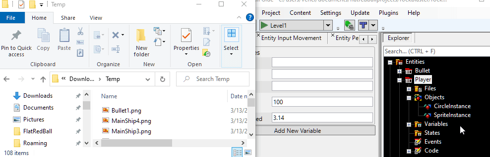

# Player Behavior

### Introduction

At this point we have a ship which is visible on Screen, but it doesn't do anything. This tutorial adds behavior to our Player Entity so that it can move, turn, and shoot.

### Adding Variables

For this game, the Player will continuously move forward at a constant speed. The Player object will be turned left and right with the keyboard or Xbox gamepad. Before we begin writing any code we'll add two variables to Player: **MovementSpeed** and **TurningSpeed**. To do this:

1. Select the Player entity
2. Select the Variables tab
3.  Click the **Create a new variable** button\


    <figure><figcaption><p>Click the Create a new variable button to add a new variable</p></figcaption></figure>
4. Leave the defaults **Create a new variable** option and **float** type
5. Enter the name **MovementSpeed**
6. Click **OK**


Repeat the steps above to also add a **TurningSpeed** variable.


Next let's give the variables some default values:

1. Enter a value of 100 for **MovementSpeed**. This is the number of pixels the Player will travel in one second.
2. Enter a value of 3.14 for **TurningSpeed**. This is the maximum number of radians the Player will rotate in one second.


### Applying Movement

To apply movement we will need to write some C# code. To do this:

1. Open the project in Visual Studio (or switch to Visual Studio if you already have it open)
2.  Open **Player.cs**. This is in the **Entities** folder in the **Solution Explorer**.

    
3. Scroll to the **CustomActivity** method in Player.cs

Modify CustomActivity as shown in the following snippet:

```csharp
void CustomActivity()
{
   this.Velocity = this.RotationMatrix.Up * this.MovementSpeed;
}
```

If you now run the game you will see the ship move upward, then eventually move off-screen.

#### **What is "RotationMatrix.Up"?**

&#x20;If you are unfamiliar with the RotationMatrix property, or with matrices in general then you may be wondering about the RotationMatrix.Up variable, and why we're using it. The RotationMatrix property contains information about how an Entity, Sprite, or any other PositionedObject is rotated. The Up property indicates you which way is "up" for the object given its current rotation. This value is in "object space" meaning that if the object rotates, then this value will rotate along with the object. This is especially convenient for this tutorial because this game will have the ships always moving forward. The code above will work regardless of which way the Player is rotated - something which we'll see in the coming sections.

### Assigning Input

The next step is to assign input logic so the Player can turn. We will add an object to our Player representing the input device. This could be a gampad, keyboard, or any other object. By using the I1DInput interface, we can write the code the same regardless of the actual hardware used to control the Player. Modify Player.cs as shown in the following snippet:

```csharp
public I1DInput TurningInput { get; set; }

private void CustomInitialize()
{
 // we'll default to using the gamepad if one is
 // plugged in. Otherwise, we'll use the keyboard
 if(InputManager.Xbox360GamePads[0].IsConnected)
 {
  TurningInput = 
    InputManager.Xbox360GamePads[0].LeftStick.Horizontal;
 }
 else
 {
  TurningInput = InputManager.Keyboard.Get1DInput(
    Microsoft.Xna.Framework.Input.Keys.Left, 
    Microsoft.Xna.Framework.Input.Keys.Right);
 }
}

private void CustomActivity()
{
 this.RotationZVelocity =
 // Negative value is needed so that holding "left" turns to the left
   -TurningInput.Value * this.TurningSpeed;
   this.Velocity = this.RotationMatrix.Up * this.MovementSpeed;
}
```

Note that all of the code we have written uses coefficients (**MovementSpeed** and **TurningSpeed**) defined in the FRB Editor. This means that you can modify these values in the Player Entity at any time if you want to tune how the game feels. For example, if you want the ship to turn faster, increase **TurningSpeed** to a larger value.

Also, keep in mind that the variables MovementSpeed and TurningSpeed can be modified both in the FRB Editor and also in code - so where should you make the change? Typically, these variables can be thought of as variables which a game designer might edit. Larger teams may include designers who are not as comfortable making changes in code. The FlatRedBall Editor provides a less-technical environment so that designers can make changes and see them in-game without venturing into complex C# code.

But you might be wondering if this is important in your case - after all you are likely just learning to use FlatRedBall, so you are a team of one. You are both the designer and programmer, so where should the changes be made? Even in this situation, the answer is the same - if you can make the changes in the FlatRedBall Editor, do so! This makes it easier to tune your game in one place instead of needing to hop around different code files.


### Adding Bullet Sprite

Next we will add a file and Sprite to the Bullet entity. This process is essentially the same as when we added PNG files and a Sprite to our Player Entity so you may find these steps familiar. To add the PNG:

1. Download the following file to your computer: 
2. Expand the **Bullet** entity in Glue
3. Drag+drop Bullet1.png onto the Files folder in the Bullet

<figure><figcaption></figcaption></figure>

To add a Sprite to the **Bullet** entity:

1. Select the **Bullet** entity in Glue
2. Click the **Quick Actions** tab
3.  Click the **Add Object to Bullet** button

    
4. Select the Sprite type
5. Click OK


Now we can set the Sprite's Texture:

1. Expand the **Bullet** Entity's **Object** folder
2. Select the newly-created **SpriteInstance**
3. Select the **Variables** tab
4. Set the **Texture** drop-down to **Bullet1**


### Shooting

The next step is to add firing bullets. We'll be using the BulletFactory which we created in an earlier tutorial to create a new bullet and automatically add it to the GameScreen's BulletList. For more information on factories, see [the tutorial on this topic](../../frb/docs/index.php). Next we will need to define a bullet speed. To do this:

1. Click the Bullet entity in Glue
2. Click the Variables tab
3.  Click the **Add New Variable** button

    
4. Leave the defaults
5.  Set the variable name to **MovementSpeed**

    
6. Set **MovementSpeed** to 300


Now we can use BulletFactory to create bullets when the player shoots. To do this:

1. Go to Player.cs in Visual Studio
2. Modify the Player.cs code so that it contains the following code:

```csharp
public I1DInput TurningInput { get; set; }
public IPressableInput ShootingInput { get; set; }

private void CustomInitialize()
{
 // we'll default to using the gamepad if one is
 // plugged in. Otherwise, we'll use the keyboard
 if(InputManager.Xbox360GamePads[0].IsConnected)
 {
  TurningInput = 
   InputManager.Xbox360GamePads[0].LeftStick.Horizontal;
  ShootingInput = InputManager.Xbox360GamePads[0].GetButton(
   Xbox360GamePad.Button.A);
 }
 else
 {
  TurningInput = InputManager.Keyboard.Get1DInput(
   Microsoft.Xna.Framework.Input.Keys.Left, 
   Microsoft.Xna.Framework.Input.Keys.Right);
  ShootingInput = InputManager.Keyboard.GetKey(
   Microsoft.Xna.Framework.Input.Keys.Space);
 }
}

private void CustomActivity()
{
 this.RotationZVelocity =
  // Negative value is needed so that holding "left" turns to the left
  -TurningInput.Value * this.TurningSpeed;
 this.Velocity = this.RotationMatrix.Up * this.MovementSpeed;

 if (ShootingInput.WasJustPressed)
 {
  // We'll create 2 bullets because it looks much cooler than 1
  Bullet firstBullet = Factories.BulletFactory.CreateNew();
  firstBullet.Position = this.Position;
  firstBullet.Position += this.RotationMatrix.Up * 12;
  // This is the bullet on the right side when the ship is facing up.
  // Adding along the Right vector will move it to the right relative to the ship
  firstBullet.Position += this.RotationMatrix.Right * 6;
  firstBullet.RotationZ = this.RotationZ;
  firstBullet.Velocity = this.RotationMatrix.Up * firstBullet.MovementSpeed;

  Bullet secondBullet = Factories.BulletFactory.CreateNew();
  secondBullet.Position = this.Position;
  secondBullet.Position += this.RotationMatrix.Up * 12;
  // This bullet is moved along the Right vector, but in the nevative
  // direction, making it the bullet on the left.
  secondBullet.Position -= this.RotationMatrix.Right * 6;
  secondBullet.RotationZ = this.RotationZ;
  secondBullet.Velocity = this.RotationMatrix.Up * secondBullet.MovementSpeed;
 }
}
```

Notice that we are using the RotationMatrix of the MainShip to adjust the initial positions of the bullets, as well as their velocity

If you run the game you should be able to fly, turn, and shoot.


### Conclusion

Although we have a long way to go, this is a big milestone for Rock Blaster. You can now see how the game feels for the very first time. Since relevant coefficients are set in Glue, you can change the values to make the game feel differently. Now that we can shoot bullets we'll need something to shoot at. The next tutorial will add Rock entity instances to the GameScreen.
