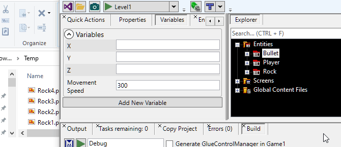
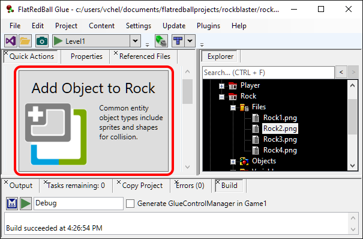
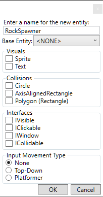
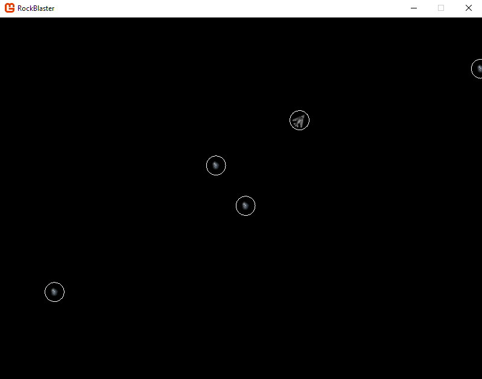

# Rock Entity

### Introduction

This tutorial will define the Rock entity and add it to our GameScreen so that we can shoot it. This tutorial will focus specifically on the creation of the Rock entity (adding a Sprite) as well as collision. We will revisit the creation of Rock entities in the next tutorial as well when we handle the creation of Rocks over time.

### Adding a PNG and Sprite

As you might have guessed, the first step is to add PNGs and a Sprite to the Rock entity. To add the PNGs:

1. Download the following four images: 
2. Expand the **Rock** Entity in Glue
3. Drag+drop the four files into the **Files** folder

<figure><figcaption></figcaption></figure>

Now you should have four files in the Rock entity. Like before, the PNG files will be copied into the game project. To add the Sprite to the Rock entity:

1. Select the Rock entity
2.  Click the **Add Object to Rock** button in the **Quick Actions** tab

    
3. Select the **Sprite** type
4.  Click OK

    

To set the Sprite's Texture:

1. Select the newly-added SpriteInstance
2. Select the Variables tab
3.  Use the Texture drop-down to select Rock1

    

### Considering Rock spawning

The next question we are faced with is how to handle spawning of the rocks (spawning also means to create an Entity at runtime on a time interval). Our spawn code should have the following criteria:

1. We should be able to control the difficulty of the game by increasing or reducing the rate at which Rocks spawn
2. Rocks need to appear at random locations so the player cannot predict their movement
3. Rocks should not spawn on-screen. This both looks unrealistic, and it can also be frustrating to the player if a Rock suddenly appears on top of the player
4. Rocks should move in all directions. Our game will require the player to rotate the ship to navigate in every direction, so rocks shouldn't just appear on the top of the screen.

Furthermore, we must also consider where we should put the code for Rock spawning. One option is to put the code in the GameScreen. However, we can keep our code easier to maintain if we separate this logic into its own class. Also, since we will want to have variables to control the initial spawn rate as well as how fast the spawn rate grows, we will create a new Entity to store these variables.

### Creating RockSpawner

To create the RockSpawner Entity:

1. Select the **Quick Actions** tab
2.  Click the **Add Entity** button

    
3. Enter the name RockSpawner
4.  Click OK - we won't need any collision or visuals in this entity

    

The RockSpawner is different from our other entities - we only need a single RockSpawner instance. To add an instance to the GameScreen:

1. Select the RockSpawner
2. Click the Quick Actions tab
3.  Click the **Add RockSpawner Instance to GameScreen** button

    

Next we'll add four variables to the RockSpawner. These are:

* RocksPerSecond
* SpawnRateIncrease
* MinVelocity
* MaxVelocity

To add RocksPerSecond:

1. Select the RockSpawner
2. Click the Variables tab
3.  Click the **Add New Variable** button

    
4. Enter the name **RocksPerSecond**
5. Click OK

Repeat the steps above for the other three variables. We'll set some defaults for our variables as well:

* RocksPerSecond = 0.2
* SpawnRateIncrease = 0.015
* MinVelocity = 50
* MaxVelocity = 100

### RockSpawner logic

Now that we have variables to use for spawning, we can create our spawning logic. The logic will be broken up into two parts:

1. Deciding if it's time to spawn a rock
2. Spawning a rock and giving it its initial velocity

First, we'll add the top-level logic to **CustomActivity**. To do this:

1. Go to Visual Studio
2. Open **RockSpawner.cs**
3. Modify this file so that it contains the following code

```csharp
public partial class RockSpawner
{
 double lastSpawnTime;
 bool IsTimeToSpawn
 {
     get
     {
         float spawnFrequency = 1 / RocksPerSecond;
         return TimeManager.CurrentScreenSecondsSince(lastSpawnTime) > spawnFrequency;
     }
 }

 private void CustomInitialize()
 {

 }
 private void CustomActivity() 
 { 
  if (IsTimeToSpawn) 
  { 
   PerformSpawn(); 
  } 
 }

 private void PerformSpawn()
 {
    // We'll define GetRandomRockPosition and GetRandomRockVelocity below
    Vector3 position = GetRandomRockPosition();
    Vector3 velocity = GetRandomRockVelocity(position);
  
    Rock rock = Factories.RockFactory.CreateNew();
    rock.Position = position;
    rock.Velocity = velocity;
  
    lastSpawnTime = TimeManager.CurrentScreenTime;
 }
...
}
```

**Vector3 not found?** If Visual Studio draws the red squiggly line underneath Vector3 and complains that it can't find it, then add the following using statement at the top of the file:

```csharp
using Microsoft.Xna.Framework;
```

**Why do we create so many functions?** You may be wondering why we have created so many functions when we implement the logic for our Entities. It would be possible to write all of the code in a single function. However, there are many reasons for breaking your code up into multiple functions. One of the most important is readability. Looking at a long function can be difficult to understand, and also difficult to maintain. Separating your code into multiple functions makes it far more readable and easy to maintain.

At this point we have two functions left to write - a GetRandomRockPosition function and a GetRandomRockVelocity. Each function will require some math and explanation so we will cover each in its own section.

### GetRandomRockPosition

GetRandomRockPosition will give us a position on the edge of the screen. Conceptually the process will be:

* Picking a random side on the screen - options are top, right, bottom, and left
* Picking a random point on the selected side
* Moving the point off-screen so that the Rock will be fully off-screen when it is spawned

To perform these three steps, add the following code to the RockSpawner.cs file:

```csharp
public partial class RockSpawner
{
  ...

  private Vector3 GetRandomRockPosition()
  {
      // 1. Pick the top, right, bottom, or left.  These values will be 0, 1, 2, 3 respectively
 
      // The argument 4 is exclusive, so this will return 0,1,2, or 3
      int randomSide = FlatRedBallServices.Random.Next(4); 
 
      // 2. Pick a random point on the side.  We'll do this by getting min and max X and Y values.  
      // Two of the values will always be the same.  
      // In other words, the min and max X on the left side will always be equal.
       
      // Let's get the absolute coordinates of the edge of the screen:
      float topEdge = Camera.Main.AbsoluteTopYEdgeAt(0);
      float bottomEdge = Camera.Main.AbsoluteBottomYEdgeAt(0);
      float leftEdge = Camera.Main.AbsoluteLeftXEdgeAt(0);
      float rightEdge = Camera.Main.AbsoluteRightXEdgeAt(0);
 
      // Now let's set the values according to randomSide
      float minX = 0;
      float maxX = 0;
      float minY = 0;
      float maxY = 0;
      switch (randomSide)
      {
          case 0: // top
              minX = leftEdge;
              maxX = rightEdge;
              minY = topEdge;
              maxY = topEdge;
              break;
          case 1: // right
              minX = rightEdge;
              maxX = rightEdge;
              minY = bottomEdge;
              maxY = topEdge;
              break;
          case 2: // bottom
              minX = leftEdge;
              maxX = rightEdge;
              minY = bottomEdge;
              maxY = bottomEdge;
              break;
          case 3: // left
              minX = leftEdge;
              maxX = leftEdge;
              minY = bottomEdge;
              maxY = topEdge;
              break;
      }
 
      // Now we can pick our point randomly using the min and max values:
      float offScreenX = FlatRedBallServices.Random.Between(minX, maxX);
      float offScreenY = FlatRedBallServices.Random.Between(minY, maxY);
 
      // 3.  Finally we move the point off-screen, since the value right now will be right on the border
 
      // Our largest Rock is 128x128.  Since rocks are positioned at their center, we only need
      // to move half of that amount (64) to guarantee that rocks spawn fully off-screen.
      float amountToMoveBy = 64;
      switch (randomSide)
      {
          case 0: // top
              offScreenY += amountToMoveBy;
              break;
          case 1: // right
              offScreenX += amountToMoveBy;
              break;
          case 2: // bottom
              offScreenY -= amountToMoveBy;
              break;
          case 3: // left
              offScreenX -= amountToMoveBy;
              break;
      }
 
      // Now we can return the value
      return new Vector3(offScreenX, offScreenY, 0);            
  }
}
```

### GetRandomRockVelocity

GetRandomRockVelocity will give us the velocity for the new Rock. This implementation will result in all rocks starting on the edge of the screen and moving towards the center. A more advanced velocity might randomize the angle at which they move so that they don't always pass through the middle; however, this approach will give us sufficiently random movement. The steps to this method are:

1. Find the center of the screen at Z = 0
2. Get the direction towards the center of the screen
3. Normalize the direction, then multiply it by the desired speed to get the final velocity

To perform these steps, add the following method to your RockSpawner.cs:

```csharp
public partial class RockSpawner
{
  ...


 private Vector3 GetRandomRockVelocity(Vector3 position)
 {
     // 1.  Find the center of the screen.
 
     // First we need to get the direction that we want to move.  We can do this
     // by subtracting the argument position from the very center of our game screen.
     // We get the center by using the Camera's X and Y, but not its Z, because the camera is
     // positioned above the game screen looking down at it.
     Vector3 centerOfGameScreen = new Vector3(Camera.Main.X, Camera.Main.Y, 0);
 
     // 2.  Get the direction towards the center of the screen
     Vector3 directionToCenter = centerOfGameScreen - position;
 
     // 3.  Normalize the direction, then multiply it by the desired speed.
     // We "normalize" it, which means we make the vector have a length of 1
     // Once it is normalized, we can multiply it by the speed that we want
     // the Rock to move at to get to get the final Velocity value
     directionToCenter.Normalize();
 
     float speed = MinVelocity + 
         FlatRedBallServices.Random.Between(MinVelocity, MaxVelocity);
 
     return speed * directionToCenter;
 }
}
```

### Increasing the spawn rate

If you run the game at this point you will notice that the RockSpawner spawns rocks, but spawn rate doesn't increase so the game never gets harder over time. To change this, add the following code to the RockSpawner's CustomActivity:

```csharp
public partial class RockSpawner
{
  ...


  private void CustomActivity()
  {
    if (IsTimeToSpawn)
    {
        PerformSpawn();
    }
 
    // new code:
    this.RocksPerSecond += TimeManager.SecondDifference * this.SpawnRateIncrease;
  }

  ...
}
```

### Conclusion



Now the game is really making progress. If you run the game now you will be able to fly around and fire bullets at rocks. Of course, we haven't put collision in just yet. We'll do that next tutorial.
