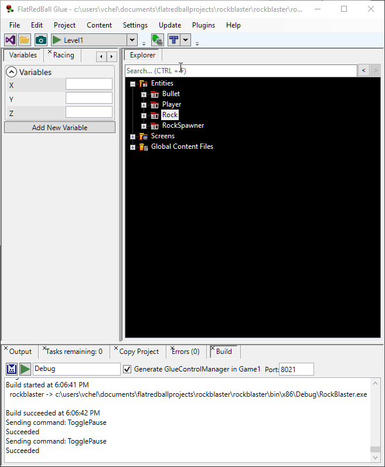
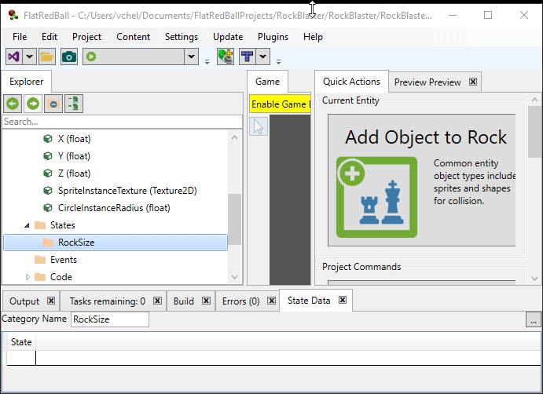

# Rock States

### Introduction

When we added a Sprite to the Rock Entity, we added four different images. At this point our game only uses one image (the smallest one). This tutorial will create states for each of the sizes, and will implement Rocks breaking up into smaller rocks.

### What is a State?

A state can be thought of as a _collection of variables_. States are usually created whenever multiple variables must be changed together. For example, we have four images for our rocks. If we change which rock we show (SpriteInstance Texture), we also want to change the collision size (CircleInstance Radius). We will be creating states for the four rock sizes in this tutorial, then add logic to break larger rocks into smaller rocks.

### Tunneling Variables

Before we create states, we will decide which variables we want to modify. In this case, the variables we want to modify are not on the Rock entity itself, but instead on *objects inside* the Rock. Therefore we will need to _tunnel variables_ to get access to these variables in our states. First we'll _tunnel_ the **Texture** variable on our **SpriteInstance**:

1. Expand the Rock entity in Glue
2. Drag+drop the **SpriteInstance** onto the **Variables** folder
3. Select **Texture** in the **Variable** dropdown
4. Click **OK**

<figure><figcaption></figcaption></figure>

Repeat the process above to tunnel the CircleInstance Radius variable. Now the Rock entity has a variable for the SpriteInstance Texture and CircleInstance radius.


### Creating States

Now we can create our four states. We recommend always placing states in a category - this keeps states organized and is very important for larger games. To add a category:

1. Expand the **Rock** object
2. Right-click on the **States** folder
3.  Select **Add State Category**

    
4. Enter the name **RockSize**
5.  Click **OK**

    

The easiest way to edit states is to use the State Data tab:

1. Expand the **States** folder
2. Click the **RockSize** state category
3.  Click the **State Data** tab. The location of your State Data tab may be different depending on FlatRedBall settings.

    

Since states usually require setting many variables, FlatRedBall provides a spreadsheet-like view of state data. By default categories do not modify any variables, so we must explicitly include which variables to our RockSize category. The easiest way is to drag+drop the variables that we would like modified onto the RockSize category.

<figure><figcaption></figcaption></figure>

Alternatively, the **...** button at the top-right of the State Data tab provides more control over included and excluded variables.

<figure><figcaption></figcaption></figure>

Now we can create four states - one for each size of rock. We will call the states Size1, Size2, Size3 and Size4. Size1 will be the smallest and Size4 will be the largest. Enter the values in the spreadsheet, with the state name being the first column.


### Creating Large Rocks Initially

New Rocks in Rock Blaster will default to State4 - the largest. Once they are shot they will break down into smaller rocks - much like the original Asteroids game. We can change the default size of Rocks with one line of code. To do this:

1. Switch to Visual Studio
2. Open RockSpawner.cs
3. Find the **PerformSpawn** function
4. Add the following line of code after **Rock rock = RockFactory.CreateNew();**

```csharp
rock.CurrentRockSizeState = Rock.RockSize.Size4;
```

If you now play the game, the rocks will be very large: 

### Breaking Rocks

Currently when a Rock collides with a Bullet the game calls Destroy on the Rock instance. Instead, we will want the Rock to decide whether it should break up into smaller rocks before it is destroyed. First, let's replace the Destroy call with a TakeHit call:

1. Open **GameScreen.Event.cs** in Visual Studio
2. Find the **OnBulletVsRockCollided** function. Make sure to modify the bullet vs rock method.
3. Change **Destroy** to **TakeHit**. Your code should look like:

```csharp
void OnBulletVsRockCollided (Entities.Bullet bullet, Entities.Rock rock)
{
 bullet.Destroy();
 rock.TakeHit(); // <-----This line of code changed
}
```

Next we'll create a TakeHit function in the Rock entity. This is a custom function which will create new rocks:

1. Open **Rock.cs**
2. Add the following code:

```csharp
public void TakeHit()
{
    if(this.CurrentRockSizeState == RockSize.Size4)
    {
        BreakIntoPieces(RockSize.Size3);
    }
    else if(this.CurrentRockSizeState == RockSize.Size3)
    {
        BreakIntoPieces(RockSize.Size2);
    }
    else if(this.CurrentRockSizeState == RockSize.Size2)
    {
        BreakIntoPieces(RockSize.Size1);
    }
    // don't break into pieces if at size 1
    this.Destroy();
}
```

Finally, we'll create a BreakIntoPieces function in Rock.cs:

```csharp
void BreakIntoPieces(RockSize newRockState)
{
 for (int i = 0; i < NumberOfRocksToBreakInto; i++)
 {
  Rock newRock = Factories.RockFactory.CreateNew();
  newRock.Position = this.Position;
  // Let's make the positions random so that they appear in a random arrangement
  newRock.Position.X += -1 + 2 * FlatRedBallServices.Random.NextSingle();
  newRock.Position.Y += -1 + 2 * FlatRedBallServices.Random.NextSingle();

  float randomAngle = FlatRedBallServices.Random.NextSingle() * (float)Math.PI * 2;

  float speed = FlatRedBallServices.Random.NextSingle() * RandomSpeedOnBreak;
  newRock.Velocity = FlatRedBall.Math.MathFunctions.AngleToVector(randomAngle) * speed;
  newRock.CurrentRockSizeState = newRockState;
 }
}
```

### Defining Breaking Variables

Notice that we are using two variables which haven't been defined:

1. NumberOfRocksToBreakInto
2. RandomSpeedOnBreak

Although we could have added these variables directly into code, it's much better to escalate these variables to Glue variables so that they can be easily modified at a later time. To do this:

1. Click the **Rock** entity
2. Click the **Variables** tab
3. **Click Add New Variable**
4. Change the type to **int** - the default (which we've used on all variables so far) is float
5. Enter the name **NumberOfRocksToBreakInto**
6.  Click **OK**

    

Repeat the process above, but create a **float** named **RandomSpeedOnBreak** Set the values:

* NumberOfRocksToBreakInto = 2
* RandomSpeedOnBreak = 50


### Conclusion


If you now run your game and shoot the rocks, you will see that they will break up into smaller pieces. Our game is becoming far more playable (and difficult). Next we'll add a HUD and logic for scoring.
