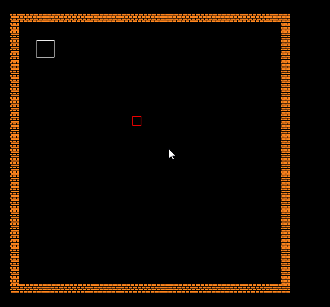

# Direct Enemy Control

### Introduction

This tutorial covers how to create enemy movement in a top down game with direct control over the enemy's input device. Compared to the [Enemy Pathfinding](enemy-pathfinding.md) tutorial, this tutorial shows how to directly control the input device manually. This approach is considered _low level_ and is not recommended for beginners. If your game includes enemies which can pathfind through a map then the [Enemy Pathfinding](enemy-pathfinding.md) tutorial is recommended.

### New Project Setup

This project tutorial assumes a Top Down Standard starting point (using the wizard), but the steps here can be used to add an Enemy entity to any project. We assume that the game already has levels.

### Enemy Entity

We'll be creating a new Enemy entity for this tutorial. To do this:

1. Click the **Quick Actions** tab
2.  Click the **Add Entity** button

    
3. Enter the name **Enemy**
4. Check **AxisAlignedRectangle**
5. Check **Top-Down** for the **Input Movement Type**
6. Leave the rest of the defaults and click **OK**


We will also change the color of the enemy rectangle to tell it apart from the player:

1. Expand the Enemy **Object** folder
2. Select **AxisAlignedRectangleInstance**
3. Select the **Variables** tab
4. Change **Width** to **16**
5. Change **Height** to **16**
6. Change **Color** to **Red**


### Adding an Enemy to Level1

To add an enemy to Level1:

1. Expand the Screens folder, then expand Level1's **Objects** folder
2. Select the **EnemyList**
3. Click the **Quick Actions** tab
4.  Click **Add a new Enemy to Enemy List**\


    <figure><figcaption></figcaption></figure>
5.  Modify the X and Y values for the new enemy so it is inside of the level boundaries by changing **X to 160** and **Y to -160**

    

### Setting the InputDevice

So far our Enemy instance is an entity with no behavior - it simply stays in the same spot when the game runs. First, we'll mark it as using Top-Down movement:

1. Select the **Enemy** entity
2. Click the **Entity Input Movement** tab
3. Set **Input Movement Type** to **Top-Down**
4.  Set **Input Device** to **None (Can Assign in Code)**

    

Now our Enemy has the behavior of top-down movement, but it is not using an input device for movement. Custom input can be set by defining an input device class which inherits from **FlatRedBall.Input.InputDeviceBase**. To do this:

1. Open the project in Visual Studio
2.  Create a new class called **EnemyInput**. Mine is in an Input folder.

    

The EnemyInput class needs to inhert from the FlatRedBall.Input.InputDeviceBase class which provides virtual methods to control how the input device behaves. Although the InputDeviceBase class offers many virtual methods, the only two that the top-down movement logic uses are:

* GetDefault2DInputX
* GetDefault2DInputY

We can override these to return values between -1 and 1. In this case we'll return constant values to test the functionality, as shown in the following code snippet.

```csharp
internal class EnemyInput : FlatRedBall.Input.InputDeviceBase
{
    protected override float GetDefault2DInputX()
    {
        return 1.0f; // 1 means all the way to the right
    }
    protected override float GetDefault2DInputY()
    {
        return -.5f; // Negative values are down, so -.5 means halfway down
    }
}
```

Next we need to assign the EnemyInput on the Enemy. To do this:

1. Open the **Entities/Enemy.cs** file in Visual Studio
2. Modify the **CustomInitialize** as shown in the following snippet:

```csharp
public partial class Enemy
{
    private void CustomInitialize()
    {
        var input = new Input.EnemyInput();
        this.InitializeTopDownInput(input);
    }
    ...
```

Now we can run the game and see the enemy move down to the right.

<figure><figcaption><p>Enemy moving down and to the right</p></figcaption></figure>

### Building the Enemy Input

This tutorial primarily shows how to create an EnemyInput class which can be used to control your enemy. So far the device returns constant values for GetDefault2DInputX and GetDefault2DInputY. A real game would use logic to determine what to return, such as the position of the Player, or how far along the enemy has moved along a patrol path.

At this point the rest of the implementation is up to you depending on your needs.&#x20;
