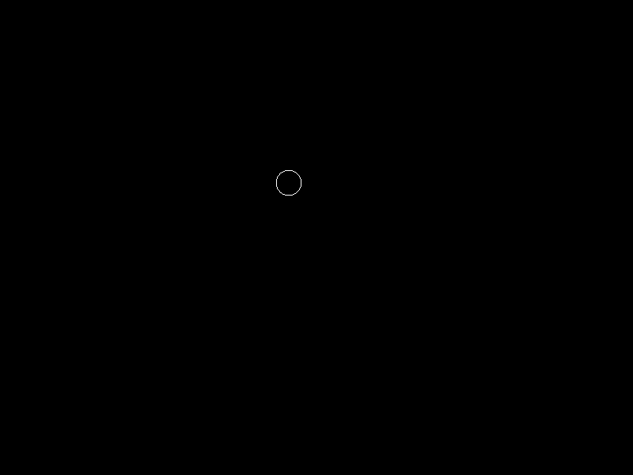

# Setup

### Introduction

This tutorial sets up an entity with Top Down controls. It provides a default implementation which requires no code. Later tutorials show how to interact with this plugin using code.

### Requirements

The top down controls must be added to an entity, so for this tutorial we will create an entity and add it to our game screen. We'll walk through the steps of creating everything in an empty project, but if you already have an existing project, top down controls can be added to any existing entity.

### Project Setup Using the New Project Wizard Preset

The simplest way to set your project up is to use the new project wizard. FlatRedBall automatically launches the wizard when creating a new project.

To create a top-down project, select the **Standard Top Down** button.

Now your game should be set up with a fully-functional top-down entity. You can verify this by clicking on the **Player** entity and then clicking on the **Entity Input Movement** tab. The Player should be marked as having **Top-Down** as its **Input Movement Type**.

### Alternative - Manually Creating GameScreen and Player Entity

This section will explain how to manually add a GameScreen and Top-Down entity. You do not need to follow this section if you have used the wizard as shown in the previous step.

1. Select the **Quick Actions** tab
2.  Click the **Add Screen** button

    
3.  Click **OK** to the default GameScreen name (all games should have a single GameScreen)

    

To add a Player entity:

1.  Click the **Add Entity** button

    
2. Name the entity **Player**
3. Check:
   1. **Circle** under **Collisions**
   2.  **Top-Down** under **Input Movement Type**

       
4. Click **OK**

If you already have an entity created, you can make it a Top Down entity:

1. Select the entity
2. Click the **Entity Input Movement** tab
3. Click the **Top-Down** option

Finally, add a list of Players the GameScreen. We recommend always creating a list of Players even if you intend to only have one player. This standard appears throughout FlatRedBall's documentation and can make moving from one project to another easier.

1. Verify **Player** is selected
2. Click the **Quick Actions** tab
3.  Click the **Add Player List to GameScreen** button

    

You will also need a Player instance in the list. To do this, drag+drop the Player onto the GameScreen and it will be added to the Player list.

<figure><figcaption></figcaption></figure>

\[/frb\_toggle]

### Moving the Entity

Now that the entity is marked as a Top Down entity and now that we have an instance of the entity in the GameScreen, we can run the game and see the player move. By default the entity uses a gamepad if one is connected. Otherwise, the entity will use WASD keys on the keyboard.

<figure><figcaption></figcaption></figure>
