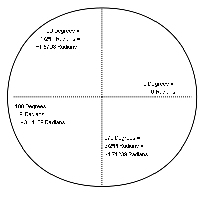

# rotation

### Introduction

Rotation is the property or collection of properties which control the orientation of an object. In other words, it controls which way the object is "facing". Rotation can be used to make a planet rotate on its axis, to rotate a space ship according to user input, or to spin particles to give them more natural-looking behavior.

Objects which implement the [IRotatable](../frb/docs/index.php) interface can be rotated. Rotation is performed using radians.

### Radians and Degrees

The FlatRedBall Engine uses [radians](http://en.wikipedia.org/wiki/Radians) instead of [degrees](http://en.wikipedia.org/wiki/Degree_\(angle\)) to measure orientation.



### Rotating a Sprite so it faces the cursor

Rotation can be used to rotate an object to "face" another object. For example a turret may rotate to face an enemy.

If the cursor is to be used as a target, the following code can be used to rotate a Sprite so it faces the cursor. The assumption on this code is that there is some identifiable "front" to the Sprite such as the nose of a plane or the tip of a turret. When the Sprite is unrotated (has a RotationZ of 0) the front of the Sprite will face a particular direction. This direction will be the "offset" variable.

```
 float offset = 0; // assumes the Sprite faces to the right when unrotated
 // If the texture faced a different direction this value would change.
 // For example, if the turret graphic points up, then offset would be
 // (float)Math.Pi/2.0f;

 // Now we get the world X and Y of the Cursor (can also use Mouse)
 float worldX = GuiManager.Cursor.WorldXAt(sprite.Z);
 float worldY = GuiManager.Cursor.WorldYAt(sprite.Z);

 // Now get the desired rotation for the Sprite
 float desiredRotation = (float) Math.Atan2(
     worldY - sprite.Y, worldX - sprite.X);

 // finally set the Sprite's rotation
 sprite.RotationZ = desiredRotation;
```

### Rotating the Shortest Angle

When presented with a current angle and a target angle, rotating clockwise or counter-clockwise is not always evident. The following method helps with this calculation:

```
// assuming currentAngle and targetAngle are both defined
float angleToRotate = FlatRedBall.Math.MathFunctions.AngleToAngle(currentAngle, targetAngle);
```

For more information, see the [AngleToAngle page](../frb/docs/index.php).

### How to find the vertices of a Sprite

First, keep in mind that a Sprite's RotationMatrix property has a relationship with the RotationX, RotationY, and RotationZ set of values - updating one automatically updates the other. Therefore, even if you only use the individual rotation values, you can still read from the RotationMatrix for finding the real-world positions of a vertex.

There are 4 steps for finding the position of a vertex.

1\. Determine the vertex that you want to edit. For this example, I will do the bottom right. The position of the vertex of a default, untouched Sprite would be (1, -1, 0). At ScaleX and ScaleY = 1, these are the coordinates of the bottom right point.

```
Vector3 bottomRightPoint = new Vector3(1, -1, 0);
```

2\. Next, scale the vector according to the Sprite's Scale values:

```
bottomRightPoint.X *= sprite.ScaleX;
bottomRightPoint.Y *= sprite.ScaleY;
```

3\. The RotationMatrix is what is actually used when the Sprite for its rotation. We can take the point and transform it by the matrix:

```
bottomRightPoint = FlatRedBall.Math.MathFunctions.TransformVector(
   bottomRightPoint, sprite.RotationMatrix);
```

4\. Finally, the vector's coordinates are relative to the center of the Sprite, so move them by the Sprite's position.

```
bottomRightPoint += sprite.Position;
```
