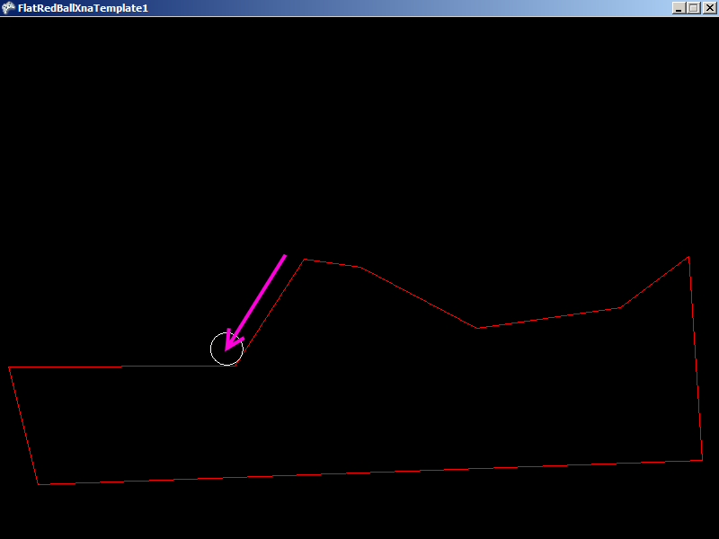

# tutorials-platformer-limiting-sliding-down-slopes

### Introduction

If you are making a platformer which is using the CollideAgainstBounce method and YAcceleration for gravity, you have probably noticed that your character slides down slopes. You may want to prevent this. This article shows how to do this.

### Setup

This code uses the following ShapeCollection file:

* [File:SampleGround.shcx](../frb/docs/index.php)

You will need to load this in code or in Glue in your current Screen.

### The Setup

The following shows a very simple platformer setup which we'll use for the rest of this article:

Add the following using statements:

```
using FlatRedBall.Math.Geometry;
using FlatRedBall.Input;
using Microsoft.Xna.Framework.Input;
```

Add the following at class scope:

```
Circle character;
ShapeCollection world;
```

Add the following to Initialize after initializing FlatRedBall:

```
world = FlatRedBallServices.Load<ShapeCollection>(
    "Content/SampleGround.shcx");
world.AddToManagers();
character = ShapeManager.AddCircle();
character.YAcceleration = -10;
```

Add the following to Update:

```
character.CollideAgainstBounce(world, 0, 1, 0);
float moveSpeed = 10;
if (InputManager.Keyboard.KeyDown(Keys.Right))
{
    character.XVelocity = moveSpeed;
}
else if (InputManager.Keyboard.KeyDown(Keys.Left))
{
    character.XVelocity = -moveSpeed;
}
else
{
    character.XVelocity = 0;
}
```

You will notice that this approach results in sliding down slopes

### Solution 1: Simple, but not perfect

The first solution, which is very simple, is to keep track of the X value before collision has occurred, then assign it after the collision. In other words this line:

```
character.CollideAgainstBounce(world, 0, 1, 0);
```

would become:

```
float xBeforeCollision = character.X;
if(character.CollideAgainstBounce(world, 0, 1, 0));
{
   character.X = xBeforeCollision;
}
```

This approach will prevent the character from sliding down the platform; however, it has two problems:

1. It results in the character sinking in to the platform slightly when landing. Worse yet is that this sinking may be frame rate dependent, which means behavior will vary depending on the performance of your game.
2. The character will move up and "through" any collision platform he collides against.

However, this approach is useful for prototyping and quick testing, so it is listed here.

### Solution 2: More advanced, but accurate

The second solution, which is more accurate, is to find the surface that the player has landed on, then project find the Y of the character on that surface. This approach is similar to Solution 1, except it will also set the Y of the character.

To implement this, this line:

```
character.CollideAgainstBounce(world, 0, 1, 0);
```

becomes:

```
Vector3 positionBefore = character.Position;
if (character.CollideAgainstBounce(world, 0, 1, 0))
{
    Vector3 distanceTraveled = character.Position - positionBefore;
    // flip this 90 degrees
    float tempVariable = distanceTraveled.X;
    distanceTraveled.X = distanceTraveled.Y;
    distanceTraveled.Y = -tempVariable;

    // this makes X = 1
    distanceTraveled /= distanceTraveled.X;
    float xShift = positionBefore.X - character.X;
    character.X = positionBefore.X;
    character.Y += (xShift * distanceTraveled.Y);
}
```

This works to solve the "sinking-in" problem that Solution 1 had, but we still move up through platforms.

### Solution 3: Even more advanced, fixes "move up through" problem

This solution solves the moving up and through the platforms by only performing a reposition if we are on the ground. To tell if we're on the ground we can use the distanceTraveled variable to see if the character was repositioned upward. Comments in the following code will explain why certain operations are being performed:

```
Vector3 positionBefore = character.Position;
if (character.CollideAgainstBounce(world, 0, 1, 0))
{
    Vector3 distanceTraveled = character.Position - positionBefore;

    Vector3 distanceTraveledNormalized = distanceTraveled;
    distanceTraveledNormalized.Normalize();

    // Now Y is between -1 to 1, representing the sine of the repositioning angle
    // If Y is greater than 0,than the character was positioned upward; however, we 
    // may want to limit standing on very steep slopes, so we will use a threshold value
    // for the maximum steepenss (minimum value of Y) for repositioning
    // This means the maximum slope for walking is (in degrees) is:
    // 90 * 2 * acos(.2) / pi = 78.46
    // You can actually enter the line above (without the comments and equals) in Google
    // to get the value, and you can change .2 to other values to see what the slope will
    // be.
    const float minimumY = .2f;

    if(Math.Abs(distanceTraveledNormalized.Y) > minimumY)
    {
        // flip this 90 degrees
        float tempVariable = distanceTraveled.X;
        distanceTraveled.X = distanceTraveled.Y;
        distanceTraveled.Y = -tempVariable;
 
        // this makes X = 1
        distanceTraveled /= distanceTraveled.X;
        float xShift = positionBefore.X - character.X;
        character.X = positionBefore.X;
        character.Y += (xShift * distanceTraveled.Y);
    }
}
```

### Velocity setting order

You may have noticed that the code above performs logic in the following order:

* Perform collision
* Set velocity from input

It is important that Velocity is set **after** collision in this code example. The reason for this is because the CollideAgainstBounce method modifies the velocity of the character - or more importantly it "redirects" the velocity so that a straight-down velocity becomes a diagonal velocity if the character is standing on a slope. However, the purpose of this code is to prevent horizontal movement when the user is not telling the character to move. Therefore, if your character uses the Velocity property, you will need to make sure to set it **after** the collision logic.

### Velocity setting order and Glue

If you are using Glue the section above may cause conceptual problems. Specifically, the section above recommends keeping the logic order as follows:

* Perform collision
* Set velocity from input

However, the natural order of code in Glue is as follows:

* Entity CustomActivity (where velocity is usually set)
* Screen CustomActivity (where collision is usually performed)

Unfortunately this is a case where the normal order of Entity-then-Screen updates must be worked around in custom code. This can be done rather easily. For example, your code may be as follows (excluding the contents of the actual collision and velocity setting code for brevity):

```
// In your Screen
public void CustomActivity(bool firstTimeCalled)
{
   /// Whatever other code your Screen might have....

   PerformCollisionActivity();
   ApplyVelocityToCharacters();   
}

void PerformCollisionActivity()
{
   // Add the collision code here:
   // code code code code
}

void ApplyVelocityToCharacters()
{
   // You may only have one Character or multiple Characters, but in either case, 
   // add the velocity-setting logic to the Character class so that the Screen only
   // calls one function instead of containing the Character movement logic
   for(int i = 0; i < mCharacters.Count; i++)
   {
       mCharacters[i].PerformVelocitySettingLogic();
   }
}

// And of couse in your Character Entity:
public void PerformVelocitySettingLogic()
{
   // Code that reads the input and sets velocity goes here:
   // code code code code
}
```
